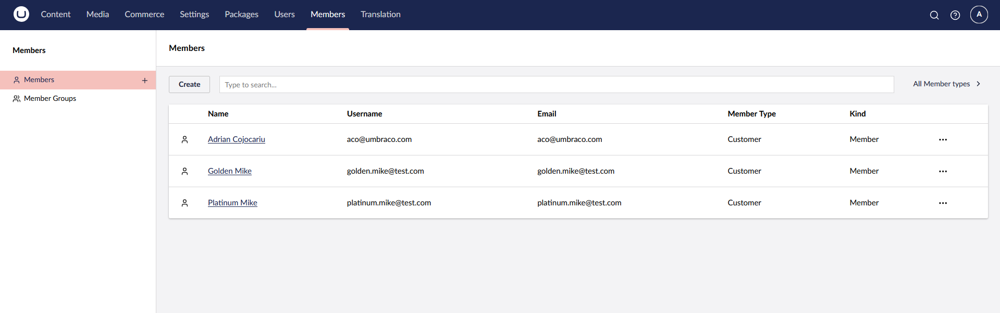
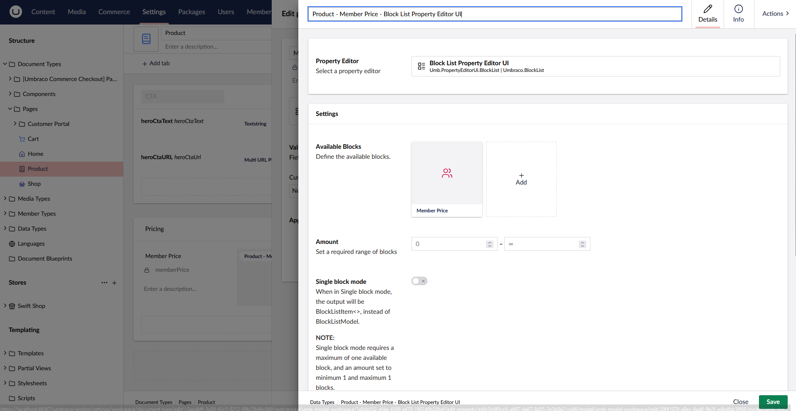
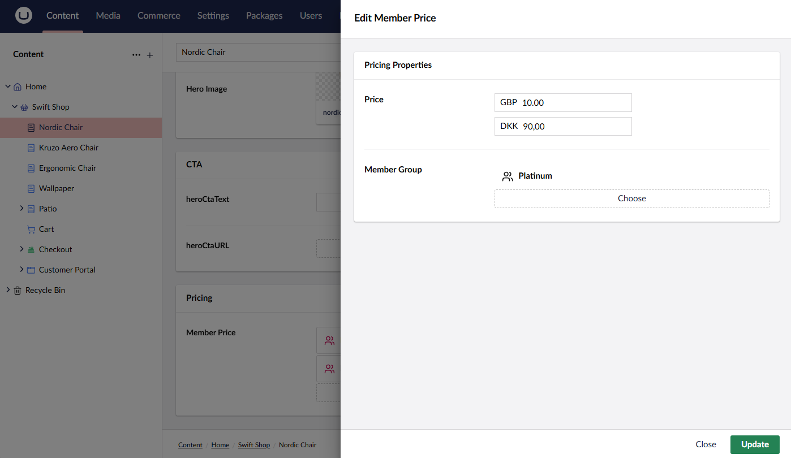

# Implementing Member Based Pricing

By default, Umbraco Commerce uses a single price for a product. However, in some cases, you may want to have different prices for different customers. In this guide, you learn how to implement member-based pricing in Umbraco Commerce.

## Member Configuration

1. Creating the Member Groups to use for the member-based pricing. In this example two member groups are created: _Platinum_ and _Gold_.


2. Create one Member for each group:



## Property Editor Configuration

Next, you will create a new property editor for the member-based pricing. The in-built Block List Editor is used for this.

1. Create a `Member Price` element type with a `Price` and `Member Group` property.
2. Use the default Umbraco Commerce `Price` property editor for the `Price` property.
3. Use the in-built `Member Group Picker` property editor for the `Member Group` property.


4. Open the **Product** Document Type.
5. Add a new `Member Price` property using a new Block List Property editor configuration.
6. Select the `Member Price` element type as the only allowed block type.



7. Navigate to the Content section.
8. Assign member-based pricing for any product you wish.
9. Populate the `Member Price` field with the required Member Group and price combination.



## Product Adapter

With the prices defined, it's time to configure Umbraco Commerce to select the correct price based on the logged-in Member. This is done by creating a custom product adapter to override the default product adapter and select the correct price.

```csharp
public class MemberPricingProductAdapter : UmbracoProductAdapter
{
    private readonly IHttpContextAccessor _httpContextAccessor;
    private readonly IMemberService _memberService;
    private readonly IMemberGroupService _memberGroupService;
    private readonly UmbracoCommerceContext _umbracoCommerce;

    public MemberPricingProductAdapter(
        IUmbracoContextFactory umbracoContextFactory, 
        IContentService contentService, 
        PublishedContentWrapperFactory publishedContentWrapperFactory, 
        IExamineManager examineManager, 
        PublishedContentHelper publishedContentHelper, 
        IUmbracoProductNameExtractor umbracoProductNameExtractor, 
        UmbracoCommerceServiceContext services,
        IHttpContextAccessor httpContextAccessor,
        IMemberService memberService,
        IMemberGroupService memberGroupService,
        UmbracoCommerceContext umbracoCommerce) 
        : base(umbracoContextFactory, contentService, publishedContentWrapperFactory, examineManager, publishedContentHelper, umbracoProductNameExtractor, services)
    {
        _httpContextAccessor = httpContextAccessor;
        _memberService = memberService;
        _memberGroupService = memberGroupService;
        _umbracoCommerce = umbracoCommerce;
    }

    public override async Task<IProductSnapshot> GetProductSnapshotAsync(Guid storeId, string productReference, string productVariantReference, string languageIsoCode, CancellationToken cancellationToken = default)
    {
        var baseSnapshot = (UmbracoProductSnapshot)await base.GetProductSnapshotAsync(storeId, productReference, productVariantReference, languageIsoCode, cancellationToken);

        if (_httpContextAccessor.HttpContext?.User.Identity is { IsAuthenticated: true }
            && baseSnapshot is { Content: Product { MemberPrice: not null } productPage }
            && productPage.MemberPrice.Any())
        {
            var memberId = _httpContextAccessor.HttpContext.User.Claims.First(x => x.Type == ClaimTypes.NameIdentifier).Value;
            var memberGroupName = _memberService.GetAllRoles(int.Parse(memberId)).First();
            var memberGroupId = (await _memberGroupService.GetByNameAsync(memberGroupName))!.Id;

            var memberPrice = productPage.MemberPrice
                .Select(x => x.Content as MemberPrice)
                .FirstOrDefault(x => int.Parse(x.MemberGroup) == memberGroupId);
                
            if (memberPrice != null)
            {
                var list2 = new List<ProductPrice>();

                var currencies = await _umbracoCommerce.Services.CurrencyService.GetCurrenciesAsync(baseSnapshot.StoreId);
                foreach (var currency in currencies)
                {
                    var productPrice = memberPrice.Price!.TryGetPriceFor(currency.Id);
                    if (memberPrice.Price != null && productPrice.Success)
                    {
                        list2.Add(new ProductPrice(productPrice.Result!.Value, productPrice.Result.CurrencyId));
                    }
                }

                baseSnapshot.Prices = list2;
            }
        }
        
        return baseSnapshot;
    }
}
```

Add the following to a `Composer` file to register the custom product adapter:

```csharp
internal class SwiftShopComposer : IComposer
{
    public void Compose(IUmbracoBuilder builder)
    {
        builder.Services.AddUnique<IProductAdapter, MemberPricingProductAdapter>();
    }
}
```

## Results

With all this implemented, the product page will display the correct price based on the logged-in Member.

The expected result for the standard product page:


The expected result for a _Gold_ Member:


The expected result for a _Platinum_ Member:


