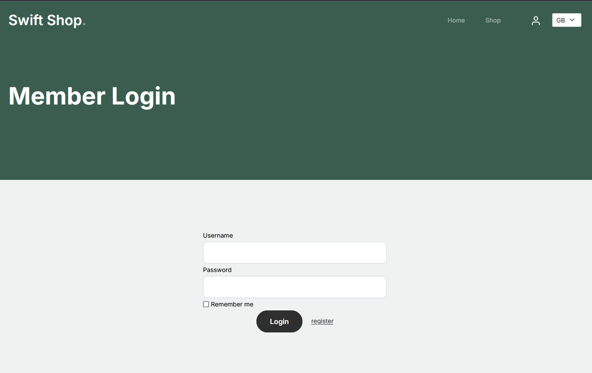
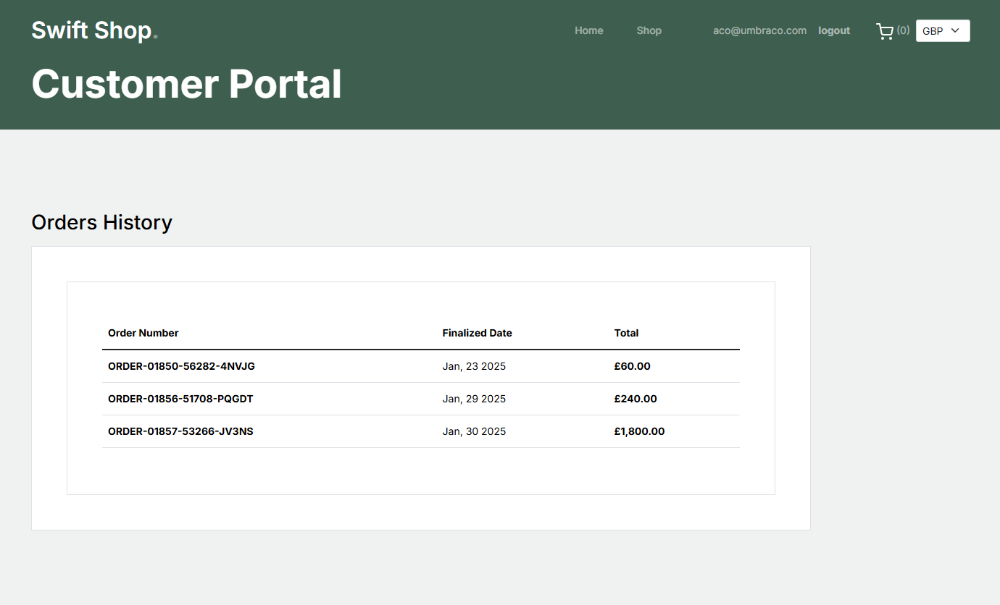
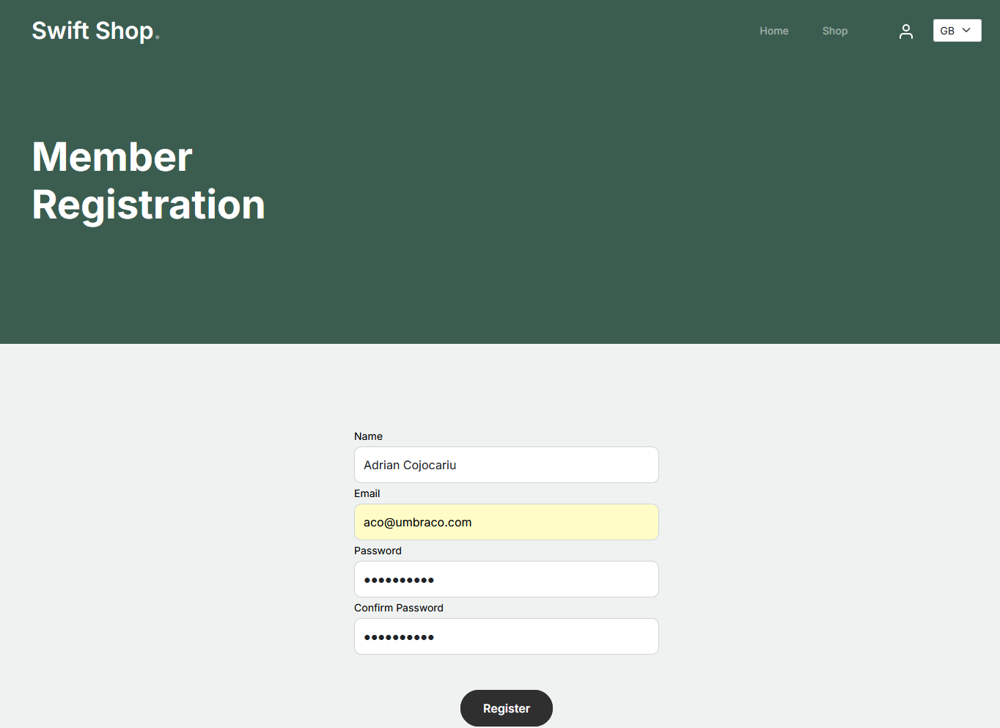

# Building a Members Portal

A members portal is a private area of your website where customers can log in to access their order history, manage their account details, and view personalized content. In this guide, we will show you how to build a members portal in Umbraco Commerce.

## Setting Up the Members

The first step in building a members portal is to create a member type for your customers. This member type will define the properties that customers can have, such as their name, email address, and password.

### Creating a Member Group

1. Navigate to the **Members** section of the backoffice.
2. Next to the **Member Groups** heading in the navigation, click the **+** button to create a new member type.
3. Enter a name for the member group, such as `Customer`.


4. Click the **Save** button to create the member group.

### Assigning Members to the Customer Member Group

1. Navigate to the **Members** section of the backoffice.
2. Click on the **Members** tab in the navigation.
3. Click on the member you want to assign to the `Customer` member group.
4. In the **Member Group** property, select the `Customer` member group.


5. Click the **Save** button to assign the member to the `Customer` member group.

## Setting Up the Members Area

The next step in building a members portal is to create the pages and templates that will make up the members area of your website.

### Document Type Setup

1. Navigate to the **Settings** section of the backoffice.
2. Create two new document types: `Customer Portal` and `Login`.


3. Update your site root document type to include the `Customer Portal` and `Login` document types as a child.


### Content Setup

1. Navigate to the **Content** section of the backoffice.
2. Create a new page using the `Customer Portal` document type and name it `Customer Portal`.
3. Create a new page using the `Login` document type and name it `Login`.


4. Expand the context menu for the `Customer Portal` node by clicking the three dots.
5. Click on the **Public Access** option.
6. In the **Public Access** dialog, choose the **Group based protection** option and click **Next**.
7. Select the `Customer` member group for the group option.
8. Select the `Login` node for the login and error page options.


9. Click **Save** to apply the public access settings.

## Implementing a Member Login

In order to access the members portal, customers will need to log in. We will create a login form that will allow customers to enter their username and password to access the portal.

1. Open the `Login.cshtml` template file.
2. Add the following code to create a login form:

```csharp
@using (Html.BeginUmbracoForm<UmbLoginController>("HandleLogin", new { RedirectUrl = "/customer-portal" }))
{
    <div asp-validation-summary="ModelOnly"></div>
        
    <div>
        <label asp-for="@loginModel.Username">Username</label>
        <input asp-for="@loginModel.Username" />
        <span asp-validation-for="@loginModel.Username"></span>
    </div>
    
    <div>
        <label asp-for="@loginModel.Password">Password</label>
        <input asp-for="@loginModel.Password" />
        <span asp-validation-for="@loginModel.Password"></span>
    </div>
    
    <button type="submit">Login</button>
}
```


The `UmbLoginController` class comes pre-installed with Umbraco and handles the login process for you, so you don't need to create a custom controller.


On the frontend, customers will be able to enter their username and password and click the **Login** button to access the members portal.



## Displaying Member Order History

Now that members can log in, we'll update the `Customer Portal` page to display the order history for the logged-in member.

1. Open the `CustomerPortal.cshtml` template file.
2. Add the following code to display the order history:

```csharp
@inject IMemberManager memberManager
@inject IUmbracoCommerceApi commerceApi
@inherits Umbraco.Cms.Web.Common.Views.UmbracoViewPage
@{
	var store = Model.GetStore();

	var currentMember = await memberManager.GetCurrentMemberAsync();
	var orders = currentMember != null
		? await commerceApi.GetFinalizedOrdersForCustomerAsync(store.Id, currentMember.Email)
		: Enumerable.Empty<OrderReadOnly>();
}

@if (orders.Count() > 0)
{
    <table>
        <thead>
            <th>Order Number</th>
            <th>Date</th>
            <th>Total</th>
        </thead>
        <tbody>
            @foreach (var order in orders)
            {
                <tr>
                    <td><strong>@order.OrderNumber</strong></td>
                    <td>@order.FinalizedDate?.ToString("MMM, d yyyy")</td>
                    <td><strong>@(await order.TotalPrice.Value.FormattedAsync())</strong></td>
                </tr>
            }
        </tbody>
    </table>
}
else
{
    <h2>You haven't placed any orders yet</h2>
}
```

The `Customer Portal` page will now display a table of the member's order history, including the order number, date, and total price.



### Assigning Orders to a Customer

The order history will display all orders that have been finalized for the logged-in member. Orders that are created whilst the member is logged in will automatically be associated with the member. If you wish to assign an order to a member at any point, you can also use the API method:

```csharp
writableOrder.AssignToCustomer(member.Key.ToString());
```

## Extras

### Displaying Member Login Status

In your site header, add the following code to display the member login status:

```csharp
@{
    var isLoggedIn = Context.User?.Identity?.IsAuthenticated ?? false;
    if (isLoggedIn)
    {
        <a href="/customer-portal">@Context.User?.Identity?.Name</a>
        @using (Html.BeginUmbracoForm<UmbLoginStatusController>("HandleLogout", new { RedirectUrl = rootPage.Url() }, new { @name = "logoutForm" }))
        {
            <button type="submit"><strong>logout</strong></button>
        }
    } 
    else 
    {
        <a href="/login">Login</a>
    }
}
```
  

  

### Registering a Member

To allow customers to register as members, you can create a registration form that will allow customers to enter their name, email address, and password.

Implement a registration document type and page in the same way as the login page. Then, open the `Register.cshtml` template file and add the following code to create a registration form:

```csharp
@using (Html.BeginUmbracoForm<UmbRegisterController>("HandleRegisterMember", new { RedirectUrl = "/customer-poratl", UsernameIsEmail = true }))
{
    <div asp-validation-summary="ModelOnly"></div>
        
    <div>
        <label asp-for="@registerModel.Name">Name</label>
        <input asp-for="@registerModel.Name" />
        <span asp-validation-for="@registerModel.Name"></span>
    </div>
    
    <div>
        <label asp-for="@registerModel.Email">Email</label>
        <input asp-for="@registerModel.Email" />
        <span asp-validation-for="@registerModel.Email"></span>
    </div>
    
    <div>
        <label for="email">Password</label>
        <input asp-for="@registerModel.Password" />
        <span asp-validation-for="@registerModel.Password"></span>
    </div>
    
    <div>
        <label for="email">Confirm Password</label>
        <input asp-for="@registerModel.ConfirmPassword" />
        <span asp-validation-for="@registerModel.ConfirmPassword"></span>
    </div>
    
    <button type="submit">Register</button>
}
```


The `UmbRegisterController` class comes pre-installed with Umbraco and handles the login process for you, so you don't need to create a custom controller.


On the frontend, customers will be able to enter their name, email address, and password to register as a member.


