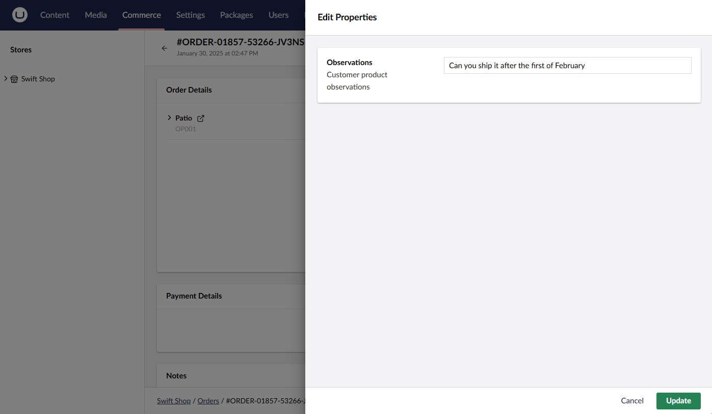

# Implementing Personalized Products

Personalized products can be customized by the customer. This customization can be adding a message or selecting different options for the product. This guide will show you how to implement personalized products in Umbraco Commerce.

This will be broken down into the following steps:

* Add a message field on the product page in the add-to-cart form
* Save the details in an order line [property](../key-concepts/properties.md)
* Register a UI extension to display the value in the Backoffice.


This guide is not a direct follow-on from the [getting started tutorial](../tutorials/build-a-store/overview.md). It is assumed that your store is set up in a similar structure.


## Capturing a Message

On the frontend, add a text area to the product page where the customer can enter their message.


## Saving the Message as an Order Line Property

When the customer adds the product to the cart, the message will be saved in an order line property.

1. Add an `Observations` property of the `AddToCartDto` to capture the message.

```csharp
public class AddToCartDto
{
    ...

    public string? Observations { get; set; }
}
```

2. Locate the `AddToCart` action.
2. Set a property on the order line if a value has been sent with the request.

```csharp
[HttpPost]
public async Task<IActionResult> AddToCart(AddToCartDto postModel)
{
    try
    {
        await _commerceApi.Uow.ExecuteAsync(async uow =>
        {
            var store = CurrentPage.GetStore();
            var order = await _commerceApi.GetOrCreateCurrentOrderAsync(store.Id)
                .AsWritableAsync(uow)
                .AddProductAsync(postModel.ProductReference, decimal.Parse(postModel.Quantity), new Dictionary<string, string>{
                    { "productObservations", postModel.Observations }
                });

            await _commerceApi.SaveOrderAsync(order);

            uow.Complete();
        });
    }
    catch (ValidationException ex)
    {
        ...
    }
}
```

## Accessing the Property in the Backoffice

To view the data in the Backoffice order editor, you need to register an `ucOrderProperty` extension along with the relevant label localizations as sampled below:

````csharp
{
  "name": "SwiftShop",
  "extensions": [
    {
      "type": "ucOrderLineProperty",
      "alias": "Uc.OrderLineProperty.ProductObservations",
      "name": "Product Observations",
      "weight": 400,
      "meta": {
        "propertyAlias": "productObservations",
        "showInOrderLineSummary": true,
        "summaryStyle": "inline",
        "editorUiAlias": "Umb.PropertyEditorUi.TextBox",
        "labelUiAlias": "Umb.PropertyEditorUi.Label"
      }
    },
    {
      "type": "localization",
      "alias": "Uc.OrderLineProperty.ProductObservations.EnUS",
      "name": "English",
      "meta": {
        "culture": "en",
        "localizations": {
          "section": {
            "ucProperties_productObservationsLabel": "Observations",
            "ucProperties_productObservationsDescription": "Customer product observations"
          }
        }
      }
    }
  ]
}
````
The property is displayed in the Backoffice order editor.


