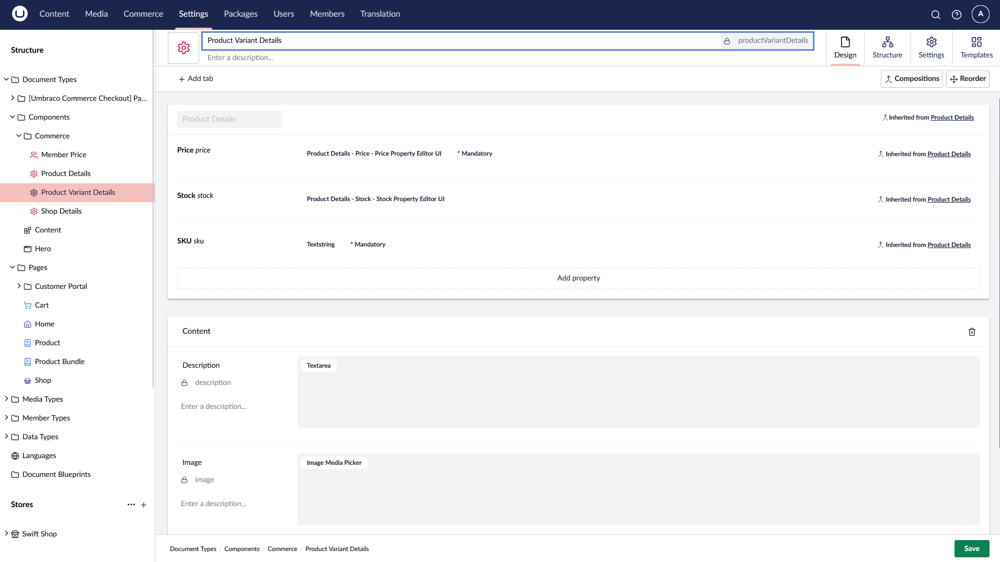
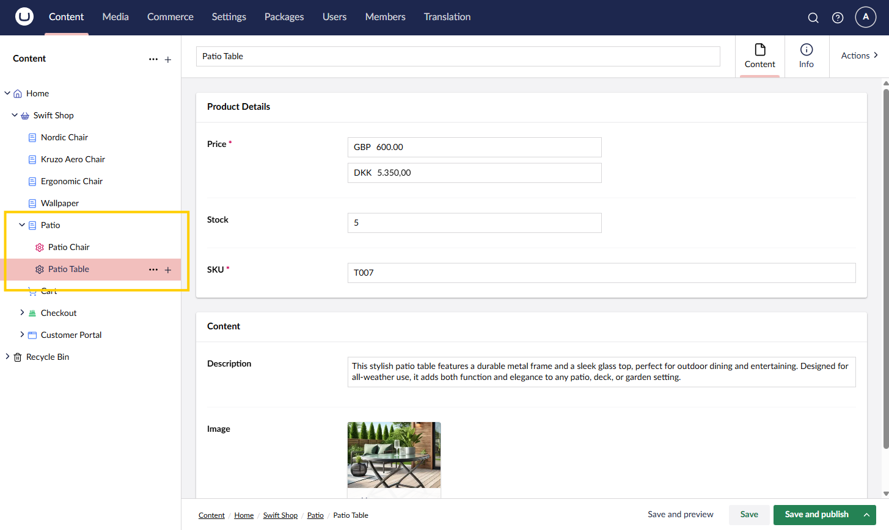
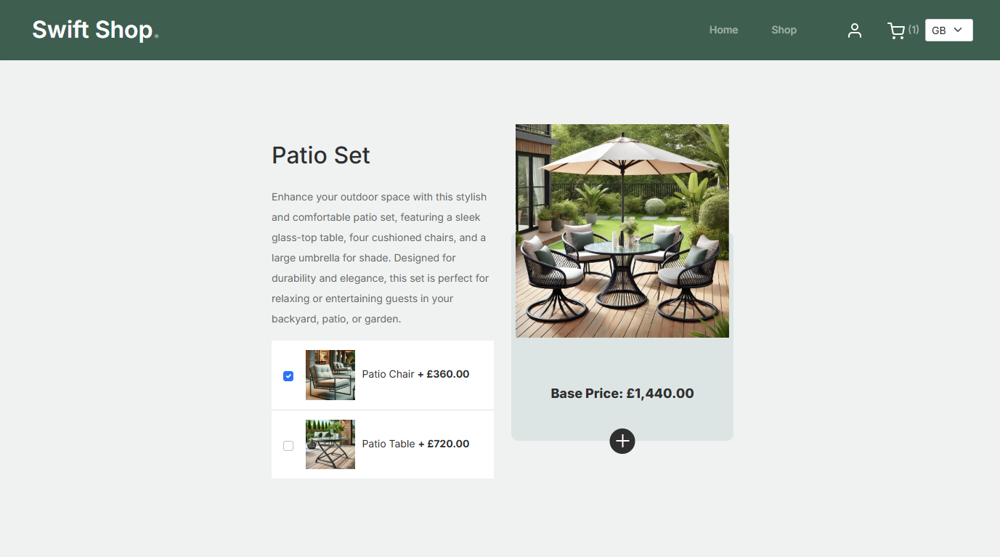

# Implementing Product Bundles

Product bundles are Umbraco Commerces' way of creating composite products. This feature allows you to create a product that consists of multiple sub-products. The sub-products can be optional or mandatory, and you can define the quantity of each sub-product. The final order line will be a composite order line of the selected primary product and its sub-product options.


Whilst this guide is not a direct follow on from the [getting started tutorial](../tutorials/build-a-store/overview.md), it is assumed that your store is setup in a similar structure.


## Product Setup

To create a product bundle, you need to create a primary product with multiple sub-products. This can be achieved in multiple ways, but the most common approach is to create a product page with a structure that allows child nodes of a product variant type.

1. In the backoffice, navigate to the settings section
2. Create a document type for your primary product.


2. Create a document type for your sub-products.



3. Update your primary product document type to allow child nodes of the sub-product type.


## Content Configuration

Our bundle content tree will contain a bundle page with variant elements as children.

1. In the backoffice, navigate to the content section
2. Create a new product page with the primary product document type
3. Add variant elements as children



## Frontend Configuration

Our base product page will display the details of the product with a list of variants that can be used as addons.

````csharp
@using (Html.BeginUmbracoForm("AddToCart", "CartSurface", FormMethod.Post))
{
    @Html.Hidden("bundleProductReference", Model.GetProductReference())
    @Html.Hidden("quantity", 1)
            
    <div>
    
        <h2>@Model.Headline</h2>
        <p>@Model.Description</p>
            
        <div>
            
            <h3>@Model.Title</h3>
            <p>Base Price: @(await Model.GetFormattedPriceAsync())</p>
        </div>
        
        <ul>
            @foreach (var item in Model.Children<ProductVariantDetails>())
            {
                <li>
                    <label>
                        <input id="chk_@item.Id" class="form-check-input me-1 align-middle" type="checkbox"
                            value="@item.GetProductReference()" name="bundleItemReferences[]" />
                        
                        <h3>@item.Name</h3>
                        <p>+ @(await item.GetFormattedPriceAsync())</p>
                    </label>
                </li>
            }
        </ul>
        
        <button type="submit">Add to Cart</button>
        
    </div>
}
````



## Add to Cart Updates

With our frontend setup, we need to update our add to cart functionality to handle the bundle product and its sub-products.

1. Update the `AddToCartDto` object to include the bundle product reference and an array of variant product references.

````csharp
public class AddToCartDto
{
    ...
    public string? BundleProductReference { get; set; }
    public string[] BundleItemReferences { get; set; }
}
````

2. Update the `AddToCart` method on your `CartSurfaceController` to handle the bundle product and its sub-products.

````csharp
[HttpPost]
public async Task<IActionResult> AddToCart(AddToCartDto postModel)
{
    try
    {
        await commerceApi.Uow.ExecuteAsync(async uow =>
        {
            StoreReadOnly store = CurrentPage!.GetStore()!;
            Order? order = await commerceApi.GetOrCreateCurrentOrderAsync(store.Id)!
                .AsWritableAsync(uow);
            
            if (postModel.BundleProductReference is null)
            {
                // Not a bundle so add the product directly
                await order.AddProductAsync(postModel.ProductReference, postModel.Quantity);
            } 
            else // Bundle product so add the bundle and its items
            {
                // Create a unique bundle id
                var bundleId = Guid.NewGuid().ToString();

                // Add the bundle product
                await order.AddProductAsync(postModel.BundleProductReference, 1, bundleId);

                // Add the bundle items to the bundle
                foreach (var itemRef in postModel.BundleItemReferences)
                {
                    await order.AddProductToBundleAsync(bundleId, itemRef, 1);
                }
            }
            
            await commerceApi.SaveOrderAsync(order);
            uow.Complete();
        });
    }
    catch (ValidationException ex)
    {
        ModelState.AddModelError("productReference", "Failed to add product to cart");

        return CurrentUmbracoPage();
    }

    TempData["successMessage"] = "Product added to cart";

    return RedirectToCurrentUmbracoPage();
}
````

With the frontend and backend updates in place, when a user adds a product and selected variants to the cart, the order will be created with the primary product and its sub-products combined.

## Order Editor View

When an order includes a bundled product, the order editor will display the primary product and its sub-products as a composite order line.


