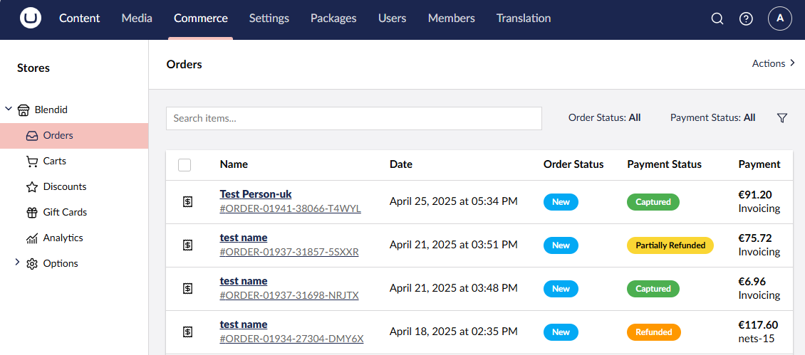
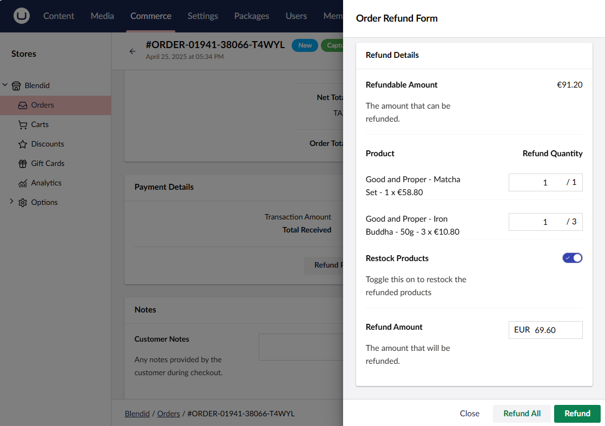
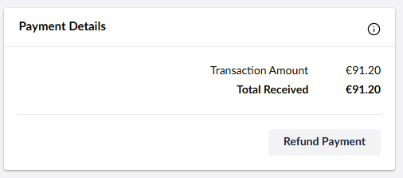

# Issue Refunds


You can issue a refund only if the payment method used supports refunds. Learn how to enable payment refunds [in the Configure Refunds](refund-configs.md) article.


To refund an order, follow the steps outlined below:

1. Go to **Settings** in the Umbraco backoffice.
2. Open the **Commerce** section.
3. Select your store from the **Stores** section.
4. Go to **Orders**.

5. Select the order that you want to refund.
6. Click **Refund Payment** on the Order Details page.

7. Fill in the fields in the Order Refund modal:
    - **Order Lines section** (*only available if partial refunds are enabled*): Enter the quantity you want to refund from each order line.
    - **Restock Products toggle**: This is a flag that tells Umbraco Commerce to restock the refunded products.
    - **Refund Amount textbox**: Displays the amount that will be refunded. Its value is auto-populated, but you can enter any positive number smaller than the refundable amount.
    - **Refund button**: Clicking on this button will issue a refund with the **Refund Amount** above.
    - **Refund All button**: Clicking on this button will issue a refund for the remaining refundable amount of the order.

8. Click on the **Refund** button to refund the desired amount or the **Refund All** button to refund the full refundable amount (*only available if partial refunds are enabled*).

Find the refund history by clicking on the information icon at the top-right corner of the Payment Details section.

