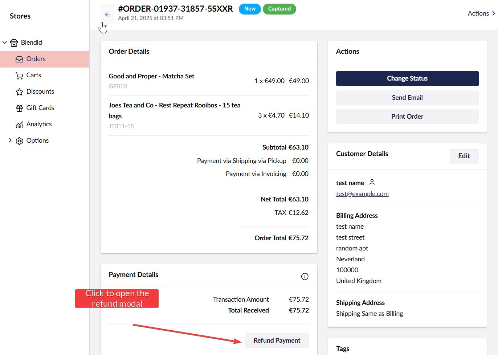

## Refund Order

You can issue a refund only if the payment method used supports refunds. Learn how to enable payment refunds [here](./refund-configs.md).


To refund an order, follow these steps:

1. Go to **Settings**.
2. Open the **Commerce** section.
3. Select your store from the **Stores** section.
4. Go to **Orders**.
5. Click on the order that you want to refund.

6. On the order details page, you can click the **Refund Payment** button to open the refund modal.

7. Fill in information in the Order Refund modal:
    - **Order Lines section** (*only available if partial refunds are enabled*): In this section, you can enter the quantity you want to refund from each order line.
    - **Restock Products toggle**: This is a flag that tells Umbraco Commerce to restock the refunded products.
    - **Refund Amount textbox**: Displays the amount that will be refunded. Its value is auto-populated but you can enter any positive number as long as it's smaller than the refundable amount.
    - **Refund button**: Clicking on this button will issue a refund with the **Refund Amount** above.
    - **Refund All button**: Clicking on this button will issue a refund for the remaining refundable amount of the order.

8. If partial refunds is enabled, you can click on the **Refund** button to refund the desired amount or click on the **Refund All** button to refund the full refundable amount.
9. The refund history along with other transaction history can be found by clicking on the information icon at the top right corner of the Payment Details section:
