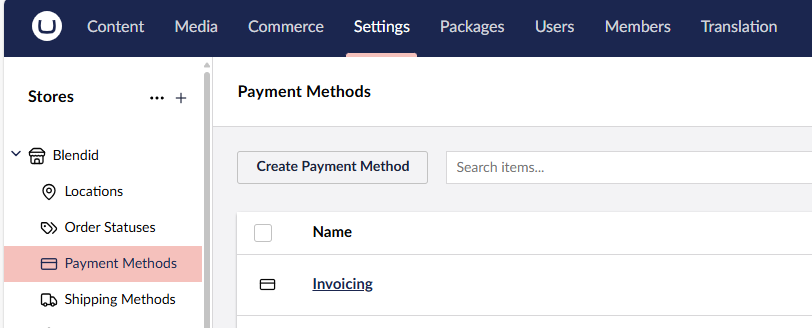
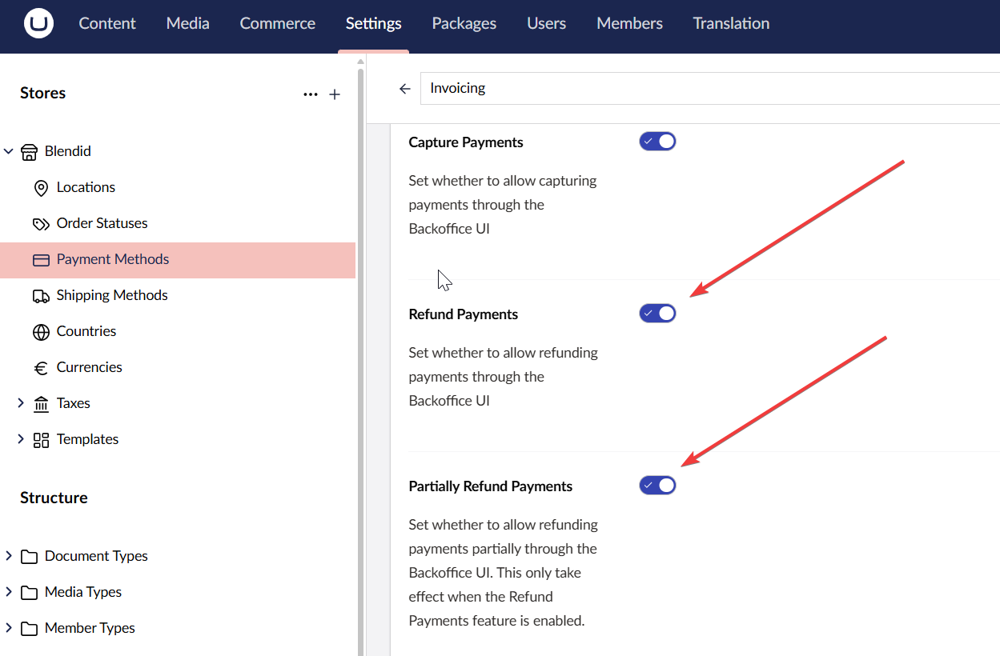

# Configure Refunds

To enable the refund feature for a payment method, follow the steps outlined below:

1. Go to **Settings** in the Umbraco backoffice.
2. Select your store from the **Stores** section.
3. Go to **Payment Methods**.

4. Select the payment method you want to configure. The **Invoicing** payment method is used as an example in this guide.

5. Toggle **Refund Payments** and **Partially Refund Payments** if needed.

6. Click **Save**.

Once refunds are enabled, you can issue refunds for a captured order. Learn how refunds are issued in the [Issue Refunds](issue-a-refund.md) article.
