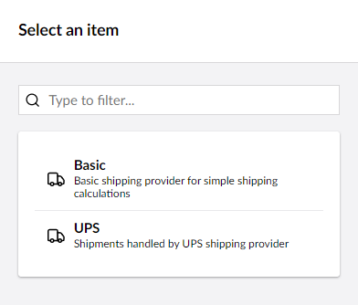
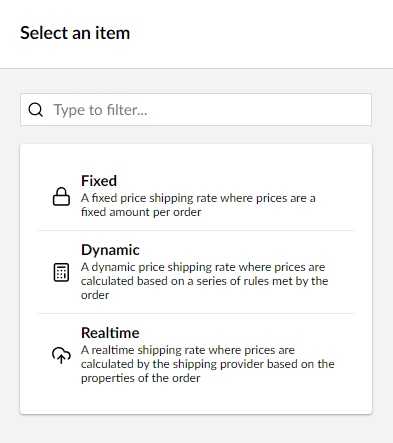
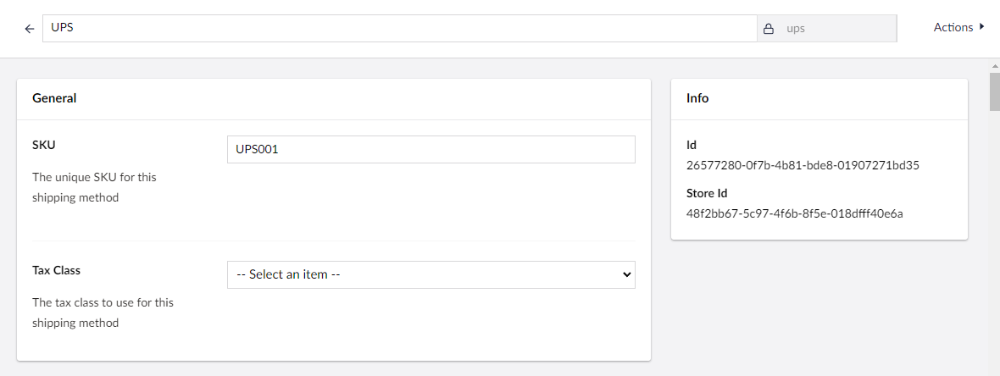

# Realtime Rate Shipping

Realtime rate shipping in Umbraco Commerce allows you to define real-time, up-to-the-minute shipping estimates directly from the shipping operators.

## Configuring Realtime Rate Shipping

To configure Realtime Rate Shipping, follow these steps:

1. Go to **Settings** > **Stores** > {Your Store} > **Shipping Methods**.

    

2. Click **Create Shipping Method**.
3. Choose the shipping provider for the shipping operator you wish to use.

    

4. Choose **Realtime** as the calculation mode option.

    

5. Enter the **Shipping Method Name**, **Alias**, and **SKU**.
6. Select the tax class from the **Tax Class** dropdown list.

    

7. Enter the shipping provider's API credentials required to connect to the shipping operator's API.

    

8. Configure any additional charges for this shipping method.

    

9. Select the countries this shipping method should be allowed in.

    

10. Click **Save**.
