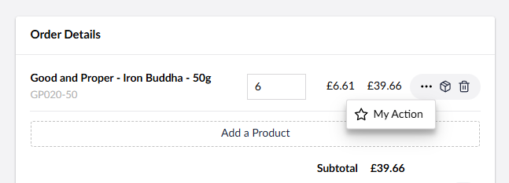

# v15.1.0-RC

## Key Takeaways

* [Cart Cleanup Service](v15.1.0-rc.md#cart-cleanup-service).
* [Order Line Actions](v15.1.0-rc.md#order-line-actions)

## Cart Cleanup Service

The cart cleanup service is a new background service that periodically cleans up old abandoned carts. This service is off by default, but can be enabled via app settings.

```json
{
    "Umbraco" : {
        "Commerce": {
            "CartCleanupPolicy": {
                "EnableCleanup": true,
                "KeepCartsForDays": 800
            }
        }
    }
}
```

See the [Configuring Cart Cleanup guide](../how-to-guides/configuring-cart-cleanup.md) for more details.

## Order Line Actions

Order line actions are a new UI extension point that lets you register custom buttons to display against each order line of a cart/order. 




See the [Order Line Actions article](../key-concepts/ui-extensions/order-line-actions.md) for more details.


## What to Test and How to Give Feedback

We welcome any feedback on installation or upgrade issues, as well as any bugs found in the sections mentioned above.

Issues can be raised on the Umbraco Commerce issue tracker at [https://github.com/umbraco/Umbraco.Commerce.Issues/issues](https://github.com/umbraco/Umbraco.Commerce.Issues/issues).
