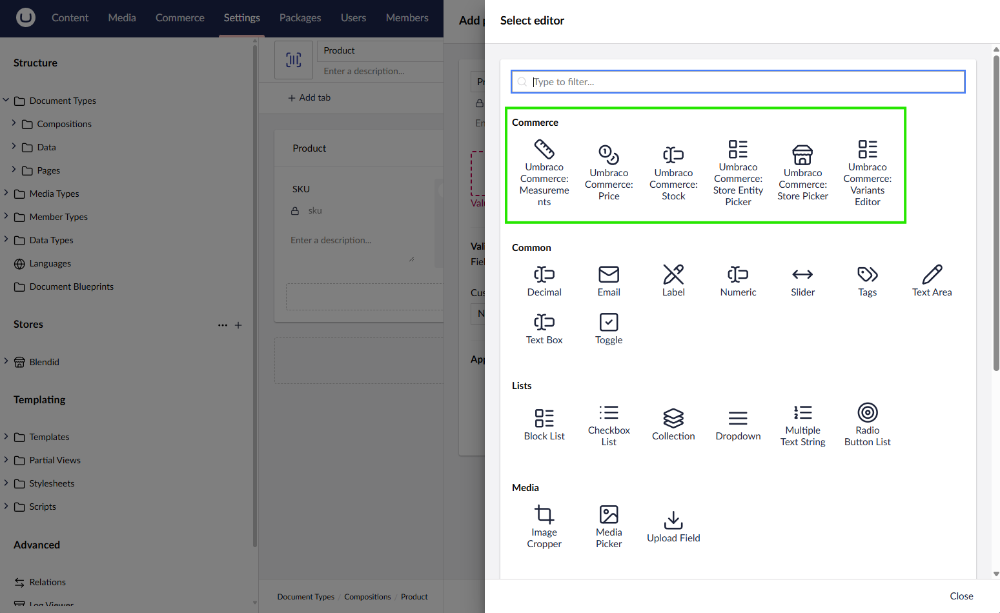

# Creating your first Product

By default, products in Umbraco Commerce are regular content nodes. These can consist of any number of properties dependant on the site design. To be considered a product however, a document type must contain the fields `Sku` and `Price`, with their corresponding aliases `sku` and `price`.

## Create a Product Composition

Because any node in Umbraco can be a product, we'll first create a `Product` composition that we could apply to any document type to make it a product.

1. Navigate to the **Settings** section of the backoffice
2. Create a new element type called `Product`
3. Add an SKU property to your document type with the alias `sku` and using the `Text Box Editor`.
4. Add a Price property to your document type with the alias `price` and using the `Price Property Editor` that comes with Umbraco Commerce.

6. Click **Save** to save the changes to the element type.

## Create a Product Document Type

With the product composition created, we can now create a document type for a product.

1. Navigate to the **Settings** section of the backoffice
2. Either create or open a document type that you want to use as a product
3. Click the **Compositions** button to open the compositions modal
4. Select the `Product` composition you created earlier and click **Submit**

5. Add an other properties to your document type as needed for your product.

6. Click **Save** to save the changes to the document type.

## Allow Creating Product Pages

If you haven't already, you'll need to allow the product document type to be a child node of the store root or product container document type.

1. Open your store root or product container document type to edit.
2. Navigate to the **Structure** tab.
3. Add our new document type to the **Allowed child node types** property.

4. Click **Save** to save the changes to the root document type.

## Create a Product

1. Navigate to the **Content** section of the backoffice
2. Create a new content node somewhere beneath the store root using the document type you created earlier

3. Fill in the details of the product, including the SKU and Price properties

4. Click **Save and Publish** to save the product
5. Navigate to the frontend of the site to view the product page

With the product created, we can now move on to [Implementing a Shopping Cart](cart-management/overview.md).
