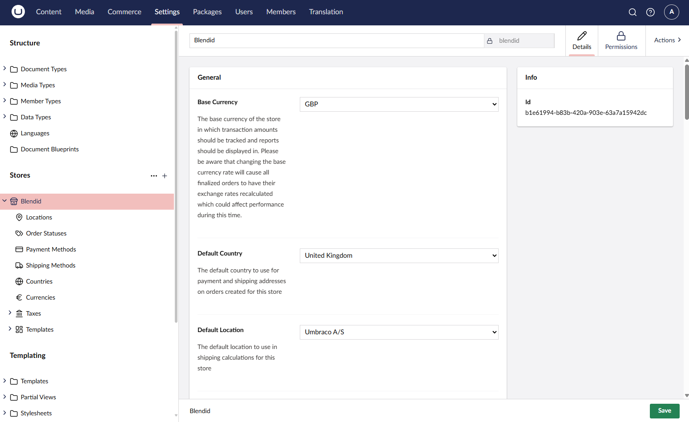

# Creating a Store

With Umbraco setup and Umbraco Commerce installed, the next step is to create a store.

A store is an online platform where products or services are listed for customers to browse, purchase, and complete transactions over online.

Setting up a store allows you to manage both the content and commerce aspects of your site. It allows you to create a custom and scalable online shopping experience. For more information, see the [Stores](../../reference/stores/README.md) article.

## Create a Store

1. Navigate to the **Settings** section of the backoffice
2. Next to the Stores heading in the navigation area, click the "+" button to launch the create store dialog.
3. In the presented dialog, enter a unique name for you store and click "Create".

4. On the store editor screen, click **Save** to create the store and auto populate it with a default configuration.

5. The store is now created and ready to be used. In this tutorial we will continue with the default configuration, but for more information on configuring the various aspects of your store, see the [Configuring your Store](configure-store.md) article.

## Connecting the Store to your website

With our store defined, the next step is to link our store to our website. This is done by associating the store with the root content node of the website. To do this, we need to add a property to the root content node that allows us to select the store.

1. Navigate to the **Settings** section of the backoffice
2. Edit your root content document type
3. Add a new property to you document type using the `Store Picker Property Editor` that comes with Umbraco Commerce.
4. Give the property the alias `store`

5. Click **Save** to save the changes to the document type.
6. Navigate to the root content node in the **Content** section.
7. Via the store property, select the store you created earlier.

8. Click **Save and Publish** to save the changes to the content node.

With the store linked to the website, we can now start adding products. For more information, see the [Creating your first Product](create-product.md) article.
