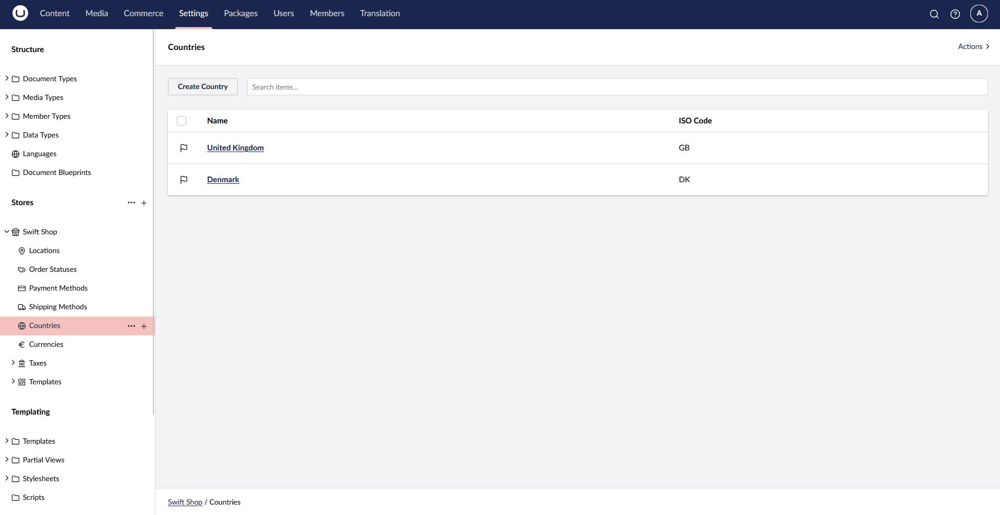
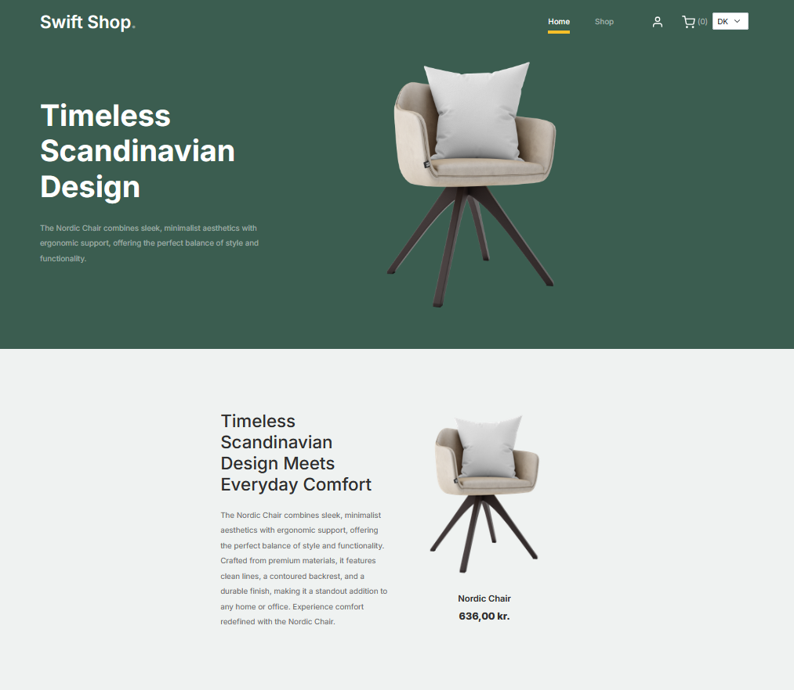
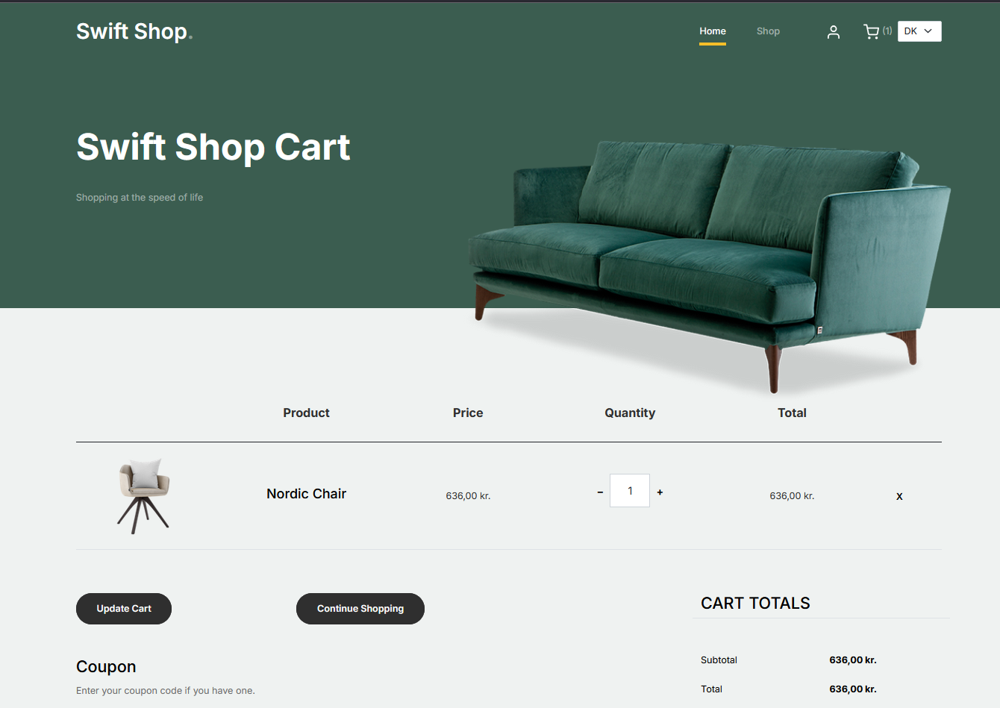

# Location Based Configuration

At a store level, you can have location based configuration for a couple of properties that include:
* Unit of Measure
* Locations
* Countries
* Currencies
* Allowed Payment/Shipping Methods

Let's consider our store with a few countries, and their default currencies (DKK/GBP):



An implementation for a country switch feature will include the following:

## Partial View

On our website's frontend we will be using a partial view to allow users to toggle between existing cultures.


With the following implementation:

````csharp
@using Umbraco.Commerce.Core.Api;
@using Umbraco.Commerce.SwiftShop.Extensions;
@inject IUmbracoCommerceApi UmbracoCommerceApi
@inherits Umbraco.Cms.Web.Common.Views.UmbracoViewPage

@{
    var store = Model.GetStore();
    var countries = await UmbracoCommerceApi.GetCountriesAsync(store.Id);
    var currentCountry = await UmbracoCommerceApi.GetDefaultShippingCountryAsync(store.Id);
}

@if (countries.Count() > 1)
{
    @using (Html.BeginUmbracoForm("ChangeCountry", "Culture", FormMethod.Post, new { @name = "changeCountryForm" }))
    {
        @Html.DropDownList("countryIsoCode", countries.Select(x => new SelectListItem(x.Code, x.Code, x.Code == currentCountry.Code)),
                    new
                    {
                        @class = "form-select form-select-sm",
                        @onchange = "document.forms['changeCountryForm'].submit()"
                    })
    }
}
````

The `POST` request will be handled by an action defined in a Surface controller by passing the country's ISO code.

````csharp
public class ChangeCountryDto
{
    public string CountryIsoCode { get; set; }
}
````

## Culture Controller

The action handling the request will ensure that the current order and the system's payment/shipping and currency details are set based on the new selected culture.

````csharp
[HttpPost]
public async Task<IActionResult> ChangeCountry(ChangeCountryDto changeCountryDto)
{
    var store = CurrentPage.GetStore();
    var country = await _commerceApi.GetCountryAsync(store.Id, changeCountryDto.CountryIsoCode);
    var currency = await _commerceApi.GetCurrencyAsync(country.DefaultCurrencyId.Value);

    await _commerceApi.SetDefaultPaymentCountryAsync(store.Id, country);
    await _commerceApi.SetDefaultShippingCountryAsync(store.Id, country);
    await _commerceApi.SetDefaultCurrencyAsync(store.Id, currency);

    var currentOrder = await _commerceApi.GetCurrentOrderAsync(store.Id);
    if (currentOrder != null)
    {
        await _commerceApi.Uow.ExecuteAsync(async uow =>
        {
            var writableOrder = await currentOrder.AsWritableAsync(uow)
                .ClearPaymentCountryRegionAsync()
                .ClearShippingCountryRegionAsync()
                .SetCurrencyAsync(currency.Id);

            await _commerceApi.SaveOrderAsync(writableOrder);

            uow.Complete();
        });
    }

    return RedirectToCurrentUmbracoPage();
}
````

The changes will reflect on the product details pages




Or the cart details page



