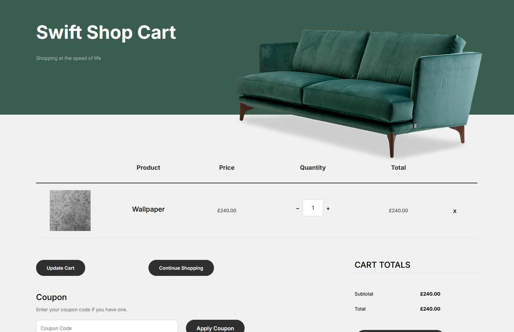

# Background

Sometimes our products portfolio could expand with items that are sold by a specific metric. This means that the product's unit price will have to be multiplied by a specific number as indicated by the customer purchasing the product.

For example, let's consider our store inventory that contains wallpapers sold by the meter. The Backoffice content type configuration holds the unit price.

To ensure the correct aquisition of products, there are a couple of steps we need to follow.

## Capture user input

On our product's frontend page, we will add a new field to capture the desired length we want to purchase.


The selected length will reflect on the cart value.



To provide the correct calculations for an order, the captured data will need to go through different tranformations behind the scenes:
* Pass the value to the order as an order line property.
* Implement a custom order line calculator.

## Order Line Property

On adding the product to cart, we pass the length for the product as a [property](https://docs.umbraco.com/umbraco-commerce/key-concepts/properties) for our order line, ensuring that the order is in Writable state.

````csharp
public class AddToCartDto
{
    ...

    public string? Length { get; set; }
}
````

````csharp
[HttpPost]
public async Task<IActionResult> AddToCart(AddToCartDto postModel)
{
    try
    {
        await _commerceApi.Uow.ExecuteAsync(async uow =>
        {
            var store = CurrentPage.GetStore();
            var order = await _commerceApi.GetOrCreateCurrentOrderAsync(store.Id)
                .AsWritableAsync(uow)
                .AddProductAsync(postModel.ProductReference, decimal.Parse(postModel.Quantity));

            if (postModel.Length is not null)
            {
                await order.SetPropertyAsync(Constants.OrderProperties.Length, postModel.Length);
            }

            await _commerceApi.SaveOrderAsync(order);

            uow.Complete();
        });
    }
    catch (ValidationException ex)
    {
        ...
    }

    ...
}
````


## Order Line Calculator

Using a custom order line calculator, we will calculate the price/tax rate of a given order line by multiplying the specified length with the unit price.

````csharp
public class SwiftOrderLineCalculator : IOrderLineCalculator
{
    private ITaxService _taxService;
    private IProductPriceFreezerService _productPriceFreezerService;

    public SwiftOrderLineCalculator(
        ITaxService taxService,
        IProductPriceFreezerService productPriceFreezerService)
    {
        _taxService = taxService;
        _productPriceFreezerService = productPriceFreezerService;
    }

    public async Task<Attempt<TaxRate>> TryCalculateOrderLineTaxRateAsync(OrderReadOnly order, OrderLineReadOnly orderLine, TaxSource taxSource, TaxRate fallbackTaxRate, OrderLineCalculatorContext context = null, CancellationToken cancellationToken = default)
    {
        order.MustNotBeNull(nameof(order));
        orderLine.MustNotBeNull(nameof(orderLine));

        TaxRate taxRate = fallbackTaxRate;

        if (orderLine.TaxClassId != null)
        {
            taxRate = (await _taxService.GetTaxClassAsync(orderLine.TaxClassId.Value)).GetTaxRate(taxSource);
        }

        return Attempt.Succeed(taxRate);
    }

    public async Task<Attempt<Price>> TryCalculateOrderLineUnitPriceAsync(OrderReadOnly order, OrderLineReadOnly orderLine, Guid currencyId, TaxRate taxRate, OrderLineCalculatorContext context = null, CancellationToken cancellationToken = default)
    {
        order.MustNotBeNull(nameof(order));
        orderLine.MustNotBeNull(nameof(orderLine));

        var numberOfMeters = order.Properties.TryGetValue(Constants.OrderProperties.Length, out var propertyValue)
            ? propertyValue.Value
            : string.Empty;

        var unitPrice = order.IsNew
            ? (await _productPriceFreezerService.GetProductPriceAsync(order.StoreId, order.Id, orderLine.ProductReference, orderLine.ProductVariantReference, currencyId)).ProductPrice.Value
            : (await _productPriceFreezerService.GetOrCreateFrozenProductPriceAsync(order.StoreId, order.Id, orderLine.ProductReference, orderLine.ProductVariantReference, currencyId)).Value;

        var price = !string.IsNullOrEmpty(numberOfMeters) && int.TryParse(numberOfMeters, out int result)
            ? result * unitPrice
            : orderLine.UnitPrice;

        var x = Price.Calculate(price, taxRate.Value, currencyId);

        return Attempt.Succeed(Price.Calculate(price, taxRate.Value, currencyId));
    }
}
````

Next, we need to register our custom calculator:

````csharp
builder.Services.AddUnique<IOrderLineCalculator, SwiftOrderLineCalculator>();
````

## Backoffice UI

To view the data in the order's details in the Backoffice, we will add some extension points to our manifest file.

You can read more about order line properties UI Extension in [this](https://docs.umbraco.com/umbraco-commerce/key-concepts/ui-extensions/order-line-properties) section of the docs.

````csharp
{
  "type": "ucOrderLineProperty",
  "alias": "Uc.OrderLineProperty.ProductLength",
  "name": "Product Length",
  "weight": 400,
  "meta": {
    "propertyAlias": "productLength",
    "readOnly": true,
    "showInOrderLineSummary": false,
    "summaryStyle": "inline",
    "editorUiAlias": "Umb.PropertyEditorUi.TextBox",
    "labelUiAlias": "Umb.PropertyEditorUi.Label"
  }
},
{
  "type": "localization",
  "alias": "Uc.OrderLineProperty.ProductLength.EnUS",
  "name": "English",
  "meta": {
    "culture": "en",
    "localizations": {
      "section": {
        "ucProperties_productLengthLabel": "Length",
        "ucProperties_productLengthDescription": "Customer product ordered length"
      }
    }
  }
}
````
