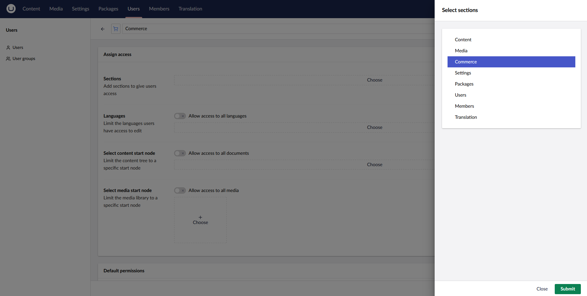
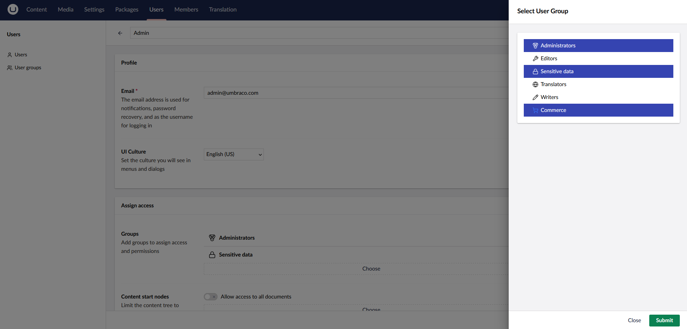

# Configuring Store Permissions

Configuring store permissions allows your to control who can access the store's management interface. 

The setup of store permissions is split into two parts:

1. Allow access to the `Commerce` section
2. Allow access to manage a store

## Allow Access to the Commerce Section

Store management is done through the `Commerce` section in the backoffice. To allow access to this section, you need to either create or update a user group and assign access to the `Commerce` section to it.

1. Navigate to the **Users** section of the backoffice
2. Create a new user group or edit an existing one
3. In the **Allowed Sections** property, select the `Commerce` section

4. Click **Save** to save the changes to the user group

### Assign Users to the User Group

After creating the user group, you can assign users to it to allow them access to the `Commerce` section.

1. Navigate to the **Users** section of the backoffice
2. Edit the user you want to assign to the user group
3. In the **Groups** property, select the user group you created earlier

4. Click **Save** to save the changes to the user

After assigning the user to the user group, they will have access to the `Commerce` section in the backoffice.

At this point however, whilst your user has access to the commerce section, they will not yet be able to manage any stores and so a message is displayed guiding you of the next steps. To manage a store, you need to [allow access to manage a store](#allow-access-to-manage-a-store).

## Allow Access to Manage a Store

To allow a user to manage a store, you need to assign store permissions from the stores settings.

1. Navigate to the **Settings** section of the backoffice
2. In the **Stores** area of the navigation, select the store you want to assign permissions to
3. In the store editor, click the **Permissions** tab

4. In the **User Roles** property, select the user group you created earlier
5. Click **Save** to save the changes to the store

After assigning the user group to the store, if we now open the `Commerce` section in the backoffice, users in that group will have access to manage the store.

