# Checkout Flow

Current section showcases the process of setting up a checkout flow for your store using the package `Umbraco.Commerce.Checkout`. You can read more about this in [this](https://docs.umbraco.com/umbraco-commerce-packages/checkout/installation) section of the official documentation.

You can of course implement your own custom checkout flow, for this direction [`Umbraco Commerce DemoStore`](https://github.com/umbraco/Umbraco.Commerce.DemoStore) can be the perfect starting point.

Upon installation, a new workspace called `Umbraco Commerce Checkout` will be available in the `Settings` section.

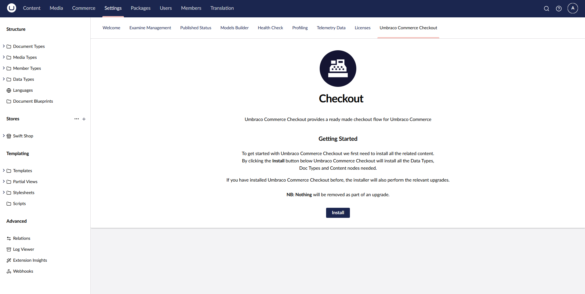

Once you have specified the root node for the checkout pages to be installed, you will get a confirmation message,

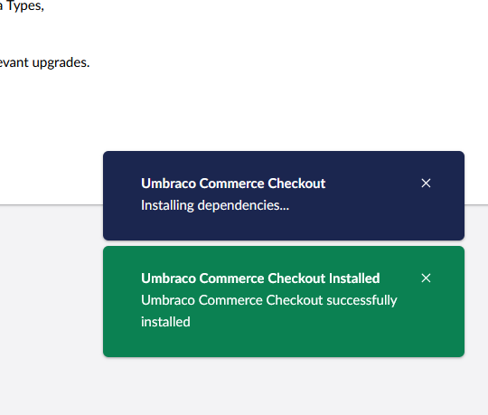

then the checkout pages will be added to your shop:

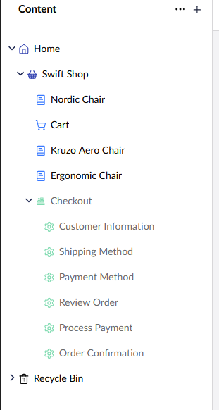

Once the checkout page properties have been set to your requirements, we can publish it with its descendants.

Each of the six checkout steps comes with two settings, one for adding a short name and the other to specify the type.

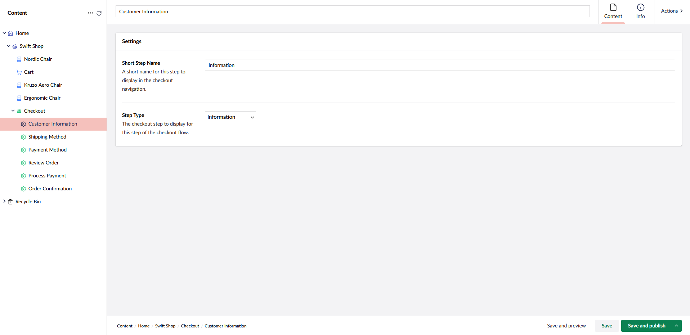

## Proceeding to Checkout

On the cart page, when selecting to proceed to checkout, you will be redirected to the checkout wizard.

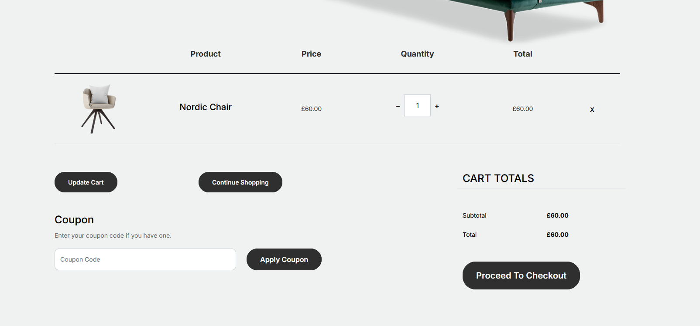

Here are the steps that you'll need to cover:

* Customer Information

Fill out customer details, billing and shipping addresses.

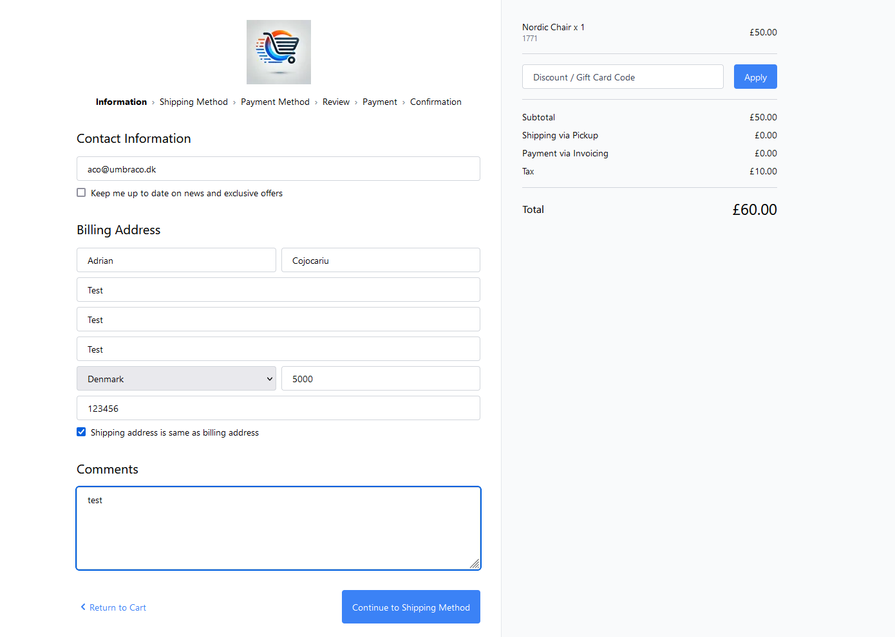

* Shipping Method

Select a shipping method.

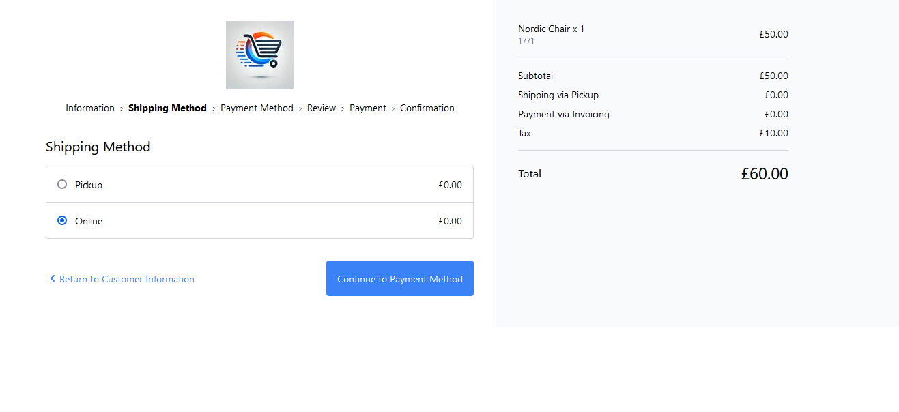

* Payment Method

Select a payment method.

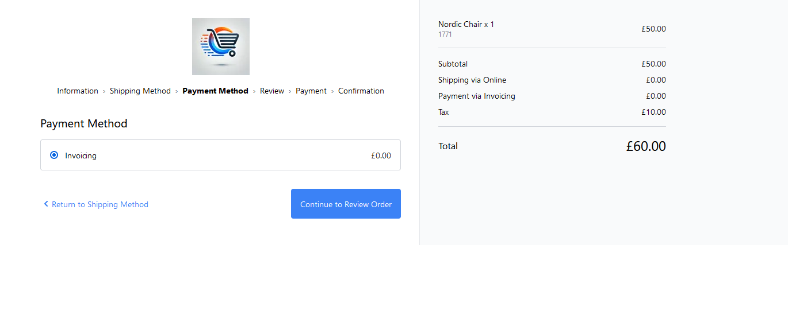

* Review Order Details

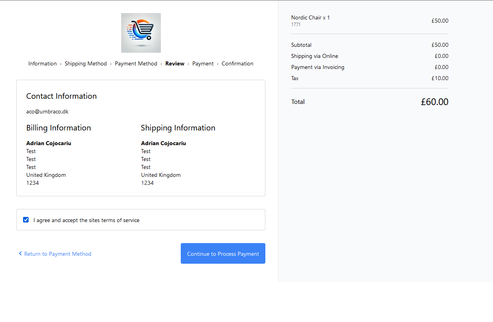

* Payment

During this step, you might encounter an error like this

``Value cannot be null. (Parameter 'context.Settings.ContinueUrl')``

The message is self explanatory, translating into a missing value for the `Continue Url` on the selected payment method.

To address this, go ahead and copy the URL to the checkout order confirmation page and paste it in the `Continue URL` field of the payment method.

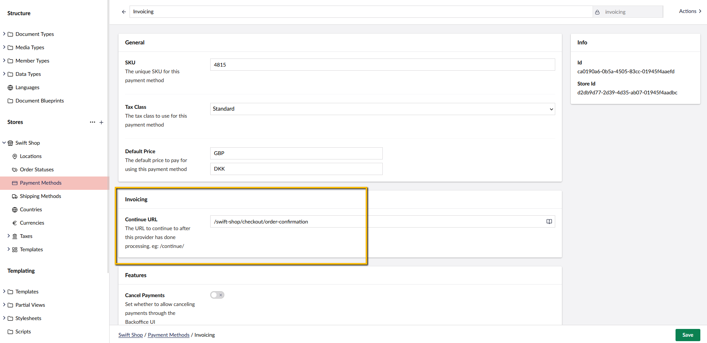

* Confirmation

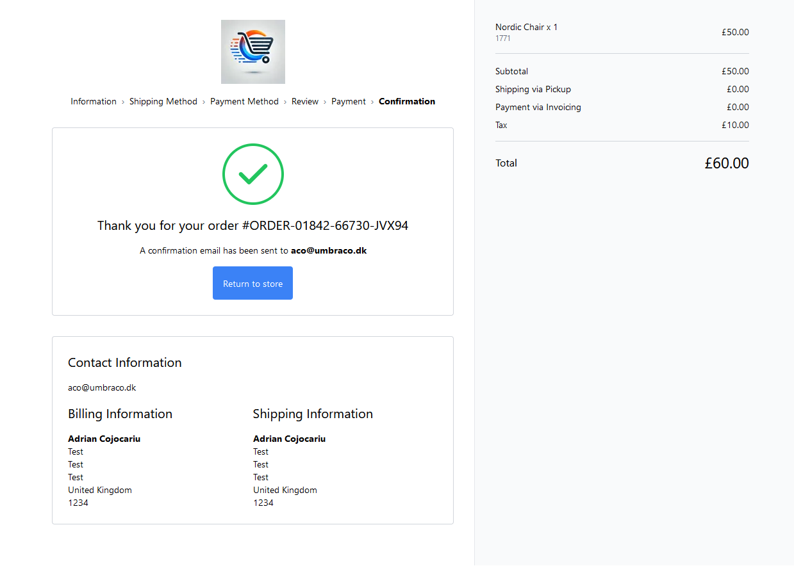

The order will then be saved and available in the Backoffice:

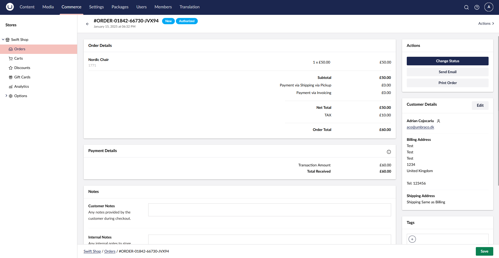

You can change the status, send an email confirmation, edit customer details or add notes to the order.
