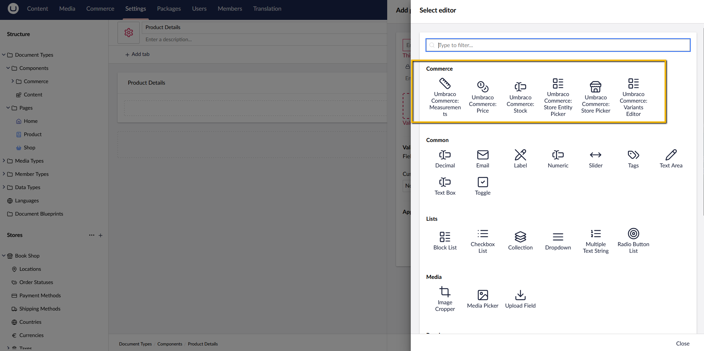

# Create Product

A product would be represented through a Backoffice document type with properties using the existing Commerce property editors.

The fields `Sku` and `Price`, with their corresponding aliases, respectively `sku` and `price` are mandatory.

