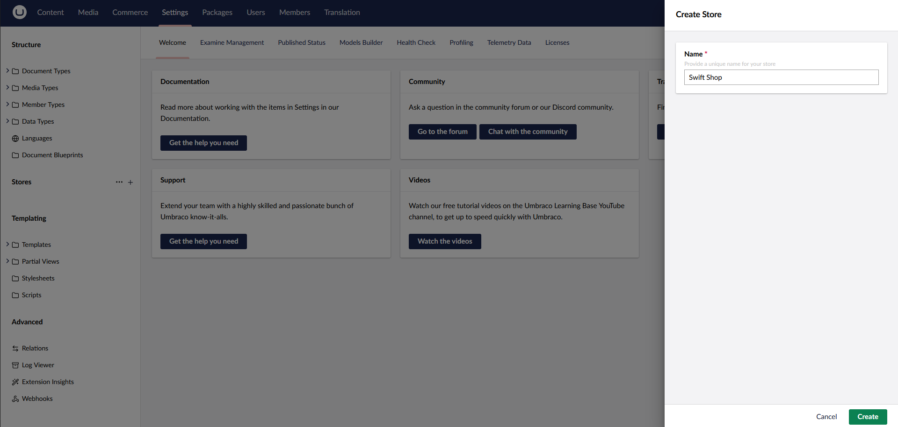
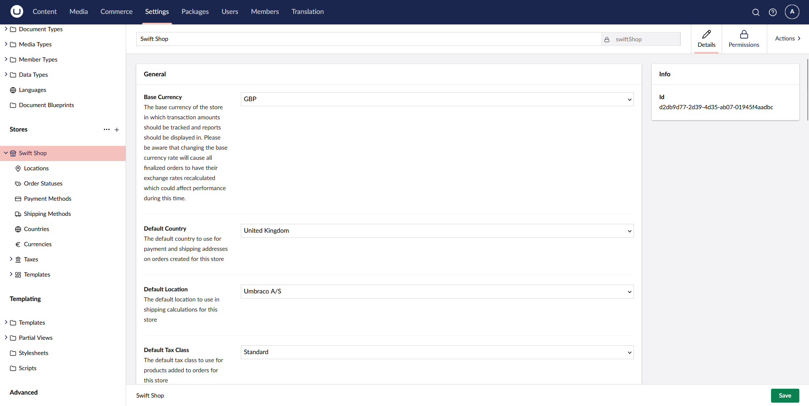
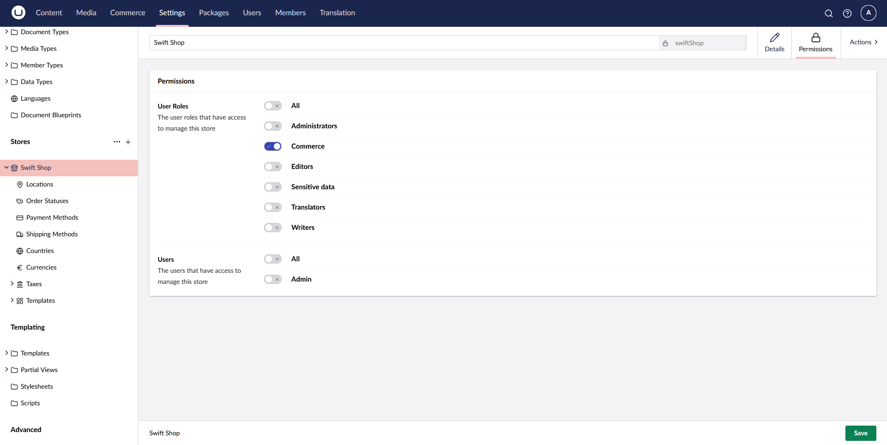
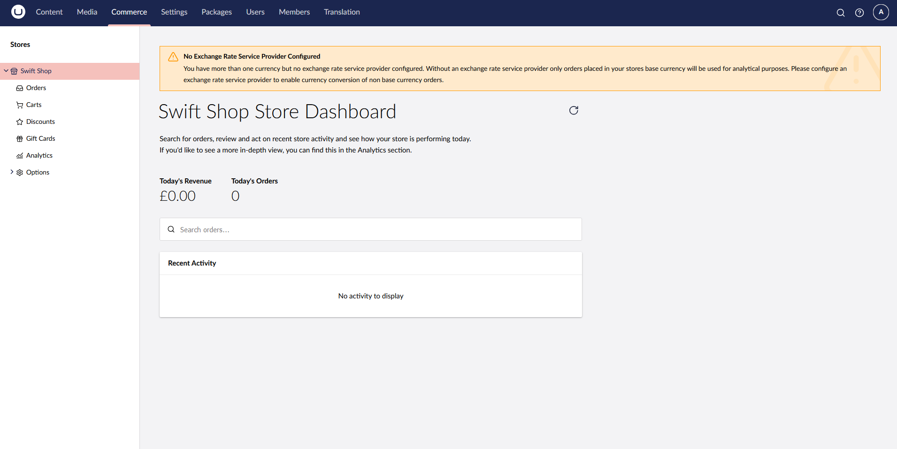
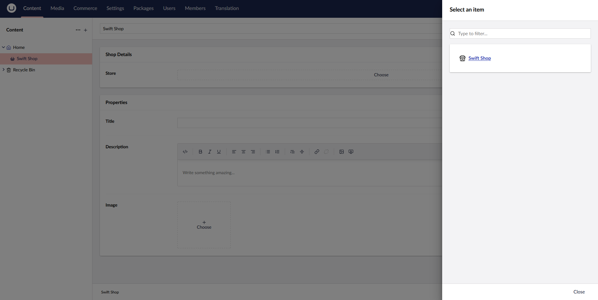

# Create Store

To proceed with the creation of your first store, you would need to
* Pick an unique store name

* Define the custom properties of your store or leave them as default

Each store comes with a set of predefined configurations that you can extend, covering:
* Locations
* Order Statuses
* Payment Methods
* Shipping Methods
* Countries
* Currencies
* Taxes
* Templates

From the permissions tab of the store, you can set permissions to our **Commerce** user group.

In the prelimary phases of setting up a store, one might choose to define additional currencies, resulting in Commerce displaying a currency exchange rate warning:

This can be addressed by registering a currency rate exchange service as detailed in the [docs](https://docs.umbraco.com/umbraco-commerce/key-concepts/currency-exchange-rate-service-providers). You can either choose between existing ones or bring your own.

### Content Configuration

Part of a correct store configuration is to ensure that the root content node of the store has a reference to the defined shop. To do so, a reference to the `Store Picker Property Editor` that comes with the package is required.

An important aspect to keep in mind is that the alias of the property editor needs to be `store`.

Then in our shop's content node we can select our defined store.

