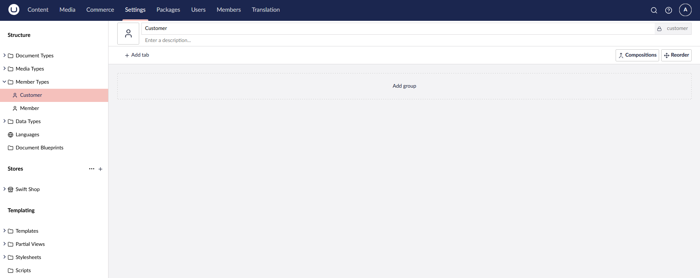

# Authentication

In this section we will detail the steps required to enable users to join the platform and access the restricted customer portal.

First we will be adding a new member type called `Customer`, which will group the clients of our shop.




## Member Login

Through the use of Umbraco's `Umbraco.Cms.Web.Website.Controllers.UmbLoginController`, upon form submission, an instance of `Umbraco.Cms.Web.Website.Models.LoginModel` will be sent to the `HandleLogin` action of the controller.

The action will take care of the authentication process, manage form fields validation and user redirect to the page specified with the `RedirectUrl` route value.

````csharp
@using (Html.BeginUmbracoForm<UmbLoginController>("HandleLogin",
    new { RedirectUrl = customerPortalPage?.Url() }))
{
    <div asp-validation-summary="ModelOnly" class="text-danger"></div>
    <div class="form-group">
        <label class="text-black" asp-for="@loginModel.Username">Username</label>
        <input asp-for="@loginModel.Username" class="form-control" />
        <span asp-validation-for="@loginModel.Username" class="text-danger"></span>
    </div>
    <div class="form-group">
        <label class="text-black" asp-for="@loginModel.Password">Password</label>
        <input asp-for="@loginModel.Password" class="form-control" />
        <span asp-validation-for="@loginModel.Password" class="text-danger"></span>
    </div>
    <div class="form-group">
        <label class="text-black">
            <input asp-for="@loginModel.RememberMe" /> Remember me
        </label>
    </div>
    <div class="text-center">
        <button type="submit" class="btn btn-primary-hover-outline">Login</button>
        &nbsp;&nbsp;&nbsp;
        <a href="@registerMemberPage?.Url()">register</a>
    </div>
}
````

## Member Register

To register as a `Customer` member type, we will be using the `Umbraco.Cms.Web.Website.Controllers.UmbRegisterController`, and ensure that we send to the `HandleRegisterMember` action the values for `RedirectUrl`, `MemberTypeAlias` (set to the `customer` alias).

The action will take care of the authentication process, manage form fields validation and user redirect to the page specified with the `RedirectUrl` route value.

````csharp
@using (Html.BeginUmbracoForm<UmbRegisterController>("HandleRegisterMember",
    new { RedirectUrl = customerPortalPage?.Url(), MemberTypeAlias = "customer", UsernameIsEmail = true }))
{
    <div asp-validation-summary="ModelOnly" class="text-danger"></div>
    <div class="form-group">
        <label class="text-black" asp-for="@registerModel.Name">Name</label>
        <input asp-for="@registerModel.Name" class="form-control"/>
        <span asp-validation-for="@registerModel.Name" class="text-danger"></span>
    </div>
    <div class="form-group">
        <label class="text-black" asp-for="@registerModel.Email">Email</label>
        <input asp-for="@registerModel.Email" class="form-control" />
        <span asp-validation-for="@registerModel.Email" class="text-danger"></span>
    </div>
    <div class="form-group">
        <label class="text-black" for="email">Password</label>
        <input asp-for="@registerModel.Password" class="form-control" />
        <span asp-validation-for="@registerModel.Password" class="text-danger"></span>
    </div>
    <div class="form-group mb-5">
        <label class="text-black" for="email">Confirm Password</label>
        <input asp-for="@registerModel.ConfirmPassword" class="form-control" />
        <span asp-validation-for="@registerModel.ConfirmPassword" class="text-danger"></span>
    </div>
    <div class="text-center">
        <button type="submit" class="btn btn-primary-hover-outline">Register</button>
    </div>
}
````
