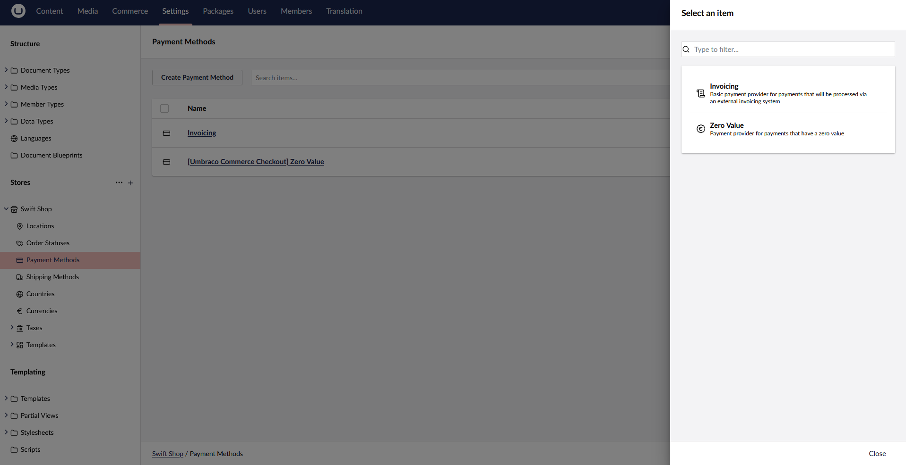

# Payment Providers

If you try adding a new payment method, you will notice that the only options available are `Invoicing` and `Zero Value`.

To include an additional payment method, you will need to install a supported payment provider, by installing one of the [supported](https://docs.umbraco.com/umbraco-commerce-payment-providers) packages.

Each package has detailed documentation to help you get started.

