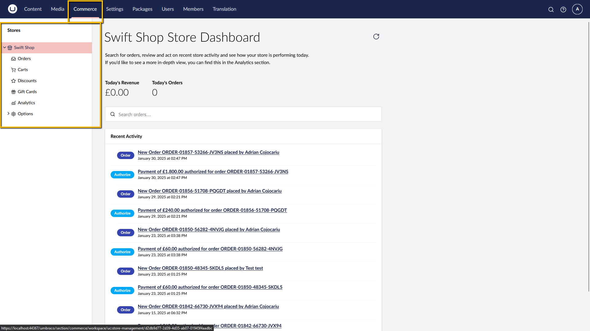

# Permissions

In working with Commerce, a good idea would be to separate the roles for people interacting with the Commerce section.

This would mainly be carried out by a store owner controlling who can access the store's management interface.

To do so, create a new user group under `Users > User groups` and assign to it the `Commerce` section.

After assigning the newly created group to the designated users,

the `Commerce` and `Stores` areas will be available.

To read more about setting permissions at a store level, you can check [this](https://docs.umbraco.com/umbraco-commerce/tutorials/getting-started-with-commerce#accessing-store-permissions-in-umbraco-commerce) section of the Umbraco Commerce documentation.
