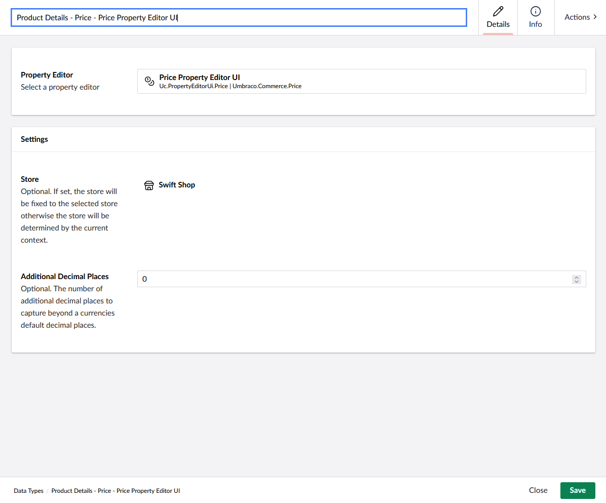
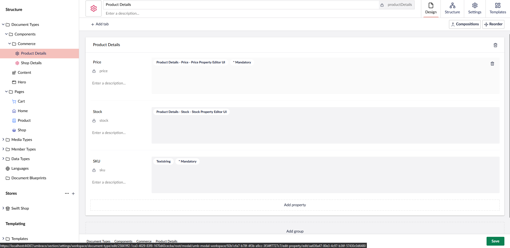
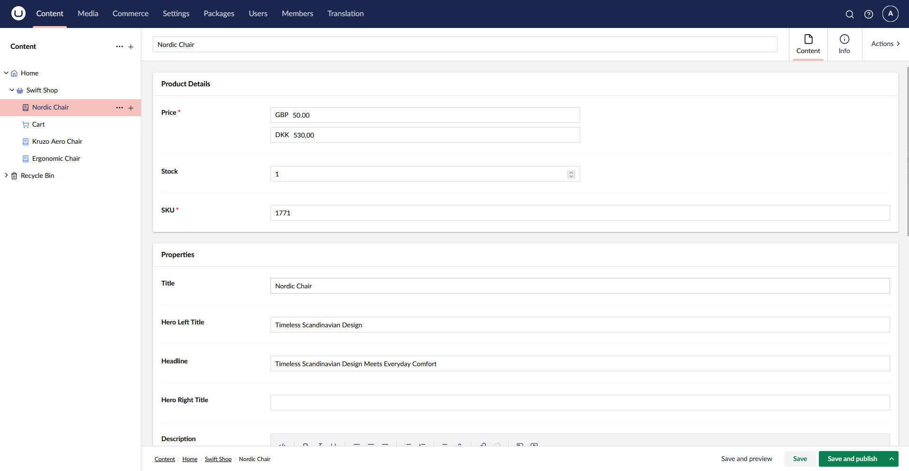
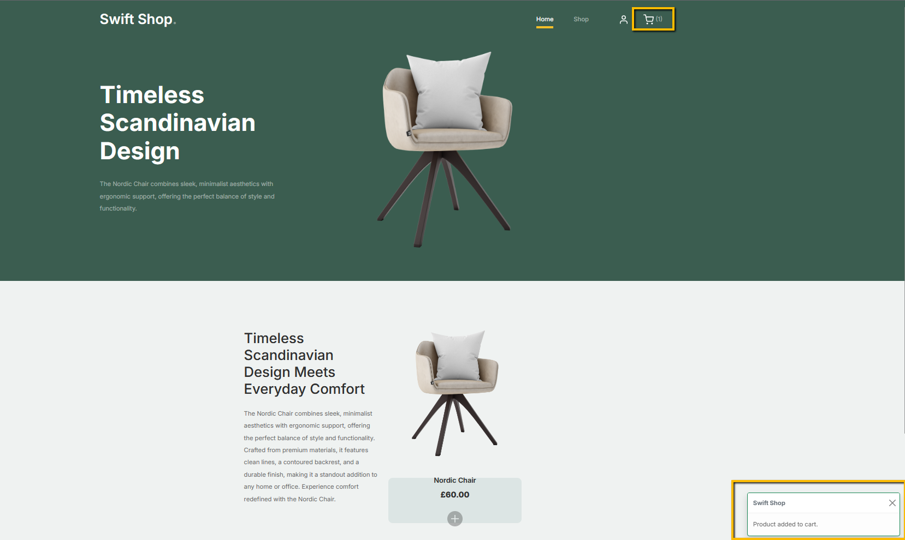

# Add to Cart

Let's consider a simple product definition with the Commerce properties **Price**, **Stock** and **SKU**. **Price** and **Stock** property editors are connected to our shop.


Component definition would be:



Our product page will inherit the details of the product component and include additional properties for the page's content.



Resulting in the following frontend page:


## Implementation

The HTML markup for our product will consist of an Umbraco form that calls an action for a `SurfaceController`, passing in the body `POST` request details about the product reference and the quantity that is added to the cart.

````csharp
<div class="col-12 col-md-4 col-lg-3 mb-5 mb-md-0">
    @using (Html.BeginUmbracoForm("AddToCart", "Cart"))
    {
        @Html.Hidden("productReference", Model.GetProductReference())
        @Html.Hidden("quantity", 1)

        <a class="product-item" onclick="document.forms[0].submit()">
            
            <h3 class="product-title">@Model.Title</h3>
            <strong class="product-price">@(await Model.GetFormattedPriceAsync())</strong>

            <span class="icon-cross">
                
            </span>
        </a>
    }
</div>
````

The `POST` request will be handled by the `AddToCart` action of our `CartController` surface controller.

````csharp
[HttpPost]
public async Task<IActionResult> AddToCart(AddToCartDto postModel)
{
    try
    {
        await _commerceApi.Uow.ExecuteAsync(async uow =>
        {
            var store = CurrentPage.GetStore();
            var order = await _commerceApi.GetOrCreateCurrentOrderAsync(store.Id)
                .AsWritableAsync(uow)
                .AddProductAsync(postModel.ProductReference, decimal.Parse(postModel.Quantity));
            await _commerceApi.SaveOrderAsync(order);

            uow.Complete();
        });
    }
    catch (ValidationException ex)
    {
        ModelState.AddModelError("productReference", "Failed to add product to cart");
        return CurrentUmbracoPage();
    }

    TempData["addedProductReference"] = postModel.ProductReference;

    return RedirectToCurrentUmbracoPage();
}
````

This action will use the [Unit of Work](https://docs.umbraco.com/umbraco-commerce/key-concepts/unit-of-work) pattern from Commerce, exposed through the `IUmbracoCommerceApi` interface to update the current order of the current store with the specified quantity from the request DTO.

````csharp
public class AddToCartDto
{
    public string ProductReference { get; set; }

    public string Quantity { get; set; }
}
````

`GetOrCreateCurrentOrderAsync` method will either retrieve the current order (if one exists) or create a new one.

On operation completed successfully, a toast message will be prompted and the cart details will be updated.



Total cart quantity is managed through a view component that displays a simple counter near the shopping cart icon.

````csharp
[ViewComponent]
public class CartCountViewComponent : ViewComponent
{
    public async Task<IViewComponentResult> InvokeAsync(IPublishedContent currentPage)
    {
        var store = currentPage.GetStore();
        var order = await currentPage.GetCurrentOrderAsync();

        return View("CartCount", (int)(order?.TotalQuantity ?? 0));
    }
}
````

The partial view used to display a `Bootstrap` `Toast` notification looks like this:

````csharp
@model Umbraco.Commerce.SwiftShop.ViewModels.ToastViewModel

<div class="position-fixed bottom-0 end-0 p-3" style="z-index: 11">
    <div id="swiftToast" class="toast border @Model.Type" role="alert" aria-live="assertive" aria-atomic="true">
        <div class="toast-header">
            <strong class="me-auto">Swift Shop</strong>
            <button type="button" class="btn-close" data-bs-dismiss="toast" aria-label="Close"></button>
        </div>
        <div class="toast-body">
            @Model.Text
        </div>
    </div>
</div>

<script type="text/javascript">
    document.addEventListener('DOMContentLoaded', () => {
        var swiftToastEl = document.getElementById("swiftToast");
        var toast = new window.bootstrap.Toast(swiftToastEl);
        toast.show();
    });
</script>
````

And it is referenced like this:

````csharp
@if (TempData["addedProductReference"] != null)
{
    @(
        await Html.PartialAsync("Toast", new Umbraco.Commerce.SwiftShop.ViewModels.ToastViewModel
        {
            Text = $"Product added to cart.",
            Type = "border-success"
        })
    )
}
````
