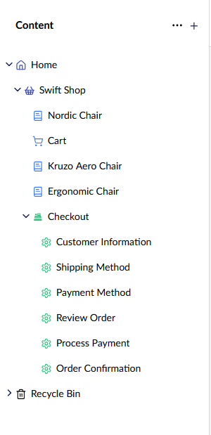

# Extension Methods

Before going into cart specific features, because we are working with published content items representing the store and products, we would need a couple of extension methods to enable us to retrieve specific details.

The structure of the store's content tree for which we are defining the extension methods has the following structure:



These will reside in a static extensions class:

````csharp
public static class PublishedContentExtensions
{
    ...
}
````

## Store Extensions

### **GetStore(this IPublishedContent content)**

Gets a readonly store reference based on the product content item.

````csharp
 public static StoreReadOnly? GetStore(this IPublishedContent content)
 {
     var shop = content.Descendant<Shop>();
     if (shop == null)
     {
         shop = content.AncestorOrSelf<Shop>();
     }

     return shop?.Store;
 }
````

### **GetStorePage(this IPublishedContent content)**

Gets the store's content page.

````csharp
public static Shop? GetStorePage(this IPublishedContent content)
{
    var shop = content.Descendant<Shop>();
    if (shop == null)
    {
        shop = content.AncestorOrSelf<Shop>();
    }
    return shop;
}
````

## Product Extensions

### **GetProductReference(this IPublishedContent content)**

Gets the GUID reference to the current product content item.

````csharp
public static string GetProductReference(this IPublishedContent content) => content.Key.ToString();
````

### **AsProductAsync(this IPublishedContent content)**

Gets a Commerce product snapshot of the product content item.

````csharp
public static async Task<IProductSnapshot?> AsProductAsync(this IPublishedContent content)
{
    var store = content.GetStore();
    if (store == null)
    {
        return null;
    }

    return await UmbracoCommerceApi.Instance.GetProductAsync(
        store.Id,
        content.GetProductReference(),
        Thread.CurrentThread.CurrentCulture.Name);
}
````

### **CalculatePriceAsync(this IPublishedContent content)**

Displays the price for a product content item.

````csharp
public static async Task<Price?> CalculatePriceAsync(this IPublishedContent content)
{
    var product = await content.AsProductAsync();
    var calculatePriceAttempt = await product.TryCalculatePriceAsync();
    if (calculatePriceAttempt.Success)
    {
        return calculatePriceAttempt.Result!;
    }

    return null;
}
````

### **GetFormattedPriceAsync(this IPublishedContent content)**

Returns a currency formatted price for a product content item.

````csharp
public static async Task<FormattedPrice?> GetFormattedPriceAsync(this IPublishedContent content)
{
    var price = await content.CalculatePriceAsync();
    if (price == null)
    {
        return null;
    }

    var formattedPrice = await price.FormattedAsync();
    return formattedPrice;
}
````

