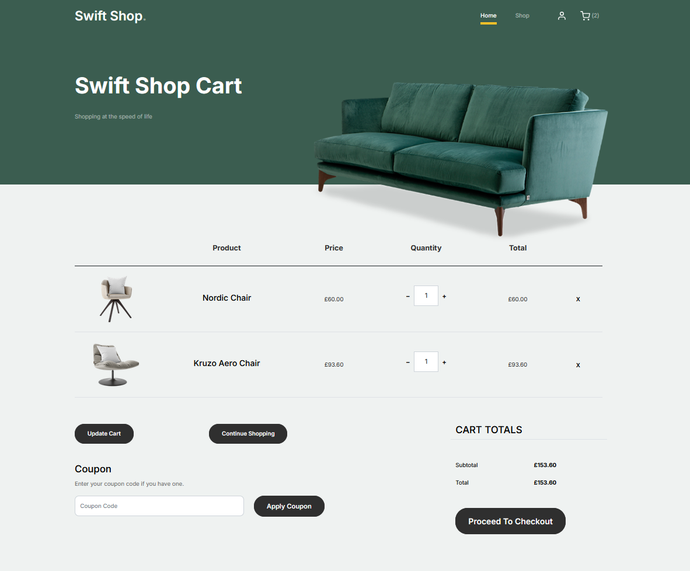
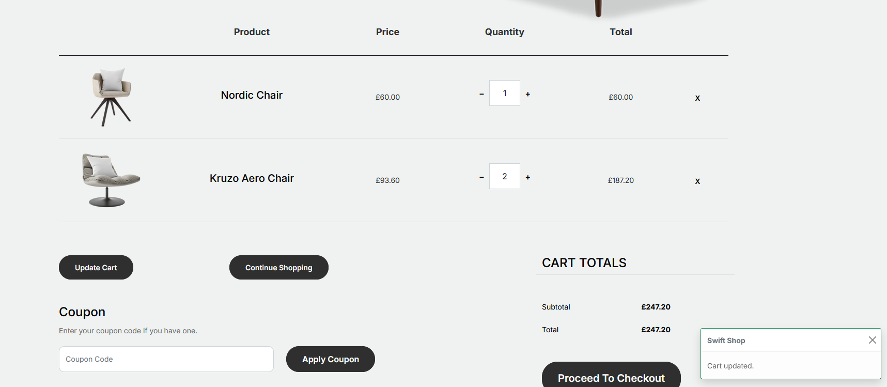
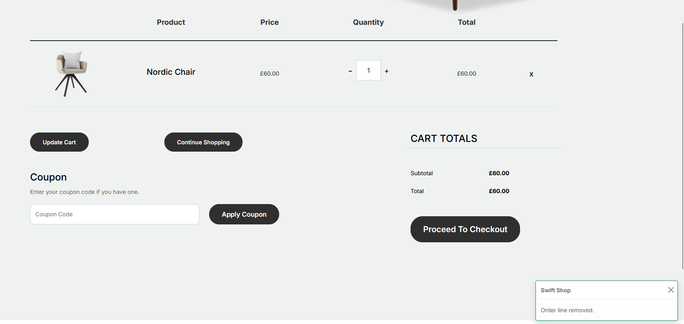

# Manage Cart

Our cart page will be fairly simple, managing page content areas, and displaying our current order's cart products.



We will retrieve the current cart using the extension method previously created.

````csharp
var order = await Model.GetCurrentOrderAsync();
````

The HTML for cart management will look like this:

````csharp
<div class="container">
    @if (Model != null && order != null && order.OrderLines.Count > 0)
    {
        using (Html.BeginUmbracoForm("UpdateCart", "Cart"))
        {
            <div class="row mb-5">
                <div class="site-blocks-table">
                    <table class="table">
                        <thead>
                            <tr>
                                <th class="product-thumbnail"></th>
                                <th class="product-name">Product</th>
                                <th class="product-price">Price</th>
                                <th class="product-quantity">Quantity</th>
                                <th class="product-total">Total</th>
                                <th class="product-remove"></th>
                            </tr>
                        </thead>
                        <tbody>
                            @foreach (var orderLine in order.OrderLines)
                            {
                                var index = order.OrderLines.IndexOf(orderLine);
                                @Html.Hidden($"orderLines[{index}].Id", orderLine.Id)
                                var product = Umbraco.Content(Guid.Parse(orderLine.ProductReference));

                                if (product != null)
                                {
                                    var image = product.Value<IPublishedContent>(nameof(Product.Image));

                                    <tr>
                                        <td class="product-thumbnail">
                                            
                                        </td>
                                        <td class="product-name">
                                            <h2 class="h5 text-black">@product.Name()</h2>
                                        </td>
                                        <td>@(await orderLine.UnitPrice.Value.FormattedAsync())</td>
                                        <td>
                                            <div class="input-group mb-3 d-flex align-items-center quantity-container"
                                            style="max-width: 120px; margin: auto;">
                                                <div class="input-group-prepend">
                                                    <button class="btn btn-outline-black decrease" type="button">&minus;</button>
                                                </div>
                                                @Html.TextBox($"orderLines[{index}].Quantity", (int)orderLine.Quantity,
                                                                  new { @class = "form-control text-center quantity-amount" })
                                                <div class="input-group-append">
                                                    <button class="btn btn-outline-black increase" type="button">&plus;</button>
                                                </div>
                                            </div>

                                        </td>
                                        <td>@(await orderLine.TotalPrice.Value.FormattedAsync())</td>
                                        <td>
                                            <a href="@Url.SurfaceAction("RemoveFromCart", "Cart", new { OrderLineId = orderLine.Id })"
                                            rel="tooltip" class="btn btn-black btn-sm">X</a>
                                        </td>
                                    </tr>
                                }

                            }

                        </tbody>
                    </table>
                </div>

            </div>

            <div class="row">
                <div class="col-md-6">
                    <div class="row mb-5">
                        <div class="col-md-6 mb-3 mb-md-0">
                            <button type="submit" class="btn btn-black btn-sm btn-block">Update Cart</button>
                        </div>
                        <div class="col-md-6">
                            <button class="btn btn-outline-black btn-sm btn-block"
                                    onclick="window.location='/swift-shop/shop'">
                                Continue Shopping
                            </button>
                        </div>
                    </div>
                    <div class="row">
                        <div class="col-md-12">
                            <label class="text-black h4" for="coupon">Coupon</label>
                            <p>Enter your coupon code if you have one.</p>
                        </div>
                        <div class="col-md-8 mb-3 mb-md-0">
                            <input type="text" class="form-control py-3" id="coupon" placeholder="Coupon Code">
                        </div>
                        <div class="col-md-4">
                            <button class="btn btn-black">Apply Coupon</button>
                        </div>
                    </div>
                </div>
                <div class="col-md-6 pl-5">
                    <div class="row justify-content-end">
                        <div class="col-md-7">
                            <div class="row">
                                <div class="col-md-12 text-right border-bottom mb-5">
                                    <h3 class="text-black h4 text-uppercase">Cart Totals</h3>
                                </div>
                            </div>
                            <div class="row mb-3">
                                <div class="col-md-6">
                                    <span class="text-black">Subtotal</span>
                                </div>
                                <div class="col-md-6 text-right">
                                    <strong class="text-black">@(await order.SubtotalPrice.Value.FormattedAsync())</strong>
                                </div>
                            </div>
                            <div class="row mb-5">
                                <div class="col-md-6">
                                    <span class="text-black">Total</span>
                                </div>
                                <div class="col-md-6 text-right">
                                    <strong class="text-black">@(await order.TotalPrice.Value.FormattedAsync())</strong>
                                </div>
                            </div>

                            <div class="row">
                                <div class="col-md-12">
                                    <button class="btn btn-black btn-lg py-3 btn-block" onclick="window.location='/swift-shop/checkout'">Proceed To Checkout</button>
                                </div>
                            </div>
                        </div>
                    </div>
                </div>
            </div>
        }
    }
    else
    {
        <div class="row">
            <div class="col-md-12 text-center pt-5">
              <h2 class="display-3 text-black">Your cart is empty.</h2>
              <p><a href="/swift-shop/shop" class="btn btn-sm btn-outline-black">Back to shop</a></p>
            </div>
        </div>
    }
</div>
````

The two actions for updating and removing items from cart are detailed below, assuming the cart surface controller detailed [here](./add-to-cart.md) has been already added.

### Update Cart

The update cart action processes the order lines from the `POST` request and updates them in the current order with the matching quantities.

````csharp
[HttpPost]
public async Task<IActionResult> UpdateCart(UpdateCartDto updateCartDto)
{
    try
    {
        await _commerceApi.Uow.ExecuteAsync(async uow =>
        {
            var store = CurrentPage.GetStore();
            var order = await _commerceApi.GetOrCreateCurrentOrderAsync(store.Id)
                .AsWritableAsync(uow);

            foreach (var orderLine in updateCartDto.OrderLines)
            {
                await order.WithOrderLine(orderLine.Id).SetQuantityAsync(orderLine.Quantity);
            }

            await _commerceApi.SaveOrderAsync(order);

            uow.Complete();
        });
    }
    catch (ValidationException ex)
    {
        ModelState.AddModelError("productReference", "Failed to update cart");
        return CurrentUmbracoPage();
    }

    TempData["cartUpdated"] = true;

    return RedirectToCurrentUmbracoPage();
}
````

````csharp
public class UpdateCartDto
{
    public OrderLineQuantityDto[] OrderLines { get; set; }
}

public class OrderLineQuantityDto
{
    public Guid Id { get; set; }

    public decimal Quantity { get; set; }
}
````

### Remove from Cart

Cart removal functionality will be handled through a `GET` request to the cart surface controller.

````csharp
[HttpGet]
public async Task<IActionResult> RemoveFromCart(RemoveFromCartDto removeFromCartDto)
{
    try
    {
        await _commerceApi.Uow.ExecuteAsync(async uow =>
        {
            var store = CurrentPage.GetStore();
            var order = await _commerceApi.GetOrCreateCurrentOrderAsync(store.Id)
                .AsWritableAsync(uow)
                .RemoveOrderLineAsync(removeFromCartDto.OrderLineId);

            await _commerceApi.SaveOrderAsync(order);

            uow.Complete();
        });
    }
    catch (ValidationException ex)
    {
        ModelState.AddModelError("productReference", "Failed to remove item from cart");
        return CurrentUmbracoPage();
    }

    TempData["itemRemovedFromCart"] = true;

    return RedirectToCurrentUmbracoPage();
}
````

We will pass with the request an id of the order line.

````charp
public class RemoveFromCartDto
{
    public Guid OrderLineId { get; set; }
}
````

Successful results of our actions will be notified through toast notifications.




