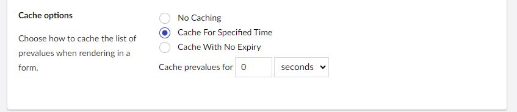
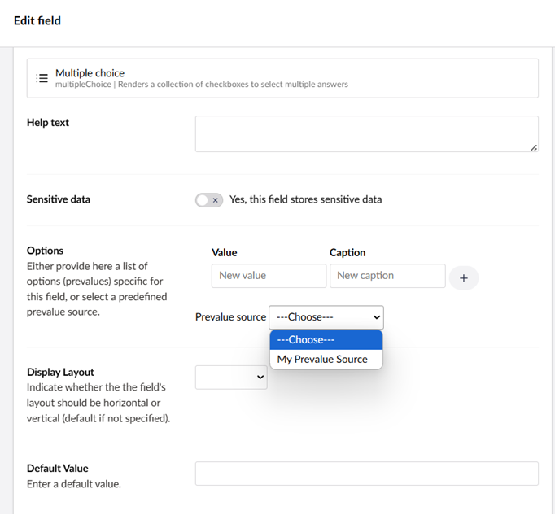

# Defining And Attaching Prevalue Sources

Prevalue sources are a way to pre-define and/or retrieve a list of items from a certain source. They can be added in any field types that include some kind of list like Dropdown and Multiple/Single Choice lists.

## Setting up a Prevalue Source

Prevalue sources can be managed in the **Prevalue sources** folder available in the **Forms** section.


To set a prevalue source:

1. Go to the **Forms** section.
2. Click **...** next to the **Prevalue Sources** folder.
3. Click **Create**.
4. The **Choose prevalue source type** pane opens in the right-side of the editor.
5. Select the type of prevalue source. For more information on the different default types, see the [Overview of the Prevalue Source Types](prevalue-source-types.md) article.

    

### Configuring the Prevalue Source

Depending on the **prevalue source type** you choose, you'll need to provide some additional settings. For this article, we will select **Get values from textfile**.

1. Select **Get values from textfile** from the **Choose prevalue source type** pane.
    

2. Enter a Name for the prevalue source type. Let's call it *My Prevalue Source*.
3. Now, create a file containing the list to use as prevalues. For example: a `.txt` file containing the following values:

    ```cs
    example value 1
    example value 2
    example value 3
    example value 4
    example value 5
    ```

4. Select **Click to upload** in the **Text File**.
5. Choose the text file you created. Click **Open**.
6. Select your preferred **Cache option** for caching the list of prevalues when rendering in a form.
7. Click **Save**.

    

If you would like to have different values presented to your users from the value stored, you can provide two values per line, separated with a vertical bar (|), e.g.:

```
1|example value 1
2|example value 2
3|example value 3
4|example value 4
5|example value 5
```

In this case the user would pick from a list showing the captions, but the single integer values would be stored with the record.

This can be useful if the recorded entries are used in any subsequent workflows or business processes, where particular values, that aren't appropriate for the user to select from, are required.

### Defining Cache Options for the Prevalue Source

Sometimes retrieving the list of options for a prevalue source can be an expensive operation. If the source depends on data from external systems, it could be that the list changes regularly or rarely.

Given the variation here, we allow you to select an appropriate level of caching for the list of options.

You can choose between:

- `No Caching` - no caching will be applied and the list of options will be retrieved from source on every request. You will likely only want to choose this option if the information changes frequently and it's important that the latest is presented to website visitors.
- `Cache For Specified Time` - the list will be cached for the period of time provided.
- `Cache With No Expiry` - the list will be cached on first request and not retrieved again until either the prevalue source is edited or the website is restarted. This ismost appropriate to use for information held within the prevalue source data itself (such as  when uploading a text file).



## Attaching a Prevalue Source to a Field

Once a prevalue source has been created, it can be used while building Forms in the Forms designer.

**Example:** Let's add a Multiple Choice field type in our Form.

If there is at least one prevalue source defined in the project, the Prevalues source will contain a dropdown from where you can choose the predefined value.



Once you have selected the prevalue source, the values are rendered in the Forms designer from the attached source.


