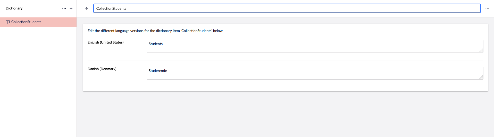
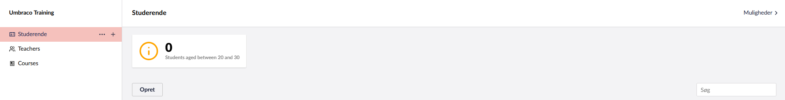
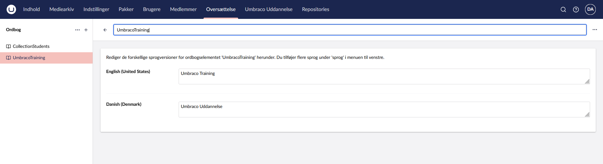

# Localization

The localization context enables developers to use multilingual collection names and descriptions in fluent configurations. It also supports translations for actions, context apps, dashboards, sections, and trees. 

To enable localization, prefix the input string with the `#` character.

Upon character identification in the fluent configuration, the localization context will attempt to lookup a matching localized string using two services available. If no matching record is found, it will default to the provided string value.

## Localization Services

The localization context uses two abstractions to provide localization options.

One is using the Umbraco translations dictionary to retrieve a value based on a provided key.

The second uses the CMS `ILocalizedTextService` to retrieve a value based on area and alias. These values are supplied in the collection's fluent configuration, separated by an underscore `_` from the localization resources.

## Example

### Localizing a Collection

For a `Students` collection, use the following fluent configuration:

```csharp
treeConfig.AddCollection<Student>(x => x.Id, "#CollectionStudents", "#CollectionStudents", "A list of students", "icon-umb-members", "icon-umb-members", collectionConfig =>
{
    ...
});
```



Alternatively, you can use the lowercase version:

```csharp
treeConfig.AddCollection<Student>(x => x.Id, "#collection_students", "#collection_students", "A list of students", "icon-umb-members", "icon-umb-members", collectionConfig =>
{
    ...
});
```

Define the translation in your localization dictionary file:
```
import type { UmbLocalizationDictionary } from "@umbraco-cms/backoffice/localization-api";

export default {
    collection: {
        students: "Studerende"
    }
    ...
}
```



### Localizing a Section
For a custom section, use the following configuration:

```csharp
.AddSection("#UmbracoTraining", sectionConfig =>
{
    ...
}
```




