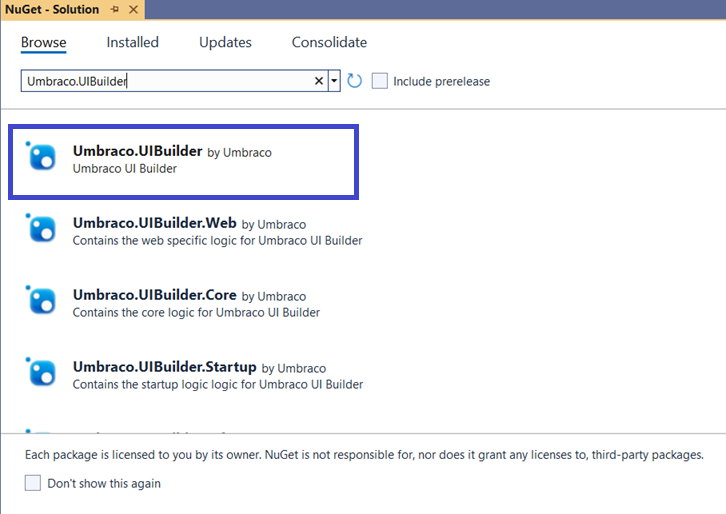

# Installation

In this article, you will learn how to install Umbraco UI Builder into your Umbraco CMS implementation.

## Install via Command Line

Run the following command in your web project:

```sh
dotnet add package Umbraco.UIBuilder
```

For a class library without UI elements, install:

```sh
dotnet add package Umbraco.UIBuilder.Startup
```

## Install via Visual Studio

To install via Visual Studio, follow these steps:

1. Open Visual Studio and load your project.
2. Go to **Tools** -> **NuGet Package Manager** -> **Manage NuGet Packages for Solution...**
3. Select the **Browse** tab and search for **Umbraco.UIBuilder**.



4. Select the appropriate version from the **Version** drop-down depending on the Umbraco version you are using.
5. Click **Install**.
6. *[Optional]* Search for and install **Umbraco.UIBuilder.Startup** if installing without UI elements.
7. Ensure that the package reference is added to the **.csproj** file once the installation is complete:

   ```cs
   <ItemGroup>
   <PackageReference Include="Umbraco.UIBuilder" Version="15.0.2" />
   </ItemGroup>
   ```

## Installing a License

For details on how to install a license, see the [Licensing](licensing-model.md#installing-your-license) article.
