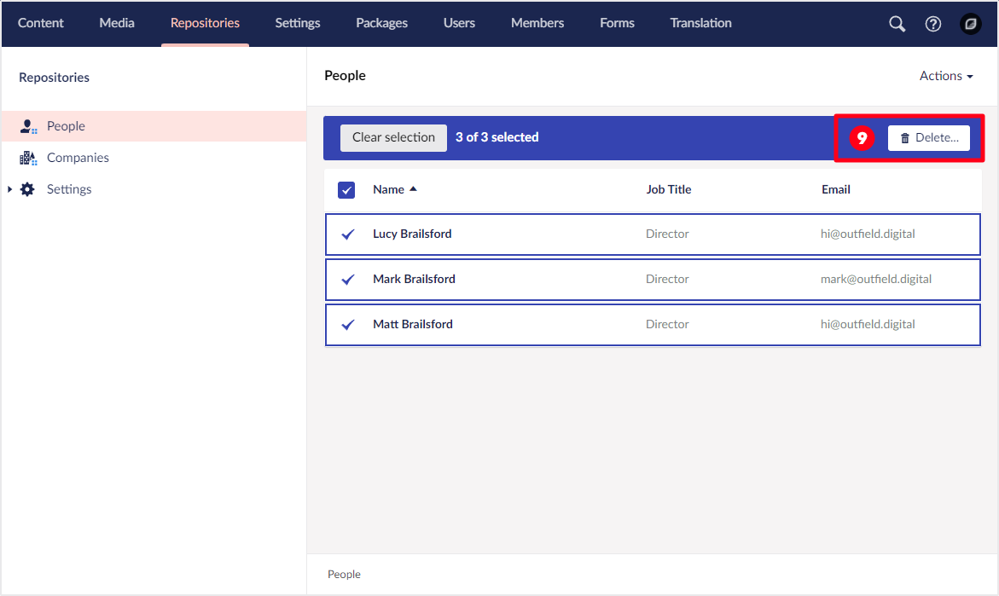

# User Interface

Before you get to know Umbraco UI Builder, you need to become familiar with the Umbraco UI and a few of its concepts. This is because Umbraco UI Builder reuses these same concepts for constructing its UI.

**1. Section** A distinct area of the Umbraco backoffice.
**2. Tree** A hierarchical structure to help organize a section.  
**3. Dashboard** An intro screen for a section, usually with useful links for that section.  

**4. List View** A list-based view of items in a tree node.

**5. Editor** The main content editing area is made up of tabs, fieldsets, and fields.

**6. Context Apps** A contextual section of a given editor UI.
**7. Tabs** A tabbed container of content.

**8. Menu Item** A context menu item + action.

**9. Bulk Action** An action to perform on multiple list view items at once.
