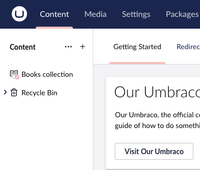
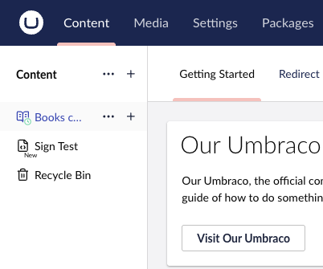

# Backoffice Signs

When trees, collections and items are presented in the backoffice, additional information can be displayed in the form of Signs.

A Backoffice sign is a client-side extension point that determines how each sign is displayed in the backoffice.

A Sign can utilize conditions in the same way as other Extensions or it can be bound to a Flag coming from the Management API.

For example, a Document scheduled for future publishing will have a Flag defined as part of trees, collections and item response:

```json
  "flags": [
    {
      "alias": "Umb.ScheduledForPublish"
    }
  ],
```

A Flag can be the determinant for a Sign by declaring the `forEntityFlags` as part of its Manifest.

Example:

```json
...
forEntityFlags: "Umb.ScheduledForPublish",
...
```

Using this binding lets the server determine which signs are present in the response via the registered collection of [flag providers](../extending/flag-providers.md).

## Displaying a Sign

To display a Sign in the backoffice, register an `entitySign` extension.

Typically, you’ll bind it to one or more flags returned in the server response using the `forEntityFlags` property. However, you can also provide your own logic to determine when a Sign should appear.

If you're using an icon variant, set kind to "icon" and provide both meta.iconName and meta.label.This ensures the user interface has the necessary visual and accessible information to render the Sign correctly.

### Example: Rendering an Entity Sign from a Server Flag

```typescript
import type { UmbExtensionManifest } from "@umbraco-cms/backoffice/extension-registry";
import { UMB_DOCUMENT_ENTITY_TYPE } from "@umbraco-cms/backoffice/document";

export const manifests: UmbExtensionManifest = {
    type: "entitySign",
    kind: "icon",
    alias: "Umb.EntitySign.Document.IsProtected",
    name: "Is Protected Document Entity Sign",
    forEntityTypes: [UMB_DOCUMENT_ENTITY_TYPE], // Where it can appear
    forEntityFlags: ["Umb.IsProtected"], // <---Binding part-When it should appear
    weight: 1000,
    meta: {
        iconName: "icon-lock", // Built-in or custom icon name
        label: "Protected", // Visible/accessible label
        iconColorAlias: "red",
    },
};
```

When an entity includes the `Umb.IsProtected` flag, this Sign appears next to it in the UI, indicating that the item is protected.



### Example: Rendering an Entity Sign with Custom Logic

The following Sign appears next to any document created within the past week. This Sign isn’t controlled by server flags.

```typescript
import type { UmbExtensionManifest } from "@umbraco-cms/backoffice/extension-registry";
import { UMB_DOCUMENT_ENTITY_TYPE } from "@umbraco-cms/backoffice/document";

export const manifests: UmbExtensionManifest = {
    type: "entitySign",
    kind: "icon",
    alias: "Umb.EntitySign.Document.RecentlyCreated",
    name: "Recently Created Document Sign",
    forEntityTypes: [UMB_DOCUMENT_ENTITY_TYPE],
    element: () => import("./recently-created-sign.element.ts"),
    meta: {
        iconName: "icon-umbraco",
        label: "Recently Created",
    },
};
```

And in `recently-created-sign.element.ts`:

```typescript
@customElement("umb-recently-created-sign")
export class UmbRecentlyCreatedSignElement extends UmbLitElement {
    @state() private _createDate?: string;

    override connectedCallback(): void {
        super.connectedCallback();
        this.consumeContext(UMB_TREE_ITEM_CONTEXT, (ctx) => {
            const item = ctx?.getTreeItem?.() ?? (ctx as any).item;
            this._createDate = item?.createDate;
            this.requestUpdate();
        });
    }

    protected override render() {
        if (!this._createDate) return null;
        const created = new Date(this._createDate);
        const weekAgo = new Date();
        weekAgo.setDate(weekAgo.getDate() - 7);
        return created > weekAgo ? html`<div>New</div>` : null;
    }
}
```




The client extension for backoffice signs are available in Umbraco 16.4.

