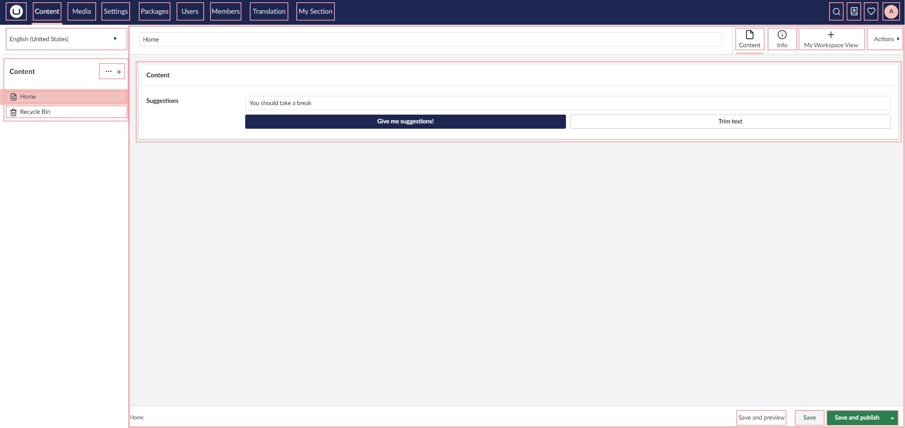

# Extension Overview

The Backoffice architecture is based on Extensions, making different parts of the UI extendable. Enabling you to append, replace, or remove parts.

<figure><figcaption></figcaption></figure>

In this section you can find the common terms, concepts and guides used to extend the Umbraco backoffice.

## [Extension Registry](extension-registry/)

How to registere extensions or manipulate others.

## [Extension Types](extension-types/)

An overview of the different ways to append funcationtlity.
