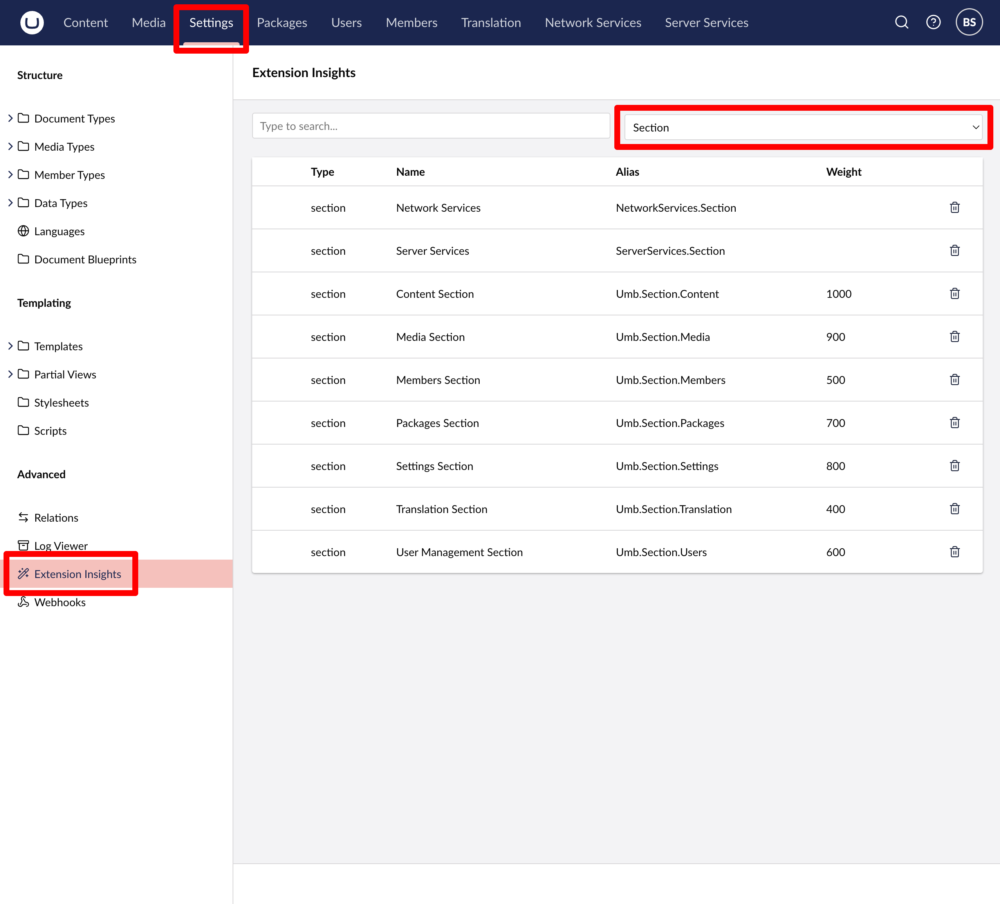

# Extension Types

## General Features

Extension Types in Umbraco allow developers to extend and customize the behavior of the backoffice. Each type provides unique functionality, such as creating custom dashboards, enhancing entity actions, or enabling localization. Learn more about the shared properties and overall structure in the [Extension Manifest](../extension-registry/extension-manifest.md) article.

## Common Extension Types

The **Umbraco backoffice** provides **Extension Types** designed to meet a variety of customization needs. These include extensions tailored for specific functionalities, as well as general-purpose extensions for broader use cases.

### [App Entry Point](app-entry-point.md)

The `App Entry Point` extension type is used to execute JavaScript when Umbraco starts up. The code will run before the user has logged in or the backoffice has initialized.

### [Backoffice Entry Point](backoffice-entry-point.md)

The `backofficeEntryPoint` extension type is used to execute JavaScript upon initialization of the backoffice. This extension type provides lifecycle hooks (startup, teardown) for extension developers to customize backoffice behavior.

### [Block Custom View](block-custom-view.md)

The `blockEditorCustomView` extension type is used to define a custom web component for representing blocks inside the Umbraco block grid property editor.

### [Bundle](bundle.md)

The `bundle` extension type is used to aggregate multiple extension manifests into a single entity, which will be registered at startup.

### [Dashboards](dashboard.md)

The `dashboard` extension type enables extension authors to create custom informational panels that can be displayed in the Umbraco backoffice. These extensions can be added to existing Umbraco sections or to a custom section.

### [Entity Actions](entity-actions.md)

The `entityAction` extension type is used to create menus for operations on an entity such as a document or media item. Built-in backoffice examples include: "Trash", "Duplicate to...", "Publish" etc.

### [Entity Bulk Actions](entity-bulk-actions.md)

The `entityBulkAction` extension type works similarly to the **Entity Actions** extension type, but performs the actions on a selection of entities from a collection.

### [Entity Create Option Action](entity-create-option-action.md)

The `entityCreateOptionAction` extension type is used to provide custom entity creation actions via a dedicated modal interface.

### [Extension Conditions](condition.md)

Most extension types support conditions which allow extension authors to control when and where the extension is available. This type enables extension authors to define their own conditions.

### [Global Context](global-context.md)

The `globalContext` extension type creates a custom context of data and functions, accessible throughout the entire backoffice and the entire session.

### [Header Apps](header-apps.md)

The `headerApp` extension type is used to place single-purpose extensions in the top-level navigation bar. These extensions appear next to the user profile.

### [Icons](icons.md)

The `icons` extension type is used to make custom icon extension sets available in the Umbraco backoffice and in custom Umbraco UI components. Extension authors provide SVG files and register them using this extension type.

### [Kinds](kind.md)

The `kind` extension type is used to create custom extension configurations to be used as the basis of other custom extension types. They can be inherited by other extension types.

### [Localization](localization.md)

The `localization` extension type is used to register additional languages and files of translation strings that can be used in Umbraco backoffice extensions.

### [Menu](menu.md)

The `menu` extension type is used to create custom menus. These can be placed in sidebar extensions or displayed as a fly-out from a button, header, or workspace view.

### [Modals](modals/README.md)

The `modal` extension type is used to configure and present dialogs and sidebars within the Umbraco backoffice.

### [Property Value Preset](property-value-preset.md)

The `propertyValuePreset` extension type is used to customize the default value of a property editor and allow for dynamic behavior through hooks.

### [Sections](sections/README.md)

The `section` extension type is used to place top-level navigation items within the Umbraco backoffice. Custom Section extensions appear alongside Content, Media, Settings, and others, as seen in the purple navigation bar.

### [Trees](tree.md)

The `tree` extension type is used to create a hierarchical structure composed of nodes, such as documents, media extensions, or toolbar extensions.

### [Workspaces](workspaces/README.md)

The `workspace` extension type provides functionality that operates within specific workspace environments, such as document editing, media management, or member editing.

## Even More Extension Types

### [Property Level UI Permissions](../../property-level-ui-permissions.md)

Umbraco allows system administrators to define read and write permissions on an individual property basis. `Property Level UI Permissions` can be created to define customized rules to fit any use case.

### [Tip-Tap Extensions](../../../fundamentals/backoffice/property-editors/built-in-umbraco-property-editors/rich-text-editor/extensions.md)

The Tip-Tap editor is the default text editor in Umbraco. Tip-Tap can be extended with either native extensions or toolbar button extensions.

### [Umbraco Flavored Markup Components](../../../reference/umbraco-flavored-markdown.md)

`Umbraco Flavored Markup (UFM) Components` are used to create descriptions and labels for entities across the backoffice. These replace the previous "Label Property Configuration" feature. Extension authors can create custom components that go beyond textual labels, including creating hooks that allow for imperative programming tasks and custom markup.

## Extension Insights Browser

Umbraco provides a number of additional extension types that can be used to extend the backoffice. The backoffice contains an interactive browser for exploring all available extension types. This feature also allows users to confirm that their own backoffice extensions are found and loaded by the backoffice.

To use the Extension Insights browser, navigate to the **Settings** section of the backoffice and select **Extension Insights** from the sidebar. A comprehensive list of available types can be found in the dropdown menu to the right.

<figure><figcaption>
Backoffice extension browser
</figcaption></figure>

## Full List of Extension Types

These are the current types of UI Extensions:

| Type                       | Description                                                                                                                                                                                                                                                                                |
| -------------------------- | ------------------------------------------------------------------------------------------------------------------------------------------------------------------------------------------------------------------------------------------------------------------------------------------ |
| authProvider               | An authentication provider for [external login](../reference/security/external-login-providers.md).                                                                                                                                                                                        |
| appEntryPoint              | An app entry point is a JavaScript module that is executed when any app is loaded (Login, Installer, Upgrader, and Backoffice). It will never be destroyed. Read more about [Entry Points](extending-overview/extension-types/app-entry-point.md).                                         |
| backofficeEntryPoint       | A backoffice entry point is a JavaScript module that is executed when the backoffice is loaded. It will be destroyed when the backoffice is closed or logged out. Read more about [Entry Points](extending-overview/extension-types/backoffice-entry-point.md).                            |
| blockEditorCustomView      | A custom view for a block in the block editor.                                                                                                                                                                                                                                             |
| bundle                     | A bundle is a collection of other manifests that can be loaded together. You would use this in lieu of a `backofficeEntryPoint` if all you needed was to load extensions through JavaScript.                                                                                               |
| condition                  | A condition that can be used to control the visibility of other UI Extensions. Read more about [Conditions](extending-overview/extension-types/condition.md).                                                                                                                              |
| currentUserAction          | A current user action is a button that can be added to the current user view.                                                                                                                                                                                                              |
| dashboard                  | A dashboard is a view that can be added to any section. It is displayed in the dashboard view with tabs. Read more about [Dashboards](extending-overview/extension-types/dashboard.md).                                                                                                    |
| dashboardCollection        | A dashboard collection is a view that can be added to a collection.                                                                                                                                                                                                                        |
| dynamicRootOrigin          | A dynamic root origin is a dynamic root origin that can be added to the Dynamic Root selector.                                                                                                                                                                                             |
| dynamicRootQueryStep       | A dynamic root query step is a query step that can be added to the Dynamic Root selector.                                                                                                                                                                                                  |
| entityAction               | An entity action is a button that can be added to any entity, like a document, media, member, etc. It will be shown in the entity actions menu and in the entity actions menu.                                                                                                             |
| entityBulkAction           | An entity bulk action is a button that can be added to the bulk actions menu, which is shown when multiple entities are selected in a collection view.                                                                                                                                     |
| entryPoint                 | (Deprecated) Old name for `backofficeEntryPoint`.                                                                                                                                                                                                                                          |
| globalContext              | A global context is a context instance that is available to all components in the Backoffice. It is used to share state between components and to provide a way to communicate between components. Read more about [Global Context](extending-overview/extension-types/global-context.md). |
| granularUserPermissions    | A granular user permission is a permission that can be added to a user. It is used to control access to specific parts of the Backoffice.                                                                                                                                                  |
| headerApp                  | A header app is a component that can be added to the header such as a button or a link. Read more about [Header Apps](extending-overview/extension-types/header-apps.md).                                                                                                                  |
| healthCheck                | A health check is a check that can be added to the health check dashboard. Read more about the backend side of [Health Checks](../reference/configuration/healthchecks.md).                                                                                                                |
| icons                      | An icon is a set of icons that can be added to the icon picker. Read more in the [Icons article](extending-overview/extension-types/icons.md).                                                                                                                                             |
| localization               | A localization is a set of translations that can be added to the localization service. Read more about [Localization](foundation/localization.md) in the UI.                                                                                                                               |
| menu                       | A menu is a component that can be added to the menu bar. Read more about [Menus](extending-overview/extension-types/menu.md).                                                                                                                                                              |
| menuItem                   | A menu item is a component that can be added to a menu.                                                                                                                                                                                                                                    |
| mfaLoginProvider           | This type of login provider is the UI component of [Two-Factor Authentication](../reference/security/two-factor-authentication.md) used to enable/disable the provider.                                                                                                                    |
| modal                      | A modal dialog. Read more about [Modals](extending-overview/extension-types/modals/).                                                                                                                                                                                                      |
| monacoMarkdownEditorAction | A Monaco Markdown Editor action is a button that can be added to the toolbar of the [Markdown Property Editor](../fundamentals/backoffice/property-editors/built-in-umbraco-property-editors/markdown-editor.md).                                                                          |
| packageView                | A package view is an optional view that can be shown in the "Packages" section of the Backoffice. The user can navigate to this view to see more information about the package and to manage it.                                                                                           |
| previewAppProvider         | A preview app provider is a provider that can be used to provide a preview app for the Save and Preview action on a document.                                                                                                                                                              |
| propertyAction             | A property action is a button that can be added to the property actions menu.                                                                                                                                                                                                              |
| propertyEditorSchema       | A property editor schema is a model that describes a Data Editor and its properties from the backend to the UI. It is used by Property Editor UIs. Read more about [Property Editors](property-editors/).                                                                                  |
| propertyEditorUi           | A property editor UI is a UI component that can be added to content types. It is used to render the UI of a Data Editor. Read more about [Property Editors](property-editors/).                                                                                                            |
| searchProvider             | A search provider is a provider that can be used to provide search results for the search bar in the Backoffice.                                                                                                                                                                           |
| searchResultItem           | A search result item is a component that can be added to the search results.                                                                                                                                                                                                               |
| theme                      | A theme is a set of styles that can be added to the Backoffice. The user can select their preferred theme in the current user modal.                                                                                                                                                       |
| tiptapExtension            | A Tiptap extension is a component that can be added to the [Rich text editor](../fundamentals/backoffice/property-editors/built-in-umbraco-property-editors/rich-text-editor/).                                                                                                            |
| tiptapToolbarExtension     | A Tiptap toolbar extension is a component that can be added to the toolbar of the [Rich text editor](../fundamentals/backoffice/property-editors/built-in-umbraco-property-editors/rich-text-editor/).                                                                                     |
| tiptapStatusbarExtension   | A Tiptap status bar extension is a component that can be added to the status bar of the [Rich text editor](../fundamentals/backoffice/property-editors/built-in-umbraco-property-editors/rich-text-editor/).                                                                               |
| treeItem                   | A tree item that can be added to the tree.                                                                                                                                                                                                                                                 |
| tree                       | A tree that can be added to a section.                                                                                                                                                                                                                                                     |
| ufmComponent               | This type of component is a formatter that can be added to the [Umbraco Flavoured Markdown](../reference/umbraco-flavored-markdown.md), which is used in property descriptions and advanced labels.                                                                                        |
| userProfileApp             | A user profile app is a component that can be added to the current user view.                                                                                                                                                                                                              |

**Collections**

| Type             | Description                                                                |
| ---------------- | -------------------------------------------------------------------------- |
| collection       | A collection to show a list of entities (documents, media, members, etc.). |
| collectionAction | A collection action is a button that can be added to a collection view.    |
| collectionView   | A collection view is a view that can be added to a collection.             |

**Repositories**

| Type       | Description                                                                                                                                                                                                                      |
| ---------- | -------------------------------------------------------------------------------------------------------------------------------------------------------------------------------------------------------------------------------- |
| repository | A repository is a class that can be used to interact with a data source. It is used either by context classes or elements directly to interact with the data source. Read more about [Repositories](foundation/repositories.md). |

**Sections**

| Type              | Description                                                                                                                                                                                                                                                                                                                                           |
| ----------------- | ----------------------------------------------------------------------------------------------------------------------------------------------------------------------------------------------------------------------------------------------------------------------------------------------------------------------------------------------------- |
| section           | A section is a section that can be added to the navigation bar of the Backoffice like the "Content" or "Media" sections that are built-in. Read more about [Sections](extending-overview/extension-types/sections/section.md).                                                                                                                        |
| sectionRoute      | A section route is a route that can be added to a section. It is used to define the URL of the view that is displayed in the main content area of the Backoffice.                                                                                                                                                                                     |
| sectionSidebarApp | A section sidebar app that can be added to the section sidebar. Read more about [Section Sidebar Apps](extending-overview/extension-types/sections/section-sidebar.md).                                                                                                                                                                               |
| sectionView       | A section view is a view that can be added to a section. It is displayed in the main content area of the Backoffice. More than one view can be added to a section, and the user can switch between them. In that case, the views are displayed as tabs. Read more about [Section Views](extending-overview/extension-types/sections/section-view.md). |

**Workspaces**

| Type                    | Description                                                                                                                                                                                                                                                                                                                                                       |
| ----------------------- | ----------------------------------------------------------------------------------------------------------------------------------------------------------------------------------------------------------------------------------------------------------------------------------------------------------------------------------------------------------------- |
| workspace               | A workspace is a component that can be added to an entity type. This is the editor you see, when you edit an entity. Read more about [Workspaces](workspaces.md).                                                                                                                                                                                                 |
| workspaceActionMenuItem | A workspace action menu item is a button that can be added to the workspace action menu.                                                                                                                                                                                                                                                                          |
| workspaceAction         | A workspace action is a button that can be added to the workspace such as the "Save" button. Read more about [Workspace Actions](extending-overview/extension-types/workspaces/workspace-editor-actions.md).                                                                                                                                                      |
| workspaceContext        | A workspace context is a context instance that is available to all components in the workspace. It is used to share state between components and to provide a way to communicate between components. Read more about [Workspace Context](extending-overview/extension-types/workspaces/workspace-context.md).                                                     |
| workspaceFooterApp      | A workspace footer app is a component that can be added to the workspace footer.                                                                                                                                                                                                                                                                                  |
| workspaceView           | A workspace view is a view that can be added to a workspace. It is displayed in the main content area of the workspace. More than one view can be added to a workspace, and the user can switch between them. In that case, the views are displayed as tabs. Read more about [Workspace Views](extending-overview/extension-types/workspaces/workspace-views.md). |

