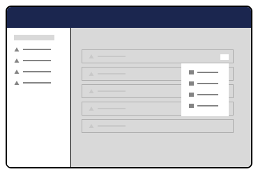

# Entity Actions


**Entity Actions** was previously known as **Tree Actions.**


Entity Actions is an extension type that provides a fly-out context menu for secondary or additional functionality to an entity (document, media, or the like).

Developers can define and associate custom actions for entities in a [tree extension](tree.md), workspace, or collection view. Access to these actions can be controlled via user permissions. The Users section of the backoffice allows Administrators to control which actions a user has permissions to access.

## Display Modes <a href="#display-modes" id="display-modes"></a>

Entity Actions extensions can be displayed in a variety of formats.

### Sidebar Context Menu <a href="#sidebar-context-menu" id="sidebar-context-menu"></a>

The sidebar context mode provides a second-level context menu that flies out from the content tree. Backoffice users will typically find default items such as sorting, moving, deleting, and publishing workflow actions here.


### Workspace Entity Menu <a href="#workspace-entity-action-menu" id="workspace-entity-action-menu"></a>

The workspace entity mode provides a drop-down menu that flies out from the upper decking of a workspace.


### Collection Menu <a href="#collection-menu" id="collection-menu"></a>

The collection mode provides a drop-down menu that appears above a collection view.



### Picker Menu <a href="#picker-menu" id="picker-menu"></a>

The picker mode provides a menu in a sidebar modal.


## Registering an Entity Action <a href="#registering-an-entity-action" id="registering-an-entity-action"></a>

To register an entity action, developers declare the entity action in the manifest file, and then extend the `UmbEntityActionBase` class to program the action's behavior.

### Declare the Entity Action


```typescript
import { extensionRegistry } from '@umbraco-cms/extension-registry';

const manifest = {
    type: 'entityAction',
    alias: 'My.EntityAction',
    name: 'My Entity Action',
    weight: 10,
    api: () => import('./my-entity-action.js'),
    forEntityTypes: ['my-entity'],
    meta: {
        icon: 'icon-add',
        label: 'My Entity Action',
    },
};

extensionRegistry.register(manifest);
```


## The Entity Action Class <a href="#the-entity-action-class" id="the-entity-action-class"></a>

Umbraco provides a few generic actions that can be used across silos, such as copy, move, and trash. Umbraco may include additional generic actions in the future.

Entity Action extensions will need to supply a class to the extension definition using the `api` property in the manifest file. This class will be instantiated as part of the action and will be passed a reference to the entity that invoked it.

The Entity Action class will provide one of the following methods:

* `getHref` - returns a URL that will be used for navigation.
* `execute` - programs custom imperative behaviors that can work with contexts and service APIs.

If both methods are provided in the entity action class, the `getHref` method will be preferred.

When the action is completed, an event on the host element will be dispatched to notify any surrounding elements.

### The `getHref()` Method <a href="#get-href-method" id="get-href-method"></a>

Entity action extensions are provided `this.args` by the `UmbEntityActionBase` superclass. The `this.args` contains a property, `unique` that allows developers to identity which element the user selected.

The `getHref()` method must return a string value, and the result will be rendered into the DOM as an anchor/link.


```typescript
import { UmbEntityActionBase } from '@umbraco-cms/backoffice/entity-action';

export class MyEntityAction extends UmbEntityActionBase<never> {
	override async getHref() {
		return `my-link/path-to-something/${this.args.unique}`;
	}
}

export { MyEntityAction as api };
```


### The `execute()` Method <a href="#execute-method" id="execute-method"></a>

The `execute()` method is flexible and allows developers to perform nearly any task on an entity. Developers can perform network requests using `fetch()`, or access a repository.


The [Executing Requests](../../foundation/fetching-data) article provides an overview of the methods for fetching data from Umbraco, including `tryExecute()` requests.



```typescript
import { UmbEntityActionBase } from '@umbraco-cms/backoffice/entity-action';

export class MyFetchEntityAction extends UmbEntityActionBase<never> {
	override async execute() {
		const response = await fetch(`/server-resource/${this.args.unique}`);

		if (!response.ok) {
			throw new Error('Network response was not ok');
		}

		const data = await response.json();

		if (data) {
			console.log(data); // Do something with the data
		}
	}
}

export { MyFetchEntityAction as api };
```


### Overriding the `UmbEntityActionBase` Constructor <a href="#umbentityaction-constructor" id="umbentityaction-constructor"></a>

If additional contexts are needed, they can be consumed from the host element via the `constructor` method.


```typescript
import { MY_CUSTOM_MODAL_TOKEN } from './my-custom-modal-token.js';
import { UmbEntityActionBase } from '@umbraco-cms/backoffice/entity-action';
import { UMB_MODAL_MANAGER_CONTEXT } from '@umbraco-cms/backoffice/modal';
import type { UmbControllerHostElement } from '@umbraco-cms/backoffice/controller-api';
import type { UmbEntityActionArgs } from '@umbraco-cms/backoffice/entity-action';

export class MyCustomModalEntityAction extends UmbEntityActionBase<never> {
	#modalManager?: typeof UMB_MODAL_MANAGER_CONTEXT.TYPE;

	constructor(host: UmbControllerHostElement, args: UmbEntityActionArgs<never>) {
		super(host, args);

		this.consumeContext(UMB_MODAL_MANAGER_CONTEXT, (modalContext) => {
			this.#modalManager = modalContext;
		});
	}

	override async execute() {
		const modal = this.#modalManager?.open(this, MY_CUSTOM_MODAL_TOKEN, {});

		if (!modal) {
			console.error('No modal manager found!');
			return;
		}

		await modal.onSubmit();

		console.log(modal.value); // Do something with the submitted data.
	}
}

export { MyCustomModalEntityAction as api };
```


## User Permission Codes <a href="#user-permission-codes" id="user-permission-codes"></a>

Developers can define custom user permission codes to control access to their actions, in addition to the standard Umbraco user permission codes. Custom permission codes need to be unique and should not clash with existing permission codes.

Each permission has a set of verbs that will be checked against on both the client and server.

### Standard Umbraco Permission Letters <a href="#standard-permission-letters" id="standard-permission-letters"></a>

| Legacy backoffice letter  | Verb                             |
|---------------------------|----------------------------------|
| C                         | Umb.Document.Create              |
| F                         | Umb.Document.Read                |
| A                         | Umb.Document.Update              |
| D                         | Umb.Document.Delete              |
| I                         | Umb.Document.CreateBlueprint     |
| N                         | Umb.Document.Notifications       |
| U                         | Umb.Document.Publish             |
| R                         | Umb.Document.Permissions         |
| Z                         | Umb.Document.Unpublish           |
| O                         | Umb.Document.Duplicate           |
| M                         | Umb.Document.Move                |
| S                         | Umb.Document.Sort                |
| I                         | Umb.Document.CultureAndHostnames |
| P                         | Umb.Document.PublicAccess        |
| K                         | Umb.Document.Rollback            |

### Custom Permission Letters <a href="#custom-permission-letters" id="custom-permission-letters"></a>

Developers who create packages with custom entity actions are encouraged to update this document by submitting pull requests to the [documentation repository](https://github.com/umbraco/UmbracoDocs). This will inform other developers which permission letters they should avoid defining.

| Custom Backoffice letter | Verb                           |
|--------------------------|--------------------------------|
| ⌘                        | *Placeholder*                  |

## Entity Action Permissions <a href="#user-permissions" id="user-permissions"></a>

Umbraco provides two extension types for user permissions: **entity user permissions** and **granular user permissions.**

These two extension types are used in tandem with each other.

* `entityUserPermission`: Defines _what_ can be done and allows assigning them globally to a User Group.
* `userGranularPermission`: Defines _how_ those same verbs can be assigned to specific nodes in the User Management UI. These extension types provide an interactive interface in the backoffice to control permission assignment.

### Entity User Permissions

Entity user permissions are assigned to entities like documents, media, and members. They are registered using the `entityUserPermission` type in the extension's manifest.


```typescript
import { extensionRegistry } from '@umbraco-cms/extension-registry';

const manifest = {
    type: 'entityUserPermission',
    alias: 'My.UserPermission.Document.Archive',
    name: 'My Document Archive User Permission',
    forEntityTypes: ['document'],
    meta: {
        verbs: ["My.Document.Archive"],
        label: "Archive Document",
        description: "Allow user to archive documents",
        group: "administration"
    },
};

extensionRegistry.register(manifest);
```



#### Management Interface

The `entityUserPermission` extension type will render a toggle control in the **Default permissions** pane in the Users > User Groups editor.

<figure><figcaption><p><strong>Entity User Permissions UI</strong></p></figcaption></figure>

### Granular User Permission

<figure><figcaption><p><strong>Default Granular User Permission UI</strong></p></figcaption></figure>

#### Management Interface

Extension developers can customize the selection and interaction style of a granular permission using the `element` property. The `element` property accepts the file location of a custom web component, and will render that component in the management interface.

The `userGranularPermission` extension type will render a document selection control in the **Granular permissions** pane in the Users > User Groups editor by default. The default selector can be replaced with a custom web component.


```typescript
import { extensionRegistry } from '@umbraco-cms/extension-registry';

const manifest = {
    type: 'userGranularPermission',
    alias: 'My.UserGranularPermission.Document',
    name: 'My Document Granular User Permission',
    element: () => import('./my-document-user-granular-permission-ui.js')
    meta: {
        schemaType: "DocumentPermissionPresentationModel",
        label: "Documents",
        description: "Assign permissions to specific documents"
    },
};

extensionRegistry.register(manifest);
```


<figure><figcaption><p><strong>Custom Granular User Permission UI</strong></p></figcaption></figure>

### Enforcing Permissions

Developers can enforce permission controls on **Entity Action** extensions by defining conditions in the `conditions` array.

In the following example, the `conditions:alias` property of an `entityAction` extension matches the `alias` property of the `entityUserPermission` extension definition.

Similarly, the `conditions:allOf` array must contain the one of the values from the `meta:verbs` array of the `entityUserPermission` extension definition.


```typescript
import { extensionRegistry } from '@umbraco-cms/extension-registry';

const manifest = {
    type: 'entityAction',
    alias: 'My.EntityAction.DocumentArchive',
    name: 'My Document Archive Action',
    api: () => import('./my-document-archive-entity-action.js'),
    meta: {
		icon: 'icon-box',
		label: 'Archive',
	},
	conditions: [
		{
			alias: 'Umb.Condition.UserPermission.Document',
			allOf: ['My.Document.Archive'],
		},
	],
};

extensionRegistry.register(manifest);
```

