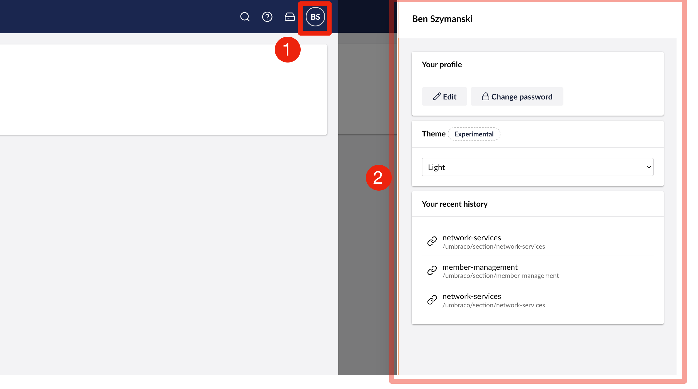

# Header Apps

Header App extensions appear next to the user profile and the global search icon in the top right of Umbraco’s Backoffice. Extension authors can create custom header apps to add globally accessible functionality to the Backoffice.

<figure><figcaption><p>Header Apps</p></figcaption></figure>

## Button Header Apps as a link
Extension authors can create header apps that link to resource both inside and outside the backoffice. Header apps can be created using a manifest or using TypeScript.

To create a link-style header app, define a `headerApp` extension in the `umbraco-package.json` file. Be sure to include `meta.label` and `meta.icon` so that your header app appears when you reload the backoffice.

If `meta.href` is defined, the header app will function as a link. Links will open in the same tab.

Header Apps can also be created using TypeScript. Examples of both approaches are shown below.




```json
{
  "$schema": "../../umbraco-package-schema.json",
  "name": "My Package",
  "version": "0.1.0",
  "extensions": [
    {
      "type": "headerApp",
      "alias": "My.HeaderApp",
      "name": "My Header App",
      "kind": "button",
      "meta": {
        "label": "Hello Umbraco",
        "icon": "icon-hearts",
        "href": "https://umbraco.com/"
      }
    }
  ]
}
```




Create an object that implements the `UmbExtensionManifest` interface, then register the extension with the `umbExtensionsRegistry` service.

```typescript
import { umbExtensionsRegistry } from '@umbraco-cms/backoffice/extension-registry';

const manifest: UmbExtensionManifest = {
  type: "headerApp",
  alias: "My.HeaderApp.Documentation",
  name: "My Documentation Header App",
  kind: "button",
  meta: {
    label: "Hello Documentation",
    icon: "icon-addressbook",
    href: "https://docs.umbraco.com/"
  }
};

umbExtensionsRegistry.register(manifest);
```




## Button Header Apps with deeper interactivity

Extension authors can also create header apps that have more interactivity than a link.

By creating a custom component, extension authors can control how the button renders itself and how it behaves when clicked. This allows header apps to control navigation, open modals, or perform other actions.

For example, this is how the current user header app is able to present a modal when clicked.

<figure><figcaption><p>The current user modal is presented from a header app</p></figcaption></figure>

In order for a header app to have some functionality, extension authors will need to define behavior by creating a JavaScript or TypeScript component. Once the component has been created, it will need to be registered in the header app's `element` property.




```json
{
  "$schema": "../../umbraco-package-schema.json",
  "name": "My Package",
  "version": "0.1.0",
  "extensions": [
    {
      "type": "headerApp",
      "alias": "My.HeaderApp.ServerServices",
      "name": "My Server Services Header App",
      "kind": "button",
      "element": "/App_Plugins/MyPackage/server-services-header-app.js"
    }
  ]
}
```



This example assumes that the extension author has transpiled the above TypeScript code into a JavaScript file. The name and location of the transpiled file should match the `element` property in the package manifest.

```typescript
import { html, customElement } from "@umbraco-cms/backoffice/external/lit";
import { UmbHeaderAppButtonElement } from "@umbraco-cms/backoffice/components";
import { umbOpenModal, UMB_CONFIRM_MODAL } from "@umbraco-cms/backoffice/modal";

@customElement("my-server-services-header-app")
export class MyServerServicesHeaderAppElement extends UmbHeaderAppButtonElement {
  async #handleUserClick() {
    umbOpenModal(this, UMB_CONFIRM_MODAL, {
      data: {
        headline: "Would you like to disable all Server Services?",
        content:
          "This action can be undone, but only after all services have stopped.",
        color: "danger",
        confirmLabel: "Disable all services",
      },
    })
      .then(() => {
        console.log("User has approved");
      })
      .catch(() => {
        console.log("User has rejected");
      });
  }

  override render() {
    return html`
      <uui-button
        @click=${this.#handleUserClick}
        look="primary"
        label="Server Services"
        compact
      >
        <uui-icon name="icon-server"></uui-icon>
      </uui-button>
    `;
  }
}

{ MyServerServicesHeaderAppElement as element };
```



