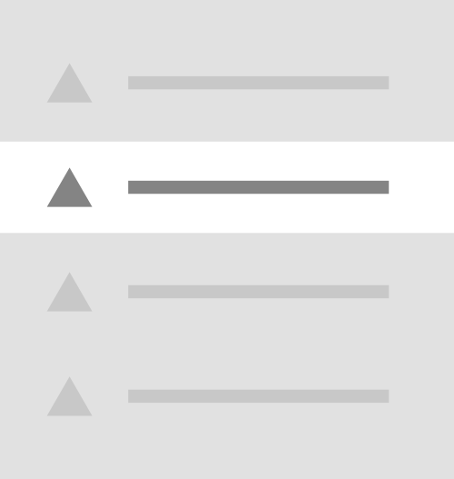
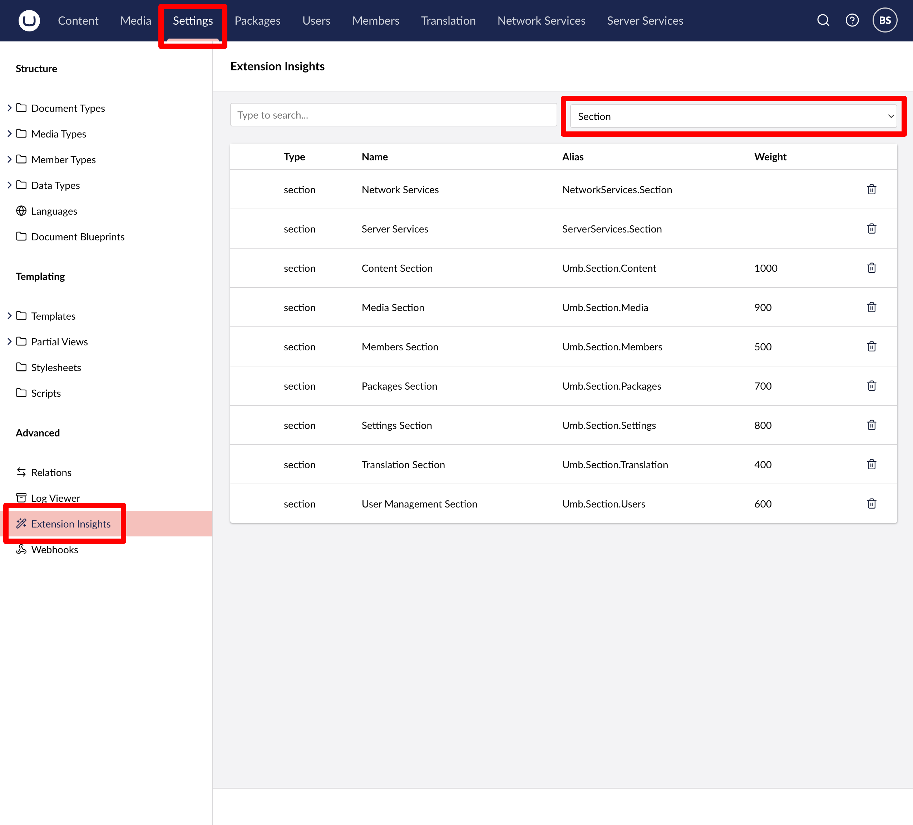

# Menu Items

Menu Item extensions are used in combination with [Menu](menu.md) extensions. Menu items can be placed in custom menus, sidebars, and even added into the built-in/default Umbraco menu extensions. Extension authors can use the default Menu Item component or create their own custom Menu Items and register them as extensions.

<figure><figcaption><p>Menu Item</p></figcaption></figure>

Menu Item extensions can be defined using either JSON in `umbraco-package.json` or using TypeScript.

## Creating Menu Items

Menu Item extensions can be created using either JSON or TypeScript. Both approaches are shown below.

### Manifest

To add custom menu items, you can define a single MenuItem manifest and link an element to it. In this element, you can fetch the data and render as many menu items as you want based on that data.




```json
{
    "$schema": "../../umbraco-package-schema.json",
    "name": "My Package",
    "version": "0.1.0",
    "extensions": [
        {
            "type": "menuItem",
            "alias": "My.MenuItem",
            "name": "My Menu Item",
            "element": "./menu-items.ts",
            "meta": {
                "label": "My Menu Item",
                "menus": ["My.Menu"]
            }
        }
    ]
}
```

The `element` parameter is optional. Omitting it will render a menu item styled using Umbraco defaults.





Extension authors define the menu manifest, then register it dynamically/during runtime using a [Backoffice Entry Point](../../extending-overview/extension-types/backoffice-entry-point.md) extension.

The `element` attribute will point toward a custom Lit component, an example of which will be in the next section of this article.


```typescript
import type { ManifestMenuItem } from '@umbraco-cms/backoffice/menu';

export const menuItemManifest: ManifestMenuItem = {
    type: 'menuItem',
    alias: 'My.MenuItem',
    name: 'My Menu Item',
    meta: {
        label: 'My Menu Item',
        menus: ["My.Menu"]
    },
};
```



```typescript
import type {
    UmbEntryPointOnInit,
} from "@umbraco-cms/backoffice/extension-api";
import { umbExtensionsRegistry } from "@umbraco-cms/backoffice/extension-registry";
import { menuItemManifest } from "./../my-menu/manifests.ts";

export const onInit: UmbEntryPointOnInit = (_host, _extensionRegistry) => {
    console.log("Hello from my extension 🎉");

    umbExtensionsRegistry.register(menuItemManifest);
};
```




## Custom menu items


**Note:** Displaying menu item extensions does not require extension authors to create custom menu item subclasss. This step is optional.


To render your menu items in Umbraco, extension authors can use the [Umbraco UI Menu Item component](https://uui.umbraco.com/?path=/docs/uui-menu-item--docs). This component enables nested menu structures with a few lines of markup.

`<uui-menu-item>` nodes accept the `has-children` boolean attribute, which will display a caret icon indicating nested items. Tying this boolean attribute to a variable requires using the `?` Lit directive, which would look similar to this: `?has-children=${boolVariable}`.

```html
<uui-menu-item label="Menu Item 1" has-children>
    <uui-menu-item label="Nested Menu Item 1"></uui-menu-item>
    <uui-menu-item label="Nested Menu Item 2"></uui-menu-item>
</uui-menu-item>
```

### Custom menu item element example

Custom elements can fetch the data and render menu items using markup, like above. Storing the results of the fetch in a `@state()` variable will trigger a re-render of the component when the value of the variable changes.




```typescript
import type { UmbMenuItemElement } from '@umbraco-cms/backoffice/menu';
import { UmbLitElement } from '@umbraco-cms/backoffice/lit-element';
import { html, TemplateResult, customElement, state } from '@umbraco-cms/backoffice/external/lit';
import { MyMenuItemResponseModel, MyMenuResource } from '../../../api';

const elementName = 'my-menu-item';

@customElement(elementName)
class MyMenuItems extends UmbLitElement implements UmbMenuItemElement {
    @state()
    private _items: MyMenuItemResponseModel[] = []; // Store fetched items

    @state()
    private _loading: boolean = true; // Track loading state

    @state()
    private _error: string | null = null; // Track any errors

    override firstUpdated() {
        this.fetchInitialItems(); // Start fetching on component load
    }

    // Fetch initial items
    async fetchInitialItems() {
        try {
            this._loading = true;
            this._items = ((await MyMenuResource.getMenuApiV1()).items); // Fetch root-level items
        } catch (e) {
            this._error = 'Error fetching items';
        } finally {
            this._loading = false;
        }
    }

    // Render items
    renderItems(items: MyMenuItemResponseModel[]): TemplateResult {
        return html`
            ${items.map(element => html`
                <uui-menu-item label="${element.name}" ?has-children=${element.hasChildren}>
                ${element.type === 1
                ? html`<uui-icon slot="icon" name="icon-folder"></uui-icon>`
                : html`<uui-icon slot="icon" name="icon-autofill"></uui-icon>`}
                    <!-- recursively render children -->
                    ${element.hasChildren ? this.renderItems(element.children) : ''}
                </uui-menu-item>
            `)}
        `;
    }

    // Main render function
    override render() {
        if (this._loading) {
            return html`<uui-loader></uui-loader>`;
        }

        if (this._error) {
            return html`<uui-menu-item active disabled label="Could not load form tree!">
        </uui-menu-item>`;
        }

        // Render items if loading is done and no error occurred
        return this.renderItems(this._items);
    }
}

export { MyMenuItems as element };

declare global {
    interface HTMLElementTagNameMap {
        [elementName]: MyMenuItems;
    }
}
```




```typescript
import type { ManifestMenuItem } from "@umbraco-cms/backoffice/menu";

export const MyMenuItemManifest: ManifestMenuItem = {
  type: "menuItem",
  kind: "tree",
  alias: "MyMenuItem.CustomMenu?Item",
  name: "My Menu Item Custom Menu Item",
  element: () => import("./menu-items.ts"),
  meta: {
    label: "Smtp",
    menus: ["Umb.Menu.Content"],
  },
};
```

**Note:** Extension authors can use the `kind` property to define the type of menu item. The `kind` property can be set to `tree` or `list`.




```typescript
import type {
    UmbEntryPointOnInit,
} from "@umbraco-cms/backoffice/extension-api";
import { umbExtensionsRegistry } from "@umbraco-cms/backoffice/extension-registry";
import { MyMenuItemManifest } from "./../my-menu/manifests.ts";

export const onInit: UmbEntryPointOnInit = (_host, _extensionRegistry) => {
    console.log("Hello from my extension 🎉");

    umbExtensionsRegistry.register(MyMenuItemManifest);
};
```



## Adding menu items to an existing menu

Extension authors are able to add their own additional menu items to the menus that ship with Umbraco.

Some examples of these built-in menus include:

* Content - `Umb.Menu.Content`
* Media - `Umb.Menu.Media`
* Settings - `Umb.Menu.StructureSettings`
* Templating - `Umb.Menu.Templating`
* ...

Additional Umbraco menus (nine, total) can be found using the Extension Insights browser and selecting **Menu** from the dropdown.

<figure><figcaption><p>Backoffice extension browser</p></figcaption></figure>

### Extending Menus

To add a menu item to an existing menu, use the `meta.menus` property.


```json
{
    "$schema": "../../umbraco-package-schema.json",
    "name": "My Package",
    "version": "0.1.0",
    "extensions": [
        {
            "type": "menuItem",
            "alias": "My.MenuItem",
            "name": "My Menu Item",
            "meta": {
                "label": "My Menu Item",
                "menus": ["Umb.Menu.Content"]
            },
            "element": "menu-items.js"
        }
    ]
}
```

