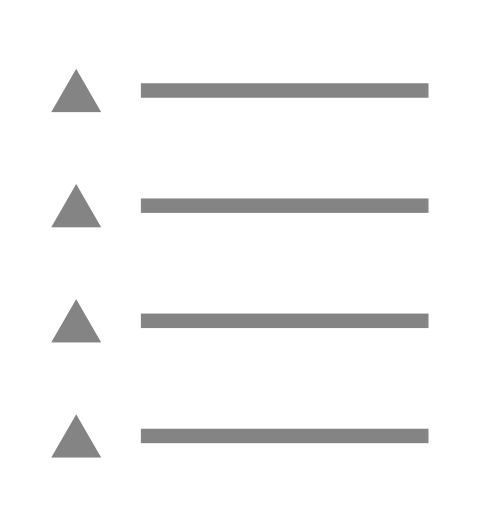

# Menus

Menu extensions contain one or more [menu item extensions](menu-item.md) and can appear throughout the backoffice, such as in sidebars and flyouts.

<figure><figcaption><p>Menu</p></figcaption></figure>

## Creating a custom menu

Menu extensions can be created using either JSON or TypeScript. Both approaches are shown below.




```json
{
    "$schema": "../../umbraco-package-schema.json",
    "name": "My Package",
    "version": "0.1.0",
    "extensions": [
        {
            "type": "menu",
            "alias": "My.Menu",
            "name": "My Menu"
        }
    ]
}
```



Extension authors define the menu manifest, then register it dynamically/during runtime using a [Backoffice Entry Point](../../extending-overview/extension-types/backoffice-entry-point.md) extension.


```typescript
import type { ManifestMenu } from '@umbraco-cms/backoffice/menu';

export const menuManifest: ManifestMenu = {
    type: 'menu',
    alias: 'My.Menu',
    name: 'My Menu'
};
```



```typescript
import type {
    UmbEntryPointOnInit,
} from "@umbraco-cms/backoffice/extension-api";
import { umbExtensionsRegistry } from "@umbraco-cms/backoffice/extension-registry";
import { menuManifest } from "./../my-menu/manifests.ts";

export const onInit: UmbEntryPointOnInit = (_host, _extensionRegistry) => {
    console.log("Hello from my extension 🎉");

    umbExtensionsRegistry.register(menuManifest);
};
```




## See Also
* [Section Sidebar](sections/section-sidebar.md) for information on creating menus for navigation within section extensions.
* [Menu Item](menu-item.md) for information on creating menu items.
