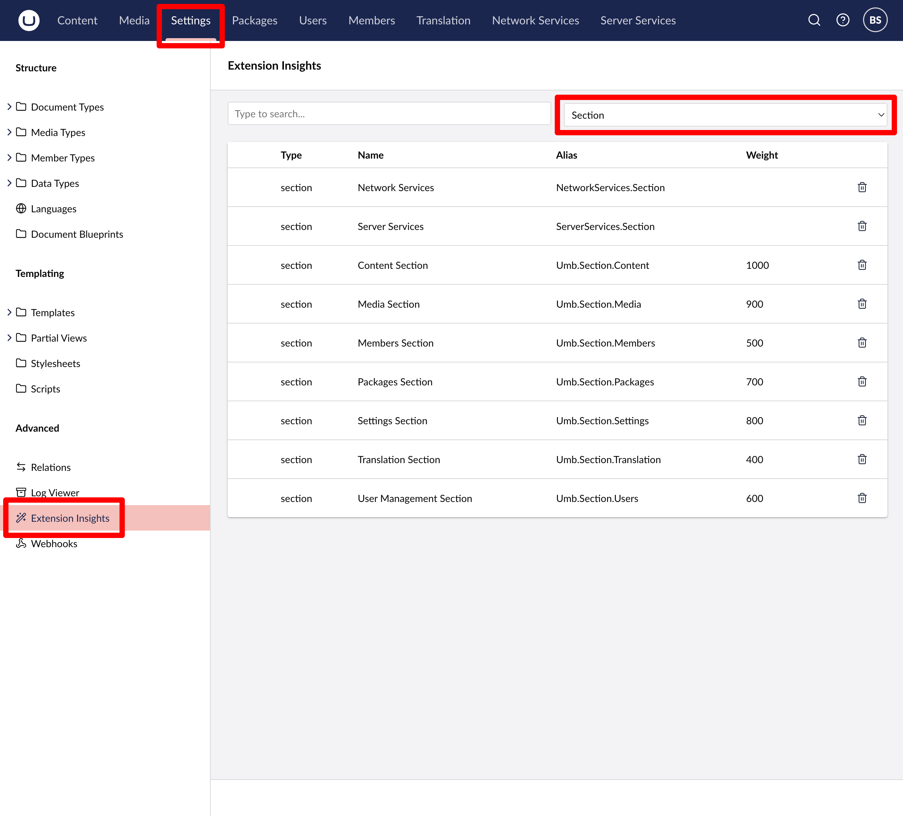

# Menus

Menu extensions contain one or more menu item extensions and can be placed throughout the backoffice - in sidebars, flyouts, and more. This article will cover how to create a menu with custom menu items.

<figure><figcaption><p>Menu</p></figcaption></figure>

## Creating a custom menu

Menu extensions can be created using either JSON or TypeScript. Both approaches are shown below.




```json
{
    "$schema": "../../umbraco-package-schema.json",
    "name": "My Package",
    "version": "0.1.0",
    "extensions": [
        {
            "type": "menu",
            "alias": "My.Menu",
            "name": "My Menu"
        }
    ]
}
```



Extension authors define the menu manifest, then register it dynamically/during runtime using a [Backoffice Entry Point](../../extending-overview/extension-types/backoffice-entry-point.md) extension.


```typescript
import type { ManifestMenu } from '@umbraco-cms/backoffice/menu';

export const menuManifest: ManifestMenu = {
    type: 'menu',
    alias: 'My.Menu',
    name: 'My Menu'
};
```



```typescript
import type {
    UmbEntryPointOnInit,
} from "@umbraco-cms/backoffice/extension-api";
import { umbExtensionsRegistry } from "@umbraco-cms/backoffice/extension-registry";
import { menuManifest } from "./../my-menu/manifests.ts";

export const onInit: UmbEntryPointOnInit = (_host, _extensionRegistry) => {
    console.log("Hello from my extension 🎉");

    umbExtensionsRegistry.register(menuManifest);
};
```




# Menu Items

Each menu consists of one or more menu item extensions. Extension authors can create customized menu items.

<figure><figcaption><p>Menu Item</p></figcaption></figure>

## Creating menu items

Menu Item extensions can be created using either JSON or TypeScript. Both approaches are shown below.

### Manifest

To add custom menu items, you can define a single MenuItem manifest and link an element to it. In this element, you can fetch the data and render as many menu items as you want based on that data.




```json
{
    "$schema": "../../umbraco-package-schema.json",
    "name": "My Package",
    "version": "0.1.0",
    "extensions": [
        {
            "type": "menuItem",
            "alias": "My.MenuItem",
            "name": "My Menu Item",
            "element": "./menu-items.ts",
            "meta": {
                "label": "My Menu Item",
                "menus": ["My.Menu"]
            }
        }
    ]
}
```

The `element` parameter is optional. Omitting it will render a menu item styled using Umbraco defaults.





Extension authors define the menu manifest, then register it dynamically/during runtime using a [Backoffice Entry Point](../../extending-overview/extension-types/backoffice-entry-point.md) extension.

The `element` attribute will point toward a custom Lit component, an example of which will be in the next section of this article.


```typescript
import type { ManifestMenuItem } from '@umbraco-cms/backoffice/menu';

export const menuItemManifest: ManifestMenuItem = {
    type: 'menuItem',
    alias: 'My.MenuItem',
    name: 'My Menu Item',
    meta: {
        label: 'My Menu Item',
        menus: ["My.Menu"]
    },
};
```



```typescript
import type {
    UmbEntryPointOnInit,
} from "@umbraco-cms/backoffice/extension-api";
import { umbExtensionsRegistry } from "@umbraco-cms/backoffice/extension-registry";
import { menuItemManifest } from "./../my-menu/manifests.ts";

export const onInit: UmbEntryPointOnInit = (_host, _extensionRegistry) => {
    console.log("Hello from my extension 🎉");

    umbExtensionsRegistry.register(menuItemManifest);
};
```




#### Default Element

The default element supports rendering a subtree of menu items.

```typescript
class UmbMenuItemTreeDefaultElement {}
```

## Adding menu items to an existing menu

Extension authors are able to add their own additional menu items to the menus that ship with Umbraco.

Some examples of these built-in menus include:

* Content - `Umb.Menu.Content`
* Media - `Umb.Menu.Media`
* Settings - `Umb.Menu.StructureSettings`
* Templating - `Umb.Menu.Templating`
* ...

Additional Umbraco menus (nine, total) can be found using the Extension Insights browser and selecting **Menu** from the dropdown.

<figure><figcaption><p>Backoffice extension browser</p></figcaption></figure>

### Extending Menus

To add a menu item to an existing menu, use the `meta.menus` property.


```json
{
    "$schema": "../../umbraco-package-schema.json",
    "name": "My Package",
    "version": "0.1.0",
    "extensions": [
        {
            "type": "menuItem",
            "alias": "My.MenuItem",
            "name": "My Menu Item",
            "meta": {
                "label": "My Menu Item",
                "menus": ["Umb.Menu.Content"]
            },
            "element": "menu-items.js"
        }
    ]
}
```


## See Also
* [Section Sidebar](sections/section-sidebar.md) for information on creating menus for navigation within section extensions.
