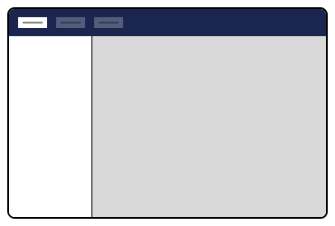
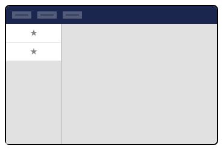
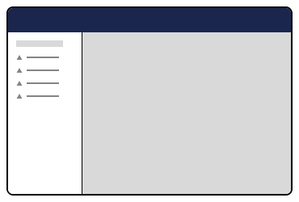
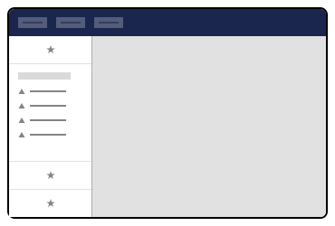

# Section Sidebar

[Section extensions](./section.md) can add deeper navigation and coordination of subviews, like
[Section View extensions](./section-view.md), as well as add additional Section-wide functionality, by declaring a
Section Sidebar extension.

Section Sidebar extensions are optional; if not defined, the Section extension defaults to a single full-screen subview.

<figure><figcaption><p>Section Sidebar</p></figcaption></figure>

## Section Sidebar Apps

Section Sidebar extensions can be composed of **one or more** section sidebar apps. Extension authors can include common
Umbraco-provided extension types, such as menus and trees, or create entirely custom sidebar apps through the use of
web components.

<figure><figcaption><p>Section Sidebar Apps</p></figcaption></figure>

### Custom Sidebar App Example

Section Sidebar extension authors can place any custom web component into the sidebar. Extension authors will need to
supply the `element` property with the path of their custom web component. Specify the full path, starting from the 
Umbraco project root.

Sidebar Section extension authors may specify where the Section Sidebar app appears using
[extension conditions](../condition.md).


```json
{
    "type": "sectionSidebarApp", 
    "alias": "My.SectionSidebarApp", 
    "name": "My Section Sidebar App", 
    "element": "/App_Plugins/<package_name>/sidebar-app.js",
    "conditions": [{
        "alias": "Umb.Condition.SectionAlias",
        "match": "My.Section"
    }]
}
```


### Menu Sidebar App Examples

The menu sidebar app is provided by the Umbraco backoffice and can be placed into Section Sidebar extensions. This
sidebar app will attach itself to a menu defined elsewhere in your manifest through the `meta:menu` property, where
this value must match the `alias` value of the menu.

<figure><figcaption><p>Menu Sidebar App</p></figcaption></figure>


```json
{
    "type": "sectionSidebarApp",
    "kind": "menu",
    "alias": "My.SectionSidebarApp.MyMenu",
    "name": "My Menu Section Sidebar App",
    "meta": {
        "label": "My Sidebar Menu",
        "menu": "My.Menu"
    },
    "conditions": [{
        "alias": "Umb.Condition.SectionAlias",
        "match": "My.Section"
    }]
}
```


In the example below, we continue by creating a menu extension and binding the `meta:menu` (My.Menu) property to the
menu extensions' `alias` property. The *My.Menu* alias is also used to attach a menu item extension to the menu
extension.


```json
[
    {
        "type": "menu",
        "alias": "My.Menu",
        "name": "Section Sidebar Menu"
    },
    {
        "type": "menuItem",
        "alias": "SectionSidebar.MenuItem1",
        "name": "Menu Item 1",
        "meta": {
        "label": "Menu Item 1",
          "menus": ["My.Menu"]
        }
    }
]
```


For more information, see the documentation for the [menus](../menu.md) extension.

#### Coordinating subviews with menu items

Menu sidebar apps can coordinate navigation between subviews in the section extension by referencing
[workspace extensions](../workspaces/workspace.md). Modify the menu item extension to include the `meta:entityType`
property, and assign it the same value as a workspace view extensions' own `meta:entityType` property.


```json
[
    {
        "type": "menuItem",
        "alias": "SectionSidebar.MenuItem1",
        "name": "Menu Item 1",
        "meta": {
            "label": "Menu Item 1",
            "menus": ["My.Menu"],
            "entityType": "myCustomWorkspaceView"
        }
    },
    {
        "type": "workspace",
        "name": "Workspace 1",
        "alias": "SectionSidebar.Workspace1",
        "element": "/App_Plugins/<package_name>/my-custom-workspace.js",
        "meta": {
            "entityType": "myCustomWorkspaceView"
        }
    }
]
```


#### Adding items to an existing menu

Section Sidebar extension authors can place their extensions in the sidebar of any Umbraco-provided section, such as
Content, Media, Settings, etc., by configuring the `conditions` property with the appropriate `SectionAlias` condition.

<figure><figcaption><p>Composed sidebar menu</p></figcaption></figure>


```json
{
    "type": "sectionSidebarApp",
    "alias": "My.SectionSidebarApp",
    "name": "My Section Sidebar App",
    "element": "/App_Plugins/<package_name>/sidebar-app.js",
    "conditions": [{
        "alias": "Umb.Condition.SectionAlias", 
        "match": "Umb.Section.Settings"
    }]
}
```


Common Umbraco-provided section aliases:

| Section Aliases         |
|-------------------------|
| Umb.Section.Content     |
| Umb.Section.Media       |
| Umb.Section.Settings    |
| Umb.Section.Packages    |
| Umb.Section.Users       |
| Umb.Section.Members     |
| Umb.Section.Translation |
