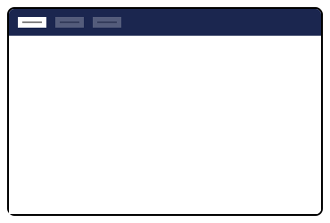
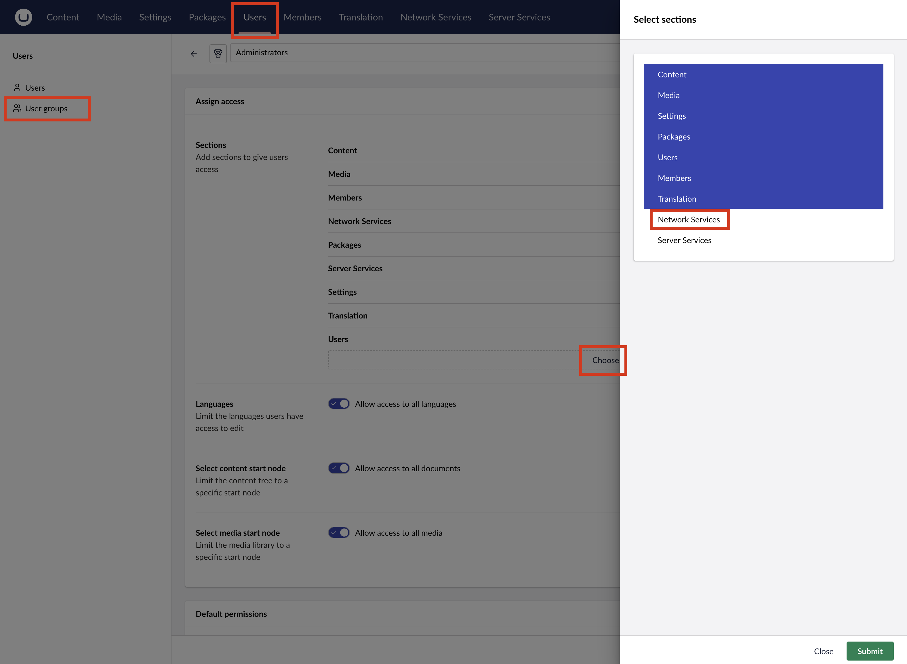
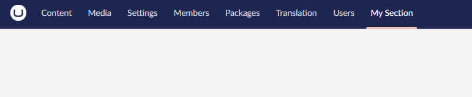

# Sections

Umbraco extension authors can place their extension in the top-level navigation of the backoffice using Sections. The
extension will be placed among the default options such as Content, Media, Settings, etc.

Within the section, authors can add menus, section views, workspace views, or any other content or interface they
desire.

<figure><figcaption><p>Section</p></figcaption></figure>

## **Creating a section**

### **Manifests**

Sections can be created by adding a definition in the extension's manifest file.


```json
{
 "type": "section",
 "alias": "My.Section",
 "name": "My Section",
 "meta": {
  "label": "My.Section",
  "pathname": "my-section"
 }
}
```


### **Group permissions**

To enable custom sections for backoffice users, site administrators must first assign permissions to those users. This
involves configuring the permission for a user group and assigning users to that group.

To grant access to the custom section, open the Umbraco backoffice, navigate to the **Users** section, and select the
**User groups** menu item. Site administrators can create a new user group or modify an existing one.

Once the user group is open, click the **Choose** button under the Sections section. Select the custom section from the
slide-out modal to enable access.

<figure><figcaption><p>Enabling new Sections</p></figcaption></figure>

After assigning permission, users may need to reload the backoffice for the changes to take effect.

<figure><figcaption><p>Section</p></figcaption></figure>

### **Entry points**

When creating a new section, create an [Entry Point](../backoffice-entry-point.md) extension in the
[Umbraco Package Manifest](../../../umbraco-package.md) to complement it. Entry Point extensions add initialization and
teardown lifecycle events that may be helpful in coordinating behavior inside the section.

## **Extend with Sidebar, Dashboards, and more**

Sections serve as blank canvases within the Umbraco backoffice. Extension authors can integrate other Umbraco extensions
into sections, including [custom dashboards](../../../../tutorials/creating-a-custom-dashboard/),
[sidebars](section-sidebar.md), and [section views](section-view.md).

Section authors can also skip Umbraco backoffice components and build a fully custom view by creating an empty element.

### **Manifest with empty element**


This approach is not recommended because it restricts content to a single element. Instead, use a Dashboard or Section View.



```typescript
const section : UmbExtensionManifest = {
    type: "section",
    alias: "Empty.Section",
    name : 'Empty Section',
    element : () => import('./empty-section.element.js'),
    meta : {
        label : 'Empty Section',
        pathname : 'empty-section'
    }
}
```


The element file must contain an `element`, a `default` export, or specify the element name in the
`elementName` field.
