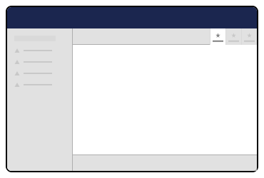

# Workspace Views

Workspace Views provide tab-based content areas within workspaces, allowing you to organize different aspects of entity editing into focused interfaces. They appear as tabs alongside the default content editing interface.


Workspace Views were previously called Content Apps in earlier versions of Umbraco.


## Purpose

Workspace Views provide:
- **Tab-based organization** for different editing aspects
- **Contextual interfaces** related to the current entity
- **Workspace integration** with access to workspace contexts
- **Custom functionality** specific to entity types

<figure><figcaption><p>Workspace Views</p></figcaption></figure>

## Manifest


```typescript
{
	type: 'workspaceView',
	name: 'Example Counter Workspace View',
	alias: 'example.workspaceView.counter',
	element: () => import('./counter-workspace-view.js'),
	weight: 900,
	meta: {
		label: 'Counter',
		pathname: 'counter',
		icon: 'icon-lab',
	},
	conditions: [
		{
			alias: UMB_WORKSPACE_CONDITION_ALIAS,
			match: 'Umb.Workspace.Document',
		},
	],
}
```


### Key Properties
- **`weight`** - Tab ordering (higher weight appears first)
- **`meta.label`** - Text displayed on the tab
- **`meta.pathname`** - URL segment for the view
- **`meta.icon`** - Icon displayed on the tab
- **`conditions`** - Determines workspace availability

## Implementation

Implement your workspace view as a Lit element that extends `UmbElementMixin`. This creates a tab-based interface that users can navigate to within the workspace:


```typescript
import { EXAMPLE_COUNTER_CONTEXT } from './counter-workspace-context.js';
import { UmbTextStyles } from '@umbraco-cms/backoffice/style';
import { css, html, customElement, state, LitElement } from '@umbraco-cms/backoffice/external/lit';
import { UmbElementMixin } from '@umbraco-cms/backoffice/element-api';

@customElement('example-counter-workspace-view')
export class ExampleCounterWorkspaceView extends UmbElementMixin(LitElement) {
	#counterContext?: typeof EXAMPLE_COUNTER_CONTEXT.TYPE;

	@state()
	private count = 0;

	constructor() {
		super();
		this.consumeContext(EXAMPLE_COUNTER_CONTEXT, (instance) => {
			this.#counterContext = instance;
			this.#observeCounter();
		});
	}

	#observeCounter(): void {
		if (!this.#counterContext) return;
		this.observe(this.#counterContext.counter, (count) => {
			this.count = count;
		});
	}

	override render() {
		return html`
			<uui-box class="uui-text">
				<h1 class="uui-h2">Counter Example</h1>
				<p class="uui-lead">Current count value: ${this.count}</p>
				<p>This workspace view consumes the Counter Context and displays the current count.</p>
			</uui-box>
		`;
	}

	static override styles = [
		UmbTextStyles,
		css`
			:host {
				display: block;
				padding: var(--uui-size-layout-1);
			}
		`,
	];
}

export default ExampleCounterWorkspaceView;

declare global {
	interface HTMLElementTagNameMap {
		'example-counter-workspace-view': ExampleCounterWorkspaceView;
	}
}
```


## View Lifecycle

### Initialization
- Views initialize when their tab becomes active
- Context consumption happens during construction
- Views have access to workspace-scoped contexts

### Tab Navigation
- Views are lazy-loaded when first accessed
- Navigation updates the workspace URL with view pathname
- Views remain in memory while workspace is open

### Context Integration
Views can consume multiple workspace contexts:

```typescript
constructor() {
	super();
	
	// Consume multiple contexts
	this.consumeContext(ENTITY_CONTEXT, (context) => {
		this.observe(context.entity, (entity) => this.requestUpdate());
	});
	
	this.consumeContext(VALIDATION_CONTEXT, (context) => {
		this.observe(context.errors, (errors) => this.requestUpdate());
	});
}
```

## Common Patterns

### Entity Information View
```typescript
@customElement('entity-info-view')
export class EntityInfoView extends UmbElementMixin(LitElement) {
	#entityContext?: EntityWorkspaceContext;

	constructor() {
		super();
		this.consumeContext(ENTITY_CONTEXT, (context) => {
			this.#entityContext = context;
		});
	}

	override render() {
		const entity = this.#entityContext?.getCurrentEntity();
		
		return html`
			<uui-box headline="Entity Information">
				<dl>
					<dt>Name</dt>
					<dd>${entity?.name}</dd>
					<dt>Created</dt>
					<dd>${entity?.createDate}</dd>
				</dl>
			</uui-box>
		`;
	}
}
```

### Interactive Configuration View
```typescript
@customElement('config-view')
export class ConfigView extends UmbElementMixin(LitElement) {
	#configContext?: ConfigWorkspaceContext;

	#handleConfigChange(property: string, value: any) {
		this.#configContext?.updateConfig(property, value);
	}

	override render() {
		return html`
			<uui-box headline="Configuration">
				<uui-toggle 
					.checked=${this.#configContext?.isEnabled}
					@change=${(e) => this.#handleConfigChange('enabled', e.target.checked)}>
					Enable Feature
				</uui-toggle>
			</uui-box>
		`;
	}
}
```

### Analytics Dashboard View
```typescript
@customElement('analytics-view')
export class AnalyticsView extends UmbElementMixin(LitElement) {
	@state()
	private analytics?: AnalyticsData;

	constructor() {
		super();
		this.#loadAnalytics();
	}

	async #loadAnalytics() {
		const entityContext = await this.getContext(ENTITY_CONTEXT);
		const entityId = entityContext.getEntityId();
		
		const analyticsService = await this.getContext(ANALYTICS_SERVICE);
		this.analytics = await analyticsService.getAnalytics(entityId);
	}

	override render() {
		if (!this.analytics) {
			return html`<uui-loader></uui-loader>`;
		}

		return html`
			<uui-box headline="Analytics">
				<div class="stats-grid">
					<div class="stat">
						<span class="value">${this.analytics.pageViews}</span>
						<span class="label">Page Views</span>
					</div>
				</div>
			</uui-box>
		`;
	}
}
```

## Best Practices

### View Organization
- Use descriptive tab labels that clearly indicate the view purpose
- Order views by importance using weight property
- Group related functionality into single views rather than many small tabs

### Context Usage
- Consume contexts in constructor for immediate availability
- Use `observe()` for reactive updates when context state changes
- Check context availability before accessing properties

### Performance
- Keep views lightweight for fast tab switching
- Load expensive data only when view becomes active
- Use loading states for async operations

### Conditional Availability
Only show views when relevant:
```typescript
conditions: [
	{
		alias: UMB_WORKSPACE_CONDITION_ALIAS,
		match: 'Umb.Workspace.Document',
	},
	{
		alias: 'My.Condition.EntityType',
		match: 'blogPost', // Only show for blog posts
	},
],
```