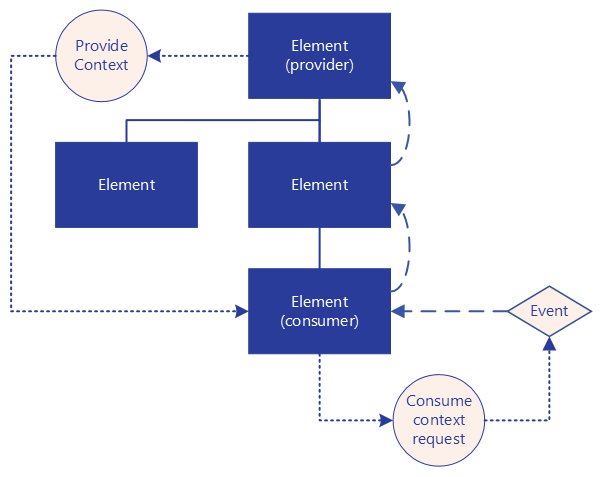

# Context API fundamentals
The Context API is a powerful communication system in Umbraco's backoffice. It enables elements to share data and functionality without tight coupling. This article covers the core concepts, terminology, and flow mechanisms you need to understand before working with contexts.

Whether you're building custom property editors, workspace extensions, or complex UI components, understanding the Context API is essential. It provides a structured way to access shared state, services, and functionality throughout the element hierarchy.

## What is the Context API?
The Umbraco backoffice is a collection of DOM elements, just like any web application. Elements can be anything: a button, a property editor, a section, a menu option, or a tree. These elements have a hierarchy and form the entire DOM tree that makes up the Umbraco application.

The Context API in Umbraco is a communication system. It allows elements to share data and functionality through their hierarchy in a `context`. Parent elements can provide contexts that their descendant elements can request and use. 

When an element needs access to some data or functionality, it requests the appropriate context. It does this by using the context's identifier. The system finds the nearest provider up the element hierarchy. This creates loose coupling between elements. Descendants don't need direct references to their dependencies. They just declare what type of context they need and the system handles the connection. 

The approach is similar to dependency injection in managing dependencies automatically. However, it works specifically through the element structure rather than a central container. For example, a custom property editor can request the `workspace context` to access information about the current document. This includes the document's name, content type, or publication status.

The Context API exists to solve common problems in complex user interfaces:

* Avoiding prop drilling: Instead of passing data through multiple layers of components, child elements can directly request what they need.
* Loose coupling: Elements don't need direct references to their dependencies. This makes the codebase more modular and maintainable.
* Shared state management: Multiple elements can access and react to the same state without complex wiring.

## Terminology
To understand the Context API, it's important to understand the terminology that is used in the rest of the documentation.

### Context
An object that encapsulates both data and methods to interact with that data. This object can be provided to descending DOM elements. A context represents a specific capability or state that multiple elements might need to access. Examples include workspace context, content data, user permissions, or specialized services. Contexts encapsulate both data and methods, making them more than simple data containers. Unlike repositories, a context is always only available within the scope of a certain element and its descendants.

### Context provider
An element that creates and makes a context available to its descending elements. The provider is responsible for the context's lifecycle. One element can provide multiple different contexts if needed.

### Context consumer
Any element that requests and consumes a context provided by one of its ancestor elements. An element becomes a consumer simply by requesting a context. It doesn't need to know which specific ancestor provides the context or implement special interfaces. The consuming element receives callbacks when the requested context becomes available or unavailable. This allows it to react appropriately to changes in the element hierarchy.

### Context Token
A unique identifier used to request specific contexts. Context tokens serve as contracts between providers and consumers. They define exactly which context is being requested and ensure that the right provider responds. This prevents conflicts when multiple contexts might have similar names. It also makes clear what functionality is being shared.

## Context consume flow
Each DOM element can be a context provider. Each descendant in the DOM hierarchy can consume that context if desired. When an element wants to consume a context, the following happens:

1. An element requests a context by a given Context Token.
2. The Context API dispatches an event that starts at the element that requested the context. The event bubbles up the DOM tree to each parent element. This continues until an element is found that responds to the event.
3. An instance of the context is provided back to the element that requested the context.

If no context could be found and the event reaches the top level element (the document), no context is consumed.

## Common contexts
Although every element can be a Context Provider, the most important contexts are registered at specific hierarchy levels. These levels are also explicit extension points in the Umbraco manifest. These levels are global, section, workspace, and property.

**Global contexts** are registered at the highest level and are always available anywhere in the backoffice. Examples of global contexts:
* The `Notification context` is used for displaying notifications in the backoffice. This context is consumable in elements anywhere in the DOM tree.
* The `Current user context` has information about the currently logged in user. This context is consumable anywhere in the DOM tree.

**Section contexts** are available in the context of a section. That's everything in the backoffice except the menubar. Examples of section contexts:
* The `Section context` provides information about the section, like path, alias, and label.
* The `Sidebar menu section context` holds information about the sidebar menu, like which menu is currently selected.

**Workspace contexts** work on a workspace; the part of Umbraco that's next to the tree. Example of this level:
* The `Workspace context` holds information about the current entity being edited in the workspace. This holds minimal information about an entity and the entity type. There are specific workspace contexts per entity type. For instance, the `Document workspace context` for documents and `Media workspace context` for media.

**Property contexts** are contexts that work at the property level. They can work on one or more property editors. An example is the clipboard functionality where blocks can be copied and pasted between block grids and block lists. Because these contexts are scoped at the property level, they are typically not consumed directly.