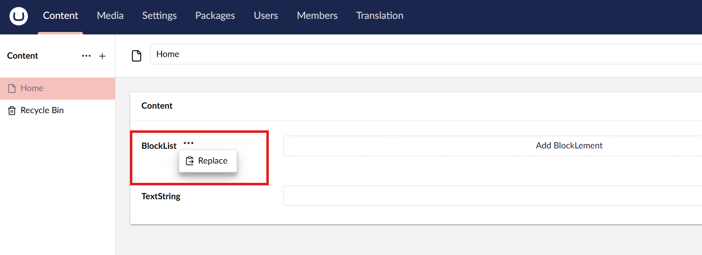

# Property Actions

Property Actions are a built-in feature of Umbraco that allows you to add extra functionality to a Property Editor. Think of them as small, secondary actions that you can attach to a property without modifying the editor itself.

Property Actions appear as a small button next to the property label, which expands to show the available actions.

## Property Actions in the UI

<figure style="max-width:60%; margin:auto; text-align:center;">
    
    <figcaption><p><strong>Property action in Block List</strong></p></figcaption>
</figure>

## Registering a Property Action


Before creating a Property Action, make sure you are familiar with the [Extension Registry in Umbraco](https://docs.umbraco.com/umbraco-cms/customizing/extending-overview/extension-registry/extension-registry).


Here is how you can register a new Property Action:
```
import { extensionRegistry } from '@umbraco-cms/extension-registry';
import { MyEntityAction } from './my-property-action.api';
const manifest =
  {
    type: 'propertyAction',
    kind: 'default',
    alias: 'My.propertyAction',
    name: 'My Property Action ',
    forPropertyEditorUis: ["my-property-editor"], // Target specific property editors
    api: () => import('./my-property-action.api.js'),
    weight: 10, // Order if multiple actions exist
    meta: {
      icon: 'icon-add', // Icon to display in the UI
      label: 'My property action', // Label shown to editors
    }
  };

extensionRegistry.register(manifest);
```
### Creating the Property Action Class

Every Property Action needs a class that defines what happens when the action is executed.
You can extend the `UmbPropertyActionBase` class for this.

```
import { UmbPropertyActionBase } from '@umbraco-cms/backoffice/property-action';
import { UMB_PROPERTY_CONTEXT } from '@umbraco-cms/backoffice/property';

export class MyPropertyAction extends UmbPropertyActionBase {
  // The execute method is called when the user triggers the action.
  async execute() {
    // Retrieve the property’s current state,
    const propertyContext = await this.getContext(UMB_PROPERTY_CONTEXT);

    // Here it's possible to modify the property or perform other actions.  In this case, setting a value.
    propertyContext.setValue("Default text here");
  }
}
export { MyPropertyAction as api };
```