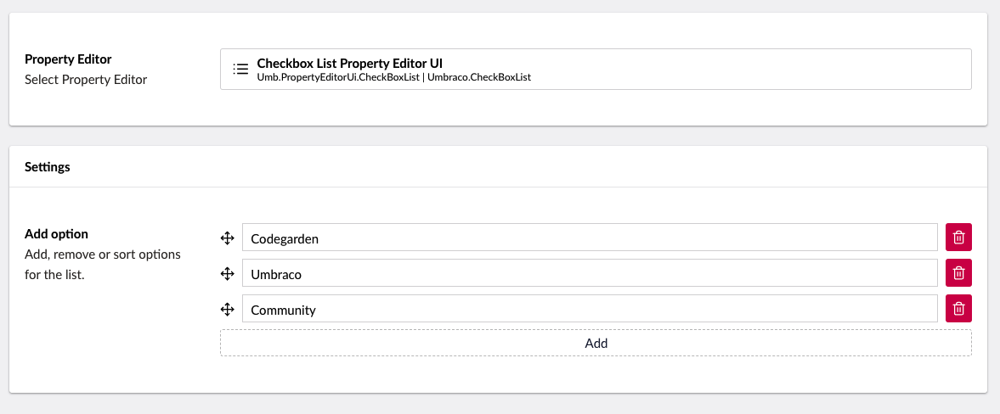

# Checkbox List

`Schema Alias: Umbraco.CheckBoxList`

`UI Alias: Umb.PropertyEditorUi.CheckBoxList`

`Returns: IEnumerable<string>`

Displays a list of preset values as a list of checkbox controls. The text saved is an IEnumerable collection of the text values.


Unlike other property editors, the Option IDs are not directly accessible in Razor.


## Data Type Definition Example




You can use dictionary items to translate the options in a Checkbox List property editor in a multilingual setup. For more details, see the [Creating a Multilingual Site](../../../../tutorials/multilanguage-setup.md#translating-multi-value-property-editors) article.


## Content Example


## MVC View Example

### Without Models Builder

```csharp
@{
    if (Model.HasValue("superHeros"))
    {
        <ul>
            @foreach (var item in Model.Value<IEnumerable<string>>("superHeros"))
            {
                <li>@item</li>
            }
        </ul>
    }
}
```

### With Models Builder

```csharp
@{
    if (Model.SuperHeros.Any())
    {
        <ul>
            @foreach (var item in Model.SuperHeros)
            {
                <li>@item</li>
            }
        </ul>
    }
}
```

## Add values programmatically

See the example below to see how a value can be added or changed programmatically. To update a value of a property editor you need the [Content Service](https://apidocs.umbraco.com/v15/csharp/api/Umbraco.Cms.Core.Services.ContentService.html).


The example below demonstrates how to add values programmatically using a Razor view. However, this is used for illustrative purposes only and is not the recommended method for production environments.


```csharp
@using Umbraco.Cms.Core.Serialization
@using Umbraco.Cms.Core.Services
@inject IContentService ContentService
@inject IJsonSerializer Serializer
@{
    // Create a variable for the GUID of the page you want to update
    var guid = Guid.Parse("32e60db4-1283-4caa-9645-f2153f9888ef");

    // Get the page using the GUID you've defined
    var content = ContentService.GetById(guid); // ID of your page

    // Set the value of the property with alias 'superHeroes'.
    content.SetValue("superHeroes", Serializer.Serialize(new[] { "Umbraco", "CodeGarden"}));

    // Save the change
    ContentService.Save(content);
}
```

Although the use of a GUID is preferable, you can also use the numeric ID to get the page:

```csharp
@{
    // Get the page using it's id
    var content = ContentService.GetById(1234);
}
```

If Models Builder is enabled you can get the alias of the desired property without using a magic string:

```csharp
@using Umbraco.Cms.Core.PublishedCache
@inject IPublishedContentTypeCache PublishedContentTypeCache
@{
    // Set the value of the property with alias 'superHeroes'
    content.SetValue(Home.GetModelPropertyType(PublishedContentTypeCache, x => x.SuperHeroes).Alias, Serializer.Serialize(new[] { "Umbraco", "CodeGarden"}));
}
```
