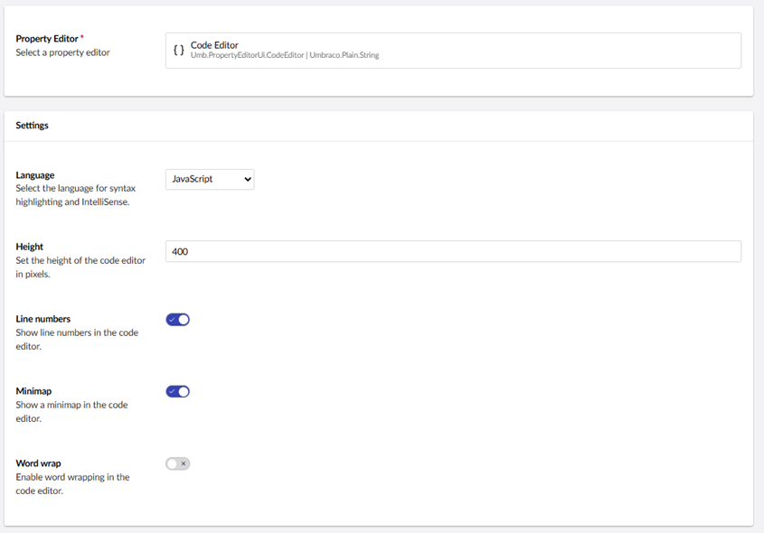
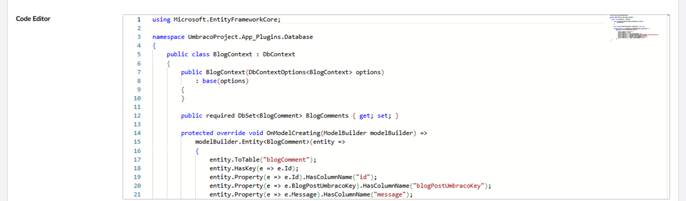

# Code Editor

`Schema Alias: Umbraco.CodeEditor`

`UI Alias: Umb.PropertyEditorUi.CodeEditor`

`Returns: String`

The Code Editor property editor provides an interface for entering and editing code snippets. It offers features like syntax highlighting, line numbering, wrapping code and so on.

## Data Type Definition Example



## Configuration

The Code Editor can be configured with the following settings:

* **Language**: A dropdown to select the syntax highlighting and validation rules for the editor. Supported languages include `C#`, `CSS`, `HTML`, `JavaScript`, `JSON`, `Markdown`, `Razor (CSHTML)`, and `TypeScript`.
* **Height**: Allows you to specify the height of the editor in pixels (for example., 400px). This ensures the editor fits well within your content entry forms.
* **Line Numbers**: A toggle to enable or disable the line number on the left side of the editor.
* **Minimap**: A toggle to enable a high-level, zoomed-out visual overview of the code on the right side of the editor for faster navigation in long files.
* **Word Wrap**: A toggle that determines if long lines of code should wrap to the next line or require horizontal scrolling.

## Content Example



## MVC View Example

### Without Models Builder

```csharp
@if (Model.HasValue("codeEditor"))
{
    var codeSnippet = Model.Value<string>("codeEditor");
    <pre><code>@codeSnippet</code></pre>
}
```

### With Modelsbuilder

```csharp
@if (Model != null && !string.IsNullOrEmpty(Model.CodeEditor))
{
    <pre><code>@Model.CodeEditor</code></pre>
}
```

## Add values programmatically

See the example below to see how a value can be added or changed programmatically. To update a value of a property editor you need the [Content Service](https://apidocs.umbraco.com/v17/csharp/api/Umbraco.Cms.Core.Services.ContentService.html).


The example below demonstrates how to add values programmatically using a Razor view. However, this is used for illustrative purposes only and is not the recommended method for production environments.


```csharp
@using Umbraco.Cms.Core.Services;

@inject IContentService Services;
@{
    // Get access to ContentService
    var contentService = Services;

    // Create a variable for the GUID of your page
    var guid = new Guid("ca4249ed-2b23-4337-b522-63cabe5587d1");

    // Get the page using the GUID you've just defined
    var content = contentService.GetById(guid);

    // Define your code string
    string newCode = "body {\n  background-color: red;\n}";

    // Set the value of the property with alias 'codeEditor'
    content.SetValue("codeEditor", newCode);

    // Save the change
    contentService.Save(content);
}
```

Although the use of a GUID is preferable, you can also use the numeric ID to get the page:

```csharp
@{
    // Get the page using it's id
    var content = contentService.GetById(1234);
}
```
