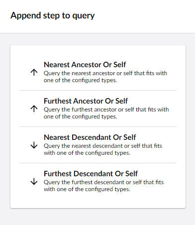

# Content Picker

`Schema Alias: Umbraco.ContentPicker`

`UI Alias: Umb.PropertyEditorUi.DocumentPicker`

`Returns: IEnumerable<IPublishedContent>`

The Content Picker enables choosing the type of content tree to display and which specific part to render. It also allows you to set a dynamic root node for the content based on the current document using the Content Picker.


The Content Picker was formerly known as the **Multinode Treepicker** in version 13 and below.

The renaming is purely a client-side UI change, meaning the property editor still uses the `Umbraco.MultiNodeTreePicker` schema alias.

The change was made as the word **Content** in the backoffice acts as an umbrella term covering Documents, Media, and Members.

**Are you looking for the original Content Picker?**

The Content Picker from version 13 and below has been renamed [Document Picker](document-picker.md).


## Data Type Definition Example


### Minimum/maximum number of items

Define a limit on the number of items allowed to be selected.

### Ignore user start nodes

Checking this field allows users to choose nodes they normally cannot access.

### Node Type

This option allows for configuring what type of content is available when using the Data Type. The available types of content are Content, Members, or Media items.

When selecting Content from the dropdown, the option to specify a root node, also called the **origin**, becomes available.&#x20;

<figure><figcaption><p>The option to specify a root node also called the "origin" becomes available when Content is selected as the Node Type.</p></figcaption></figure>


When picking the **origin** there are several different options available:

<figure><figcaption><p>The available options for setting a root node (origin) for the Content Picker.</p></figcaption></figure>

The following options are available when picking the origin:

* **Root**: The root is the first level item of the sub-tree of the current node.
* **Parent**: The parent is the nearest ancestor of the current node.
* **Current**: The current node.&#x20;
  * A picker that uses the current node, cannot pick anything when the current node is created, as it will not have any children.
* **Site**: The nearest ancestor of the current node with a domain assigned.
* **Specific node**: A specific node selected from the existing content.

When an origin has been specified, it becomes possible to continue to build a _Dynamic Root_ by adding additional query steps.

Navigate the content tree relative to the specified origin to execute multiple query steps and find the root node needed.



The following options are available:

* **Nearest Ancestor or Self:** Find the nearest ancestor or current item that fits with one of the configured Document Types.
* **Furthest Ancestor or Self:** Find the furthest ancestor or current item that fits with one of the configured Document Types.
* **Nearest Descendant or Self:** Find the nearest descendant or current item that fits with one of the configured Document Types.
* **Furthest Descendant or Self:** Find the furthest descendant or current item that fits with one of the configured Document Types.

The options above are all based on navigating the document hierarchy by locating ancestors and descendants. It is possible to execute **custom steps** to build even more complex queries. Once a custom query is available it will be added to the bottom of the _Append steps to query_ dialog. Learn more about [adding custom query steps in the section below](content-picker.md#adding-a-custom-query-step).

Each query step takes the output from the origin or the previous step as input. It is only ever the result of the last query step that is passed to the next step.


#### Adding a custom query step

Custom query steps can be used to solve specific use cases, such as traversing sibling documents or matching property values. Before the custom query steps can be selected in the Data Type settings, they must be defined via code.

When implementing a query step it requires a collection of origins and information about the query step. The collection is taken from where the name specified in the UI can be found.


**Specifying the origin is required** for the custom query step to become available.

Read the [Node Type section](content-picker.md#node-type) above to learn more about this.


You can inject dependencies into the constructor. These dependencies could be custom repositories or the `IVariationContextAccessor`, if you want to use the current culture.

The `ExecuteAsync` method receives a set of content keys from the last executed query step or the origin. It has to return a new set of content keys.

```csharp
public class MyCustomDynamicRootQueryStep : IDynamicRootQueryStep
{
    private readonly IMyCustomRepository _myCustomRepository;

    public MyCustomDynamicRootQueryStep(IMyCustomRepository myCustomRepository)
    {
        _myCustomRepository = myCustomRepository;
    }

    // The string below is what you specify in the UI to execute this custom query step.
    public virtual string SupportedDirectionAlias { get; set; } = "MyCustomStep";

    public async Task<Attempt<ICollection<Guid>>> ExecuteAsync(ICollection<Guid> origins, DynamicRootQueryStep filter)
    {
        if (filter.Alias != SupportedDirectionAlias)
        {
            return Attempt<ICollection<Guid>>.Fail();
        }

        if (origins.Any() is false)
        {
            return Attempt<ICollection<Guid>>.Succeed(Array.Empty<Guid>());
        }

        // Replace the following with your custom logic
        var result = await _myCustomRepository.GetWhateverIWantAsync(origins);

        return Attempt<ICollection<Guid>>.Succeed(result);
    }
}
```

To register the custom query step, append it to the existing query steps, `DynamicRootSteps()`. This is done from a composer as shown below.

```csharp
public class CustomQueryStepComposer : IComposer
{
    public void Compose(IUmbracoBuilder builder)
    {
        builder.DynamicRootSteps().Append<MyCustomDynamicRootQueryStep>();
    }
}
```

Finally, register the custom query step on the client side and provide a brief description.

You can do this in an `umbraco-package.json` file, as shown below:

```json
{
  "$schema": "../../umbraco-package-schema.json",
  "name": "My.Test.Extension",
  "version": "0.1.0",
  "extensions": [
    {
      "type": "dynamicRootQueryStep",
      "alias": "Umb.DynamicRootQueryStep.MyCustomStep",
      "name": "Dynamic Root Query Step: My Custom Step",
      "meta": {
        "queryStepAlias": "MyCustomStep",
        "label": "My Custom Step",
        "description": "My custom step description.",
        "icon": "icon-coffee"
      },
      "weight": 0
    }
  ]
}
```

### Allow items of type

Choose which types of content should be available to pick using the Content Picker.

This is done by selecting one or more Document Types.

## Query Example

Consider the following tree structure where the Document Type alias is presented in square brackets.

* Codegarden
  * 2023 \[`year`]
    * Talks \[`talks`]
      * ...
      * Umbraco anno MMXXIII \[`talk`]
    * Stages \[`stages`]
      * Social Space \[`stage`]
      * No 10 \[`stage`]
      * No 16 \[`stage`]
      * The Theatre \[`stage`]
  * 2022 \[`year`]
    * Talks \[`talks`]
      * ...
    * Stages \[`stages`]
      * Main Stage \[`stage`]
      * The Barn \[`stage`]
      * The Theatre \[`stage`]

Consider configuring a Content Picker on the `talk` Document Type to select a `stage` for the `talk`. Here, you want to display only the stages for the actual year. To do this, you need to set the parent as the origin.

For instance, if you are on the `Umbraco anno MMXXIII` node, the collection of content keys passed into the first query step will only contain the `Talks` content node.

* First, query for the nearest ancestors of the type `year`. This will return `2023`.
* Second, query for the nearest descendants of the type `stages`.

When opening the picker on the `Umbraco anno MMXXIII` node, it will now show the children of the node on the path `Codegarden > 2023 > Stages`.

## MVC View Example

### Without Modelsbuilder

```csharp
@{
    var typedContentPicker = Model.Value<IEnumerable<IPublishedContent>>("featuredArticles");
    if (typedContentPicker != null) {
        foreach (var item in typedContentPicker)
        {
            <p>@item.Name</p>
        }
}
```

### With Modelsbuilder

```csharp
@{
    var typedContentPicker = Model.FeaturedArticles;
    foreach (var item in typedContentPicker)
    {
        <p>@item.Name</p>
    }
}
```

## Add values programmatically

See the example below to see how a value can be added or changed programmatically. To update the value of a property editor you need the [Content Service](https://apidocs.umbraco.com/v15/csharp/api/Umbraco.Cms.Core.Services.ContentService.html).


The example below demonstrates how to add values programmatically using a Razor view. However, this is used for illustrative purposes only and is not the recommended method for production environments.


```csharp
@inject IContentService Services;
@using Umbraco.Cms.Core;
@using Umbraco.Cms.Core.Services

@{
    // Get access to ContentService
    var contentService = Services;

    // Create a variable for the GUID of the page you want to update
    var guid = Guid.Parse("32e60db4-1283-4caa-9645-f2153f9888ef");

    // Get the page using the GUID you've defined
    var content = contentService.GetById(guid); // ID of your page

    // Get the pages you want to assign to the Content Picker
    var page = Umbraco.Content("665d7368-e43e-4a83-b1d4-43853860dc45");
    var anotherPage = Umbraco.Content("1f8cabd5-2b06-4ca1-9ed5-fbf14d300d59");

    // Create Udi's of the pages
    var pageUdi = Udi.Create(Constants.UdiEntityType.Document, page.Key);
    var anotherPageUdi = Udi.Create(Constants.UdiEntityType.Document, anotherPage.Key);

    // Create a list of the page udi's
    var udis = new List<string>{pageUdi.ToString(), anotherPageUdi.ToString()};

    // Set the value of the property with alias 'featuredArticles'.
    content.SetValue("featuredArticles", string.Join(",", udis));

    // Save the change
    contentService.Save(content);
}
```

Although the use of a GUID is preferable, you can also use the numeric ID to get the page:

```csharp
@{
    // Get the page using it's id
    var content = contentService.GetById(1234);
}
```

If Modelsbuilder is enabled you can get the alias of the desired property without using a magic string:



```csharp
@inject IPublishedSnapshotAccessor _publishedSnapshotAccessor;
@using Umbraco.Cms.Core.PublishedCache;

@{
    // Set the value of the property with alias 'featuredArticles'
    content.SetValue(Home.GetModelPropertyType(_publishedSnapshotAccessor ,x => x.FeaturedArticles).Alias, string.Join(",", udis));
}
```
