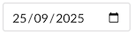
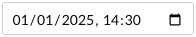

# Date Time

The Date Time property editors provide interfaces for selecting dates, times, and time zones. Each editor is designed for specific use cases, from basic date selection to comprehensive date/time handling with time zone support.


These property editors supersede the [Date Time](../date-time.md) property editor, offering more focused functionality and specific return types (like `DateOnly`, `TimeOnly`, `DateTime`, or `DateTimeOffset`). You can switch from the legacy Date Time editor by changing your properties to use the new editors.


Umbraco CMS currently ships with four Date Time editors:

| Editor | Purpose | Use Cases | Return Type | Preview |
|--------|---------|-----------|-------------|---------|
| [Date Only](date-only.md) | Date selection | Birthdays, deadlines, event dates | `DateOnly` |  |
| [Time Only](time-only.md) | Time selection | Business hours, schedules, time-based events | `TimeOnly` |  |
| [Date Time (Unspecified)](date-time-unspecified.md) | Date and time without timezone | Local events | `DateTime` |  |
| [Date Time (with Time Zone)](date-time-with-time-zone.md) | Full date, time, and timezone support | International apps, timezone-aware scheduling | `DateTimeOffset` |  |
