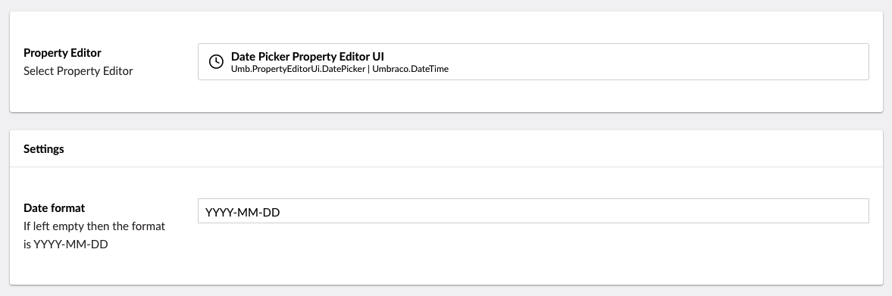

# DateTime

`Schema Alias: Umbraco.DateTime`

`UI Alias: Umb.PropertyEditorUi.DatePicker`

`Returns: DateTime`

Displays a calendar UI for selecting dates which are saved as a DateTime value.

## Data Type Definition Example



There is one setting available for manipulating the DateTime property.

The setting involves defining the format. The default date format in the Umbraco backoffice is `YYYY-MM-DD HH:mm:ss`, but you can change it to a different format. See [MomentJS.com](https://momentjs.com/) for the supported formats.

## Content Example


## MVC View Example - displays a datetime

### With Modelsbuilder

```csharp
@Model.DatePicker
```

### Without Modelsbuilder

```csharp
@Model.Value("datePicker")
```

## Add values programmatically

See the example below to see how a value can be added or changed programmatically. To update a value of a property editor you need the [Content Service](https://apidocs.umbraco.com/v15/csharp/api/Umbraco.Cms.Core.Services.ContentService.html).


The example below demonstrates how to add values programmatically using a Razor view. However, this is used for illustrative purposes only and is not the recommended method for production environments.


```csharp
@inject IContentService Services;
@using Umbraco.Cms.Core.Services;
@{
    // Get access to ContentService
    var contentService = Services;

    // Create a variable for the GUID of the page you want to update
    var guid = new Guid("32e60db4-1283-4caa-9645-f2153f9888ef");

    // Get the page using the GUID you've defined
    var content = contentService.GetById(guid); // ID of your page

    // Set the value of the property with alias 'datePicker'
    content.SetValue("datePicker", DateTime.Now);

    // Save the change
    contentService.Save(content);
}
```

Although the use of a GUID is preferable, you can also use the numeric ID to get the page:

```csharp
@{
    // Get the page using it's id
    var content = contentService.GetById(1234); 
}
```

If Modelsbuilder is enabled you can get the alias of the desired property without using a magic string:



```csharp
@using Umbraco.Cms.Core.PublishedCache;
@inject IPublishedSnapshotAccessor _publishedSnapshotAccessor;
@{

    // Set the value of the property with alias 'datePicker'
    content.SetValue(Home.GetModelPropertyType(_publishedSnapshotAccessor, x => x.DatePicker).Alias, DateTime.Now);
}
```
