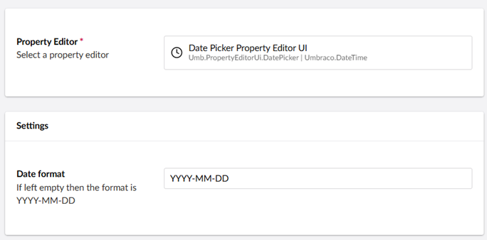
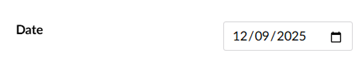

# Date

`Schema Alias: Umbraco.DateTime`

`UI Alias: Umb.PropertyEditorUi.DatePicker`

`Returns: Date`

Displays a calendar UI for selecting dates which are saved as a DateTime value.

## Data Type Definition Example



The only setting that is available for manipulating the Date property is to set a format. By default the format of the date in the Umbraco backoffice will be `YYYY-MM-DD`, but you can change this to something else. See [MomentJS.com](https://momentjs.com/) for the supported formats.

## Content Example



## MVC View Example - displays a datetime

### With Models Builder

```csharp
@Model.Date.ToString("dd MM yyyy")
```

### Without Models Builder


See [Common pitfalls](../../../../reference/common-pitfalls.md) for more information about why the dynamic approach is obsolete.


```csharp
@{
    @Model.Date.ToString("dd-MM-yyyy")
}
```

## Add values programmatically

See the example below to see how a value can be added or changed programmatically. To update a value of a property editor you need the [Content Service](https://apidocs.umbraco.com/v15/csharp/api/Umbraco.Cms.Core.Services.ContentService.html).


The example below demonstrates how to add values programmatically using a Razor view. However, this is used for illustrative purposes only and is not the recommended method for production environments.


```csharp
@using Umbraco.Cms.Core.Services
@inject IContentService ContentService
@{
    // Create a variable for the GUID of the page you want to update
    var guid = Guid.Parse("ca4249ed-2b23-4337-b522-63cabe5587d1");

    // Get the page using the GUID you've defined
    var content = ContentService.GetById(guid); // ID of your page

    // Set the value of the property with alias 'date'
    content.SetValue("date", DateTime.Now);

    // Save the change
    ContentService.Save(content);
}
```

Although the use of a GUID is preferable, you can also use the numeric ID to get the page:

```csharp
@{
    // Get the page using it's id
    var content = ContentService.GetById(1234); 
}
```

If Models Builder is enabled you can get the alias of the desired property without using a magic string:

```csharp
@using Umbraco.Cms.Core.PublishedCache
@inject IPublishedContentTypeCache PublishedContentTypeCache
@{

    // Set the value of the property with alias 'date'
    content.SetValue(Home.GetModelPropertyType(PublishedContentTypeCache, x => x.Date).Alias, DateTime.Now);
}
```
