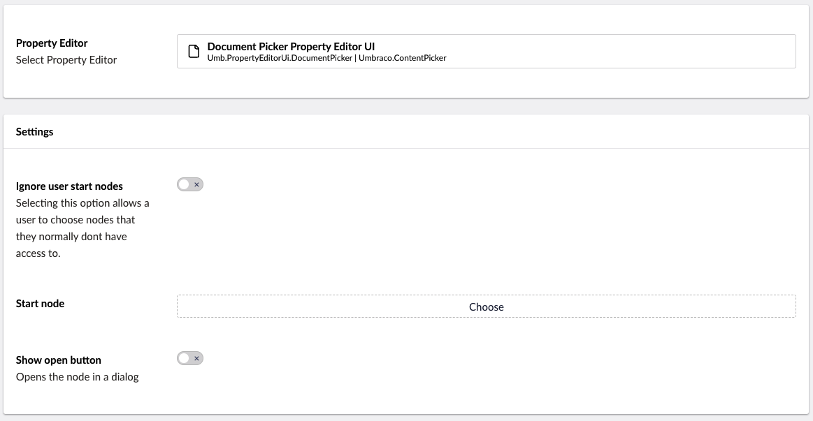

# Document Picker

`Schema Alias: Umbraco.ContentPicker`

`UI Alias: Umb.PropertyEditorUi.DocumentPicker`

`Returns: IPublishedContent`

The Document Picker opens a panel to pick a specific page from the content structure. The value saved is the selected nodes [UDI](../../../../reference/querying/udi-identifiers.md).


The Document Picker was formerly known as the **Content Picker** in version 13 and below.

The renaming is purely a client-side UI change, meaning the property editor still uses the `Umbraco.ContentPicker` schema alias.

The change was made as the word **Content** in the backoffice acts as an umbrella term covering the terms Document, Media, and Member.


## Data Type Definition Example



## Document Picker Example


## MVC View Example

### Without Models Builder

```csharp
@{
    IPublishedContent typedContentPicker = Model.Value<IPublishedContent>("featurePicker");
    if (typedContentPicker != null)
    {
        <p>@typedContentPicker.Name</p>
    }
}
```

### With Models Builder

```csharp
@{
    IPublishedContent typedContentPicker = Model.FeaturePicker;
    if (typedContentPicker != null)
    {
        <p>@typedContentPicker.Name</p>
    }
}
```

## Add values programmatically

See the example below to see how a value can be added or changed programmatically. To update a value of a property editor you need the [Content Service](https://apidocs.umbraco.com/v15/csharp/api/Umbraco.Cms.Core.Services.ContentService.html).


The example below demonstrates how to add values programmatically using a Razor view. However, this is used for illustrative purposes only and is not the recommended method for production environments.


```csharp
@using Umbraco.Cms.Core
@using Umbraco.Cms.Core.Services
@inject IContentService ContentService
@{
    // Create a variable for the GUID of the page you want to update
    var guid = Guid.Parse("32e60db4-1283-4caa-9645-f2153f9888ef");

    // Get the page using the GUID you've defined
    var content = ContentService.GetById(guid); // ID of your page

    // Get the page you want to assign to the document picker
    var page = Umbraco.Content("665d7368-e43e-4a83-b1d4-43853860dc45");

    // Create an Udi of the page
    var udi = Udi.Create(Constants.UdiEntityType.Document, page.Key);

    // Set the value of the property with alias 'featurePicker'.
    content.SetValue("featurePicker", udi.ToString());

    // Save the change
    ContentService.Save(content);
}
```

Although the use of a GUID is preferable, you can also use the numeric ID to get the page:

```csharp
@{
    // Get the page using it's id
    var content = ContentService.GetById(1234);
}
```

If Models Builder is enabled you can get the alias of the desired property without using a magic string:

```csharp
@using Umbraco.Cms.Core.PublishedCache
@inject IPublishedContentTypeCache PublishedContentTypeCache
@{
    // Set the value of the property with alias 'featurePicker'
    content.SetValue(Home.GetModelPropertyType(PublishedContentTypeCache, x => x.FeaturePicker).Alias, udi.ToString());
}
```
