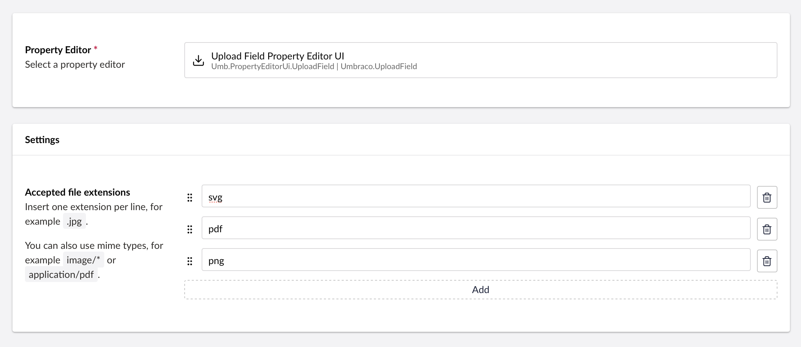

# File Upload

`Schema Alias: Umbraco.UploadField`

`UI Alias: Umb.PropertyEditorUi.UploadField`

`Returns: string`

Adds an upload field, which allows documents or images to be uploaded to Umbraco.

You can define which file types should be accepted through the upload field.


For uploading and adding files and images to your Umbraco project, we recommend using the Media Picker.

Find the full documentation for the property in the [Media Picker](media-picker-3.md) article.


## Data Type Definition Example



## Content Example

 

In code, the property is a string, which references the location of the file.

Example: `"/media/o01axaqu/guidelines-on-remote-working.pdf"`

## MVC View Example

### Without Models Builder

```csharp
@if (Model.HasValue("myFile"))
{
    var myFile = Model.Value<string>("myFile");

    <a href="@myFile">@System.IO.Path.GetFileName(myFile)</a>
}
```

### With Models Builder

```csharp
@if (Model.HasValue("myFile"))
{
   <a href="@Model.MyFile">@System.IO.Path.GetFileName(Model.MyFile)</a>
}
```

## Add values programmatically

See the example below to see how a value can be added or changed programmatically. To update a value of this property editor you need the [Content Service](https://apidocs.umbraco.com/v16/csharp/api/Umbraco.Cms.Core.Services.ContentService.html) and the [Media Service](https://apidocs.umbraco.com/v16/csharp/api/Umbraco.Cms.Core.Services.MediaService.html).


The example below demonstrates how to add values programmatically using a Razor view. However, this is used for illustrative purposes only and is not the recommended method for production environments.


```csharp
@using System.Net
@using Umbraco.Cms.Core
@using Umbraco.Cms.Core.Services
@using Umbraco.Cms.Core.PropertyEditors
@using Umbraco.Cms.Core.IO
@using Umbraco.Cms.Core.Serialization
@using Umbraco.Cms.Core.Strings
@inject MediaFileManager MediaFileManager
@inject IShortStringHelper ShortStringHelper
@inject IContentTypeBaseServiceProvider ContentTypeBaseServiceProvider
@inject IContentService ContentService
@inject IMediaService MediaService
@inject IJsonSerializer Serializer
@inject MediaUrlGeneratorCollection MediaUrlGeneratorCollection
@{
    // Create a variable for the GUID of the parent where you want to add a child item
    var guid = Guid.Parse("32e60db4-1283-4caa-9645-f2153f9888ef");

    // Get the page using the GUID you've defined
    var content = ContentService.GetById(guid); // ID of your page

    // Create a variable for the file you want to upload, in this case the Our Umbraco logo
    var imageUrl = "https://our.umbraco.com/assets/images/logo.svg";

    // Create a request to get the file
    var request = WebRequest.Create(imageUrl);
    var webResponse = request.GetResponse();
    var responseStream = webResponse.GetResponseStream();

    // Get the file name 
    var lastIndex = imageUrl.LastIndexOf("/", StringComparison.Ordinal) + 1;
    var filename = imageUrl.Substring(lastIndex, imageUrl.Length - lastIndex);

    // Create a media file
    var media = MediaService.CreateMediaWithIdentity("myImage", -1, "File");
    media.SetValue(MediaFileManager, MediaUrlGeneratorCollection, ShortStringHelper, ContentTypeBaseServiceProvider, Constants.Conventions.Media.File, filename, responseStream);
    // Save the created media 
    MediaService.Save(media);

    // Get the published version of the media (IPublishedContent)
    var publishedMedia = Umbraco.Media(media.Id);

    // Set the value of the property with alias 'myFile' 
    content.SetValue("myFile", publishedMedia.Url());

    // Save the child item
    ContentService.Save(content);
}
```

If Models Builder is enabled you can get the alias of the desired property without using a magic string:

```csharp
@using Umbraco.Cms.Core.PublishedCache
@inject IPublishedContentTypeCache PublishedContentTypeCache
@{
    // Set the value of the property with alias 'myFile'
    content.SetValue(Home.GetModelPropertyType(PublishedContentTypeCache, x => x.MyFile).Alias, publishedMedia.Url();
}
```
