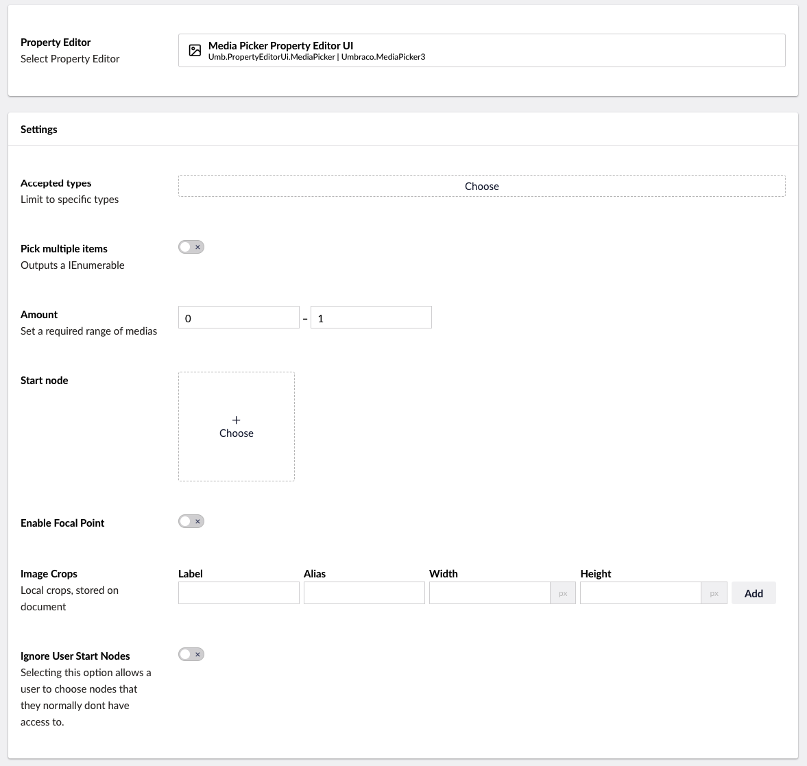

# Media Picker

`Schema Alias: Umbraco.MediaPicker3`

`UI Alias: Umb.PropertyEditorUi.MediaPicker`

`Returns: IEnumerable<MediaWithCrops>` or `MediaWithCrops`

This property editors returns one of the following:

- A collection (`IEnumerable<MediaWithCrops>`) if the **Pick multiple items** setting is enabled.
- A single `MediaWithCrops` item if the **Pick multiple items** setting is disabled.

## Data Type Definition Example



### Accepted types

Use setting to limit the picker to only select Media Items of these types.

### Pick multiple items

Use this setting to enable the property to contain multiple items. When this is enabled the property editor returns an `IEnumerable<MediaWithCrops>`.

You can still set the maximum amount to 1. Do so when you want to retrieve a collection but only allow the Content Editors to select one Media Item.

### Amount

Use this setting to enforce a minimum and/or maximum amount of selected Media Items.


It is not possible to set a maximum amount when the "Pick multiple items" feature is disabled.


### Start node

This setting is used to limit the Media Picker to certain parts of the Media Tree.

### Ignore user start nodes

Use this setting to overrule user permissions, to enable any user of this property to pick any Media Item of the chosen Start node.

When this setting is enabled, a user can access the media available under the selected "Start Node" (/Design in this case). This applies even if they normally lack access. The access is granted specifically when using this particular Media Picker.

### Enable Focal Point

Enable the focal point setter, do only enable this if the focal point is used or if you have Image crops defined.

### Image Crops

Define local image crops. Local image crop data is stored on the document in this property. This means it can differentiate between documents.

This is different from Global crops as they are defined on the Media Item, making the crops shared between all usage of that Media Item.

Global crops are configured on the Image Cropper property of the Image Media Type

[Read about the Image Cropper here](image-cropper.md)

## Content Example


## MVC View Example

### Multiple enabled without Modelsbuilder

```csharp
@using Umbraco.Cms.Core.Models
@{
    var typedMultiMediaPicker = Model.Value<IEnumerable<MediaWithCrops>>("medias");
    foreach (var entry in typedMultiMediaPicker)
    {
        
    }
}
```

#### Multiple enabled without Modelsbuilder to retrieve IEnumerable<IPublishedContent> data

```csharp
@using Umbraco.Cms.Core.Models
@{
    var listOfImages = Model.Value<IEnumerable<IPublishedContent>>("medias");
    foreach (var image in listOfImages)
    {
        
    }
}
```


While `MediaWithCrops` is the default return type, `IPublishedContent` may be used in backward-compatible implementations or when working directly with core APIs.


### Multiple enabled with Modelsbuilder

```csharp
@{
    var typedMultiMediaPicker = Model.Medias;
    foreach (var entry in typedMultiMediaPicker)
    {
        
    }
}
```

### Multiple disabled without Modelsbuilder

```csharp
@using Umbraco.Cms.Core.Models
@{
    var typedMediaPickerSingle = Model.Value<MediaWithCrops>("media");
    if (typedMediaPickerSingle != null)
    {
        
    }
}
```

### Multiple disabled with Modelsbuilder

```csharp
@using Umbraco.Cms.Core.Models
@{
    var typedMediaPickerSingle = Model.Media;
    if (typedMediaPickerSingle is MediaWithCrops mediaEntry)
    {
        
    }
}
```

## Using crops

Both local and global crops are retrieved using the method `GetCropUrl`. If crops with identical aliases are defined both locally and globally, the locally defined crops are always prioritized by `GetCropUrl`.

The following is an example of how to retrieve a crop from a `MediaWithCrops` entry:

```csharp
@{
    foreach (var entry in Model.Medias)
    {
        
    }
}
```

### Explicitly retrieving global crops

You can retrieve globally defined crops explicitly by using `GetCropUrl` on the `UrlHelper`:

```csharp
@{
    foreach (var entry in Model.Medias)
    {
        
    }
}
```

### Add values programmatically

See the example below to see how a value can be added or changed programmatically. To update a value of a property editor you need the [Content Service](https://apidocs.umbraco.com/v15/csharp/api/Umbraco.Cms.Core.Services.ContentService.html).

The following sample will update a single image in a Media Picker.


The example below demonstrates how to add values programmatically using a Razor view. However, this is used for illustrative purposes only and is not the recommended method for production environments.


```csharp
@using Umbraco.Cms.Core;
@using Umbraco.Cms.Core.Services;
@inject IContentService Services;
@{
    // Get access to ContentService
    var contentService = Services;

    // Create a variable for the GUID of the page you want to update
    var guid = Guid.Parse("32e60db4-1283-4caa-9645-f2153f9888ef");

    // Get the page using the GUID you've defined
    var content = contentService.GetById(guid); // ID of your page

    // Get the media you want to assign to the media picker 
    var media = Umbraco.Media("bca8d5fa-de0a-4f2b-9520-02118d8329a8");

    // Create an Udi of the media
    var udi = Udi.Create(Constants.UdiEntityType.Media, media.Key);

    // Set the value of the property with alias 'featuredBanner'. 
    content.SetValue("featuredBanner", udi.ToString());

    // Save the change
    contentService.Save(content);
}
```

Although the use of a GUID is preferable, you can also use the numeric ID to get the page:

```csharp
@{
    // Get the page using it's id
    var content = contentService.GetById(1234); 
}
```

If Modelsbuilder is enabled you can get the alias of the desired property without using a magic string:



```csharp
@using Umbraco.Cms.Core.PublishedCache;
@inject IPublishedSnapshotAccessor _publishedSnapshotAccessor;
@{
    // Set the value of the property with alias 'featuredBanner'
    content.SetValue(Home.GetModelPropertyType(_publishedSnapshotAccessor, x => x.FeaturedBanner).Alias, udi.ToString());
}
```
