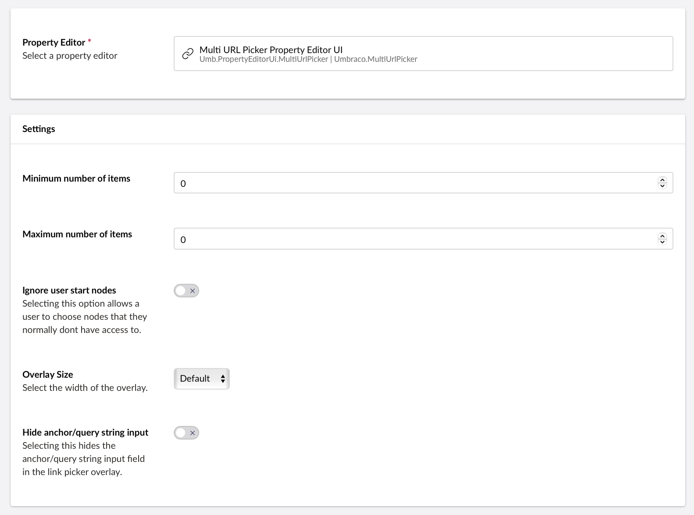

# Multi Url Picker

`Schema Alias: Umbraco.MultiUrlPicker`

`UI Alias: Umb.PropertyEditorUi.MultiUrlPicker`

`Returns: IEnumerable<Link> or Link`

Multi Url Picker allows an editor to pick and sort multiple URLs.
It returns either a single item or a collection. This depends on the "Maximum number of items" Data Type setting.
When that is set to 1, it returns a single item, otherwise a collection.
Multi URL Picker allows editors to select and sort multiple URLs. The property returns either a single item or a collection, depending on the **Maximum number of items** setting in the Data Type configuration.

- When the maximum is set to 1, it returns a single item.
- When the maximum is greater than 1, it returns a collection.

The URLs can point to **internal**, **external**, or **media** items.

## Data Type Definition Example



## Content Example


## MVC View Example

### Without Models Builder

```csharp
@using Umbraco.Cms.Core.Models
@{
    var links = Model.Value<IEnumerable<Link>>("footerLinks");
    if (links.Any())
    {
        <ul>
            @foreach (var link in links)
            {
                <li><a href="@link.Url" target="@link.Target">@link.Name</a></li>
            }
        </ul>
    }
}
```

This example handles the case of `Maximum number of items` set to `1`:

```csharp
@using Umbraco.Cms.Core.Models
@{
    var link = Model.Value<Link>("link");
    if (link != null)
    {
        <a href="@link.Url" target="@link.Target">@link.Name</a>
    }
}
```

### With Models Builder

```csharp
@{
    var links = Model.FooterLinks;
    if (links.Any())
    {
        <ul>
            @foreach (var link in links)
            {
                <li><a href="@link.Url" target="@link.Target">@link.Name</a></li>
            }
        </ul>
    }
}
```

And here is the case of `Maximum number of items` set to `1`:

```csharp
@{
    var link = Model.Link;
    if (link != null)
    {
        <a href="@link.Url" target="@link.Target">@link.Name</a>
    }
}
```


## Add values programmatically

See the example below to see how a value can be added or changed programmatically. To update a value of a property editor you need the [Content Service](https://apidocs.umbraco.com/v15/csharp/api/Umbraco.Cms.Core.Services.ContentService.html).


The example below demonstrates how to add values programmatically using a Razor view. However, this is used for illustrative purposes only and is not the recommended method for production environments.


```csharp
@using Umbraco.Cms.Core
@using Umbraco.Cms.Core.Serialization
@using Umbraco.Cms.Core.Services
@using Umbraco.Cms.Core.Models
@inject IContentService ContentService
@inject IJsonSerializer Serializer
@{
    // Create a variable for the GUID of the page you want to update
    var guid = Guid.Parse("32e60db4-1283-4caa-9645-f2153f9888ef");

    // Get the page using the GUID you've defined
    var content = ContentService.GetById(guid); // ID of your page

    // Get the media you want to assign to the footer links property 
    var media = Umbraco.Media("bca8d5fa-de0a-4f2b-9520-02118d8329a8");

    // Create an Udi of the media
    var mediaUdi = Udi.Create(Constants.UdiEntityType.Media, media.Key);

    // Get the content you want to assign to the footer links property 
    var contentPage = Umbraco.Content("665d7368-e43e-4a83-b1d4-43853860dc45");

    // Create an Udi of the Content
    var contentPageUdi = Udi.Create(Constants.UdiEntityType.Document, contentPage.Key);

    // Create a list with different link types
    var externalLinks = new List<Link>
    {
        // External Link
        new Link
        {
            Target = "_blank",
            Name = "Our Umbraco",
            Url = "https://our.umbraco.com/",
            Type = LinkType.External
        },
        // Media 
        new Link
        {
            Target = "_self",
            Name = media.Name,
            Url = media.MediaUrl(),
            Type = LinkType.Media,
            Udi = mediaUdi
        }, 
        // Content 
        new Link
        {
            Target = "_self",
            Name = contentPage.Name,
            Url = contentPage.Url(),
            Type = LinkType.Content,
            Udi = contentPageUdi
        }
    };

    // Serialize the list with links to JSON
    var links = Serializer.Serialize(externalLinks);


    // Set the value of the property with alias 'footerLinks'. 
    content.SetValue("footerLinks", links);

    // Save the change
    ContentService.Save(content);
}
```

If Models Builder is enabled you can get the alias of the desired property without using a magic string:

```csharp
@using Umbraco.Cms.Core.PublishedCache
@inject IPublishedContentTypeCache PublishedContentTypeCache
@{
    // Set the value of the property with alias 'footerLinks'
    content.SetValue(Home.GetModelPropertyType(PublishedContentTypeCache, x => x.FooterLinks).Alias, links);
}
```
